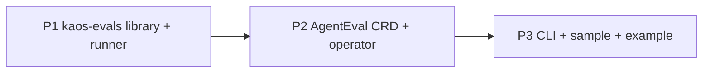

# Proposed work split and sequencing

**Status**: Draft for execution (v1)
**Date**: 2026-07-16
**Scope**: High-level phasing of the implementation that realises the KAOS evals architecture decided across [adr_0001](../adrs/adr_0001_eval-model-contract-and-harness-engine.md) through [adr_0003](../adrs/adr_0003_control-plane-eval-crd-operator-and-cli.md), grounded in the requirements baseline ([KAOS-E1](../research/KAOS-E1-evaluation-features-and-limitations.md)) and the target picture ([KAOS-E7](../research/KAOS-E7-target-picture.md)). It spans a new `kaos-evals` Python package, the Go operator, the `kaos` CLI, the Helm chart, and the docs/examples surface.

---

## Purpose

This document proposes *how the evals work is chunked and in what order*, before the detailed task-level plans. It is intentionally high level: the goal is to agree the sequencing and the dependency structure, not the granular tasks. Each phase is executed as its own plan-implement iteration (one PR per phase, stacked), and the detailed per-phase task breakdown lives in its own `P<n>-<slug>.md` plan file next to this one.

The implementation is organised **bottom-up**, the discipline proven on the memory track: build and validate the smallest independently-testable layer first (the contract and harness library), wrap the execution around it (the runner), then wire the control plane and the user-facing surfaces. Because the engine is from the same ecosystem as the KAOS runtime and was verified in depth ([KAOS-E5-1](../research/KAOS-E5-1-pydantic-evals.md)), no standalone feasibility milestone is warranted; instead the first phase **opens with an engine-validation task** whose findings gate the rest of the phase and feed plan deltas downstream.

---

## Guiding principles for the split

- **Validate the engine first, inside the first phase.** The load-bearing hypotheses — the pinned Pydantic Evals APIs match the deep dive, `LLMJudge` routes through an OpenAI-compatible base URL, report JSON export is lossless — are proven with working checks in `./tmp/evals/` (gitignored) before production code builds on them.
- **Bottom-up: contract and library first, wire last.** The engine-independent contract and gate logic have zero Kubernetes dependencies and full unit coverage; the runner composes them; the operator only ever launches a runner that already works locally.
- **KAOS owns the contract; the engine stays behind the boundary.** Engine types never appear in the CRD, CLI, or stored results ([adr_0001](../adrs/adr_0001_eval-model-contract-and-harness-engine.md)); the engine is version-pinned.
- **Evaluate the deployed thing.** The primary target adapter calls the agent's serving surface; the `local` adapter exists for development parity, which also makes every phase demoable without a cluster ([adr_0002](../adrs/adr_0002_execution-model-and-runner.md)).
- **Mocks break upstream dependencies.** The library is tested with fake OpenAI-compatible servers and injected models; the runner is exercised against a local `AgentServer` with `DEBUG_MOCK_RESPONSES` before the CRD exists; the operator e2e uses the same mock-model agents as the existing suites, so no phase needs a live LLM.
- **Build on what exists.** The operator already reconciles CRDs into workloads with owner references, conditions, and `defaultImages` (MemoryStore controller is the template); `{modelAPI, model}` reference resolution exists; `kaos-memory` is the package-layout template; the executable-docs example pattern is established. The phases extend these rather than greenfielding.
- **One phase = one plan-implement iteration = one PR**, stacked, with tests validated and CI green before moving on. Progress and learnings for each phase are documented under `impl/`, and after each phase the next plan is re-read and recalibrated against what was learned.

---

## Current-state baseline (what already exists)

Condensed from [KAOS-E1](../research/KAOS-E1-evaluation-features-and-limitations.md), which this plan treats as authoritative.

- **No eval anything**: no dataset/case/evaluator/result types, no N-case orchestration, no judge wiring, no eval CRD, no Job-creating controller, no `kaos eval` CLI, no scheduled or online evaluation (gaps 1–20).
- **Strong invocation and mocking seams**: deployed agents serve an OpenAI-compatible chat surface and A2A; `DEBUG_MOCK_RESPONSES` gives deterministic runs including scripted tool calls; `create_agent_server()` supports in-process serving for the `local` adapter.
- **Reusable control-plane machinery**: MemoryStore controller (CRD → Deployment/Service with conditions, owner refs, model-reference resolution, `defaultImages`), Agent dependency gating (`waitForDependencies`), Helm/RBAC/manifest generation flows, KIND-based e2e harness.
- **Observability in place**: OTel spans for runs/tools under `kaos.*` conventions with OTLP export — the future trajectory and online-eval substrate; eval scores will adopt the OTel GenAI evaluation vocabulary.
- **Engine verified**: Pydantic Evals `Dataset`/`Case`/`Evaluator`/`LLMJudge` APIs, concurrency/repetition/retry, JSON report export, and the in-process-only span capture limitation are documented in [KAOS-E5-1](../research/KAOS-E5-1-pydantic-evals.md).

---

## The proposed phases

Three phases, each a stacked PR. P1 delivers a fully usable local eval capability; P2 makes it declarative; P3 makes it a product surface.

### P1 — `kaos-evals` library and runner (contract, harness, adapters)

**Goal**: the complete evaluation capability as a Python package, runnable locally end to end with no cluster.

**Scope**: engine-validation checks in `./tmp/evals/` (pinned-API conformance, judge routing through a fake OpenAI-compatible endpoint, lossless report export) whose findings are recorded before building; the new `kaos-evals` package mirroring `kaos-memory`'s layout — core contract module (`EvalSuite`, `EvalCase`, `EvaluatorSpec`, `GateSpec`, `RunSpec`, `CaseResult`, `RunResult`, `Provenance`) with YAML/JSON suite loading, schema validation, and content-hash identity; gate evaluation and the three-valued verdict with failure-kind separation; the harness mapping suite→engine and engine-report→`RunResult` behind the boundary; the first evaluator set (`contains`, `equals`, `regex`, `is_json`, `max_duration`, `llm_judge` with `{modelAPI-resolved base URL}` judge models required explicitly); target adapters (`http` for deployed/OpenAI-compatible endpoints with fresh-session-per-case and KAOS-side per-case timeout, `local` for in-process `AgentServer`); the runner CLI entrypoint (load → verify hash → execute → gate → write summary and full report JSON → verdict exit code); OTel spans per run/case/evaluator including `gen_ai.evaluation.result` score events and per-case trace-ID capture; full unit coverage plus a cross-component test against a mock-model `AgentServer`.

**Realises**: all of [adr_0001](../adrs/adr_0001_eval-model-contract-and-harness-engine.md); the adapter, isolation, failure-kind, and report decisions of [adr_0002](../adrs/adr_0002_execution-model-and-runner.md) (Job packaging excluded).

**Depends on**: nothing. **Demoable**: a suite YAML evaluated against a local mock-model agent prints a gated report, exits with the verdict code, and exports the full JSON report; a judge evaluator routes through a stubbed OpenAI-compatible endpoint.

### P2 — Control plane: `AgentEval` CRD, operator reconciliation, runner image

**Goal**: declarative evals — applying an `AgentEval` runs the suite in-cluster and reports the verdict in status.

**Scope**: the `AgentEval` CRD (agentRef, suite inline/configMapRef, run settings, schedule, retention) and its status contract (phase, suiteHash, lastRun summary, resultsRef, conditions); the controller reconciling it fail-closed into runner **Jobs** (dependency validation against Agent and judge ModelAPIs, `defaultImages` runner image, env/volume wiring for suite/target/judges/OTel, Job watch, status projection, `kaos.tools/rerun` annotation handling, retention garbage-collection of run Jobs and result ConfigMaps, controller-managed cron scheduling); the runner container image built by the existing image pipeline; the full-report-in-ConfigMap persistence with deterministic truncation; `make generate manifests`, RBAC, Helm chart, and `defaultImages` wiring; operator unit tests plus a KIND e2e (mock-model agent, deterministic suite, assert `Passed` status and results ConfigMap).

**Realises**: the remaining execution decisions of [adr_0002](../adrs/adr_0002_execution-model-and-runner.md) (Job shape, in-cluster wiring, results ConfigMap); the CRD, reconciliation, scheduling, and retention decisions of [adr_0003](../adrs/adr_0003_control-plane-eval-crd-operator-and-cli.md).

**Depends on**: P1. **Demoable**: `kubectl apply` of an `AgentEval` against a mock-model agent yields `phase: Passed` with aggregates in status and the per-case report retrievable from the results ConfigMap; a failing gate yields `Failed`; a missing dependency yields `Pending` with a precise condition.

### P3 — CLI, sample, and worked example

**Goal**: the human on-ramp — `kaos eval` verbs, a deployable sample, and an executable documentation example.

**Scope**: `kaos eval run|list|show|delete` (thin over the CRD and results ConfigMaps; `run --wait` exits 0/1/2 for Passed/Failed/Error; `show -o json` for CI); a samples-surface entry (mock-model Agent + deterministic `AgentEval`); the worked example `docs/examples/evals.md` in the executable-docs pattern (deploy, run, inspect per-case results, gate failure demonstration — CI-runnable with mocks, judge variant documented against a real `ModelAPI`); operator/user documentation (AgentEval CRD reference, eval architecture page) and `.github` instruction updates.

**Realises**: the CLI and sample decisions of [adr_0003](../adrs/adr_0003_control-plane-eval-crd-operator-and-cli.md).

**Depends on**: P2. **Demoable**: the documented example runs green end to end on a fresh KIND cluster; `kaos eval run --wait` gates a CI job.

---

## Sequencing at a glance

| Phase | Repo area | Primary ADRs | Hard prerequisites |
|---|---|---|---|
| P1 library + runner | `kaos-evals/` (new, Python) | 0001, 0002 | — |
| P2 CRD + operator | `operator/`, chart, runner image | 0003, 0002 | P1 |
| P3 CLI + sample + example | `kaos-cli/`, samples, `docs/` | 0003 | P2 |

---

## Cross-cutting notes

- **Simulation contract (pre-P2).** Until the operator launches the runner, the target endpoint, judge base URLs, and suite path are supplied directly (env/flags) so P1 is validated without the control plane — the same mocks-break-upstream-dependencies discipline as the memory track.
- **Where the new code lives.** The contract, harness, adapters, and runner are a new `kaos-evals` package, sibling to `kaos-memory` and structured like it (core + extras); the control plane extends `operator/`; the CLI extends `kaos-cli`. None of it lives inside the operator binary — the operator launches it.
- **Testing strategy.** Unit tests land in-repo as functionality is built (`kaos-evals` pytest + lint mirroring `kaos-memory`'s `uv run pytest` + `make lint`; operator `make test-unit` + `make generate manifests`; kaos-cli dry-run YAML tests); integration coverage is a cross-component test against a mock-model `AgentServer` in P1, promoted to a KIND e2e in P2 and the executable example in P3. Run scratch in `./tmp/` (never `/tmp`) and suppress noise to `./tmp/null`.
- **Execution conventions (embedded in every phase plan).** Each phase plan is a numbered TODO list executed strictly one by one without skipping; every task ends with tests validated and passing and a comprehensive, succinct, functional conventional commit — never referencing tasks, phases, or plan steps in the message, branch, or PR text; when all tasks finish, a gitignored `REPORT.md` (overwritten if present) records every requested task and its completion status and is posted as a PR comment, never committed.
- **Recalibration.** After each phase the next plan file is re-read and adjusted against the phase's `impl/learnings/` entry before execution begins.
- **ADR reconciliation.** This plan owns sequencing; the ADRs own the target design. Where a phase discovers an ADR must change, the ADR is amended (status lifecycle preserved) rather than silently diverged from.

---

## Explicitly later / out of the critical path

- **Remote-trajectory evaluator over the OTel backend** — the seam (trace-ID capture, evaluator kind) ships in P1/P2; the backend-querying implementation is a recorded follow-up ([adr_0002](../adrs/adr_0002_execution-model-and-runner.md)).
- **Online (production-trace) scoring worker** — deferred until the offline capability is landed and used ([adr_0002](../adrs/adr_0002_execution-model-and-runner.md)).
- **A2A target adapter; fleet selectors; change-triggered runs** — compatible evolutions of the adapter seam and CRD ([adr_0002](../adrs/adr_0002_execution-model-and-runner.md), [adr_0003](../adrs/adr_0003_control-plane-eval-crd-operator-and-cli.md)).
- **`EvalSuite` extraction, results service, object-store report sink, `compare`/`export` verbs** — built when sharing, history depth, or report size demand them ([adr_0003](../adrs/adr_0003_control-plane-eval-crd-operator-and-cli.md)).
- **DeepEval metric wrapping; Langfuse/Phoenix exporters** — additive integrations behind existing seams ([KAOS-E6](../research/KAOS-E6-tool-selection.md)).
