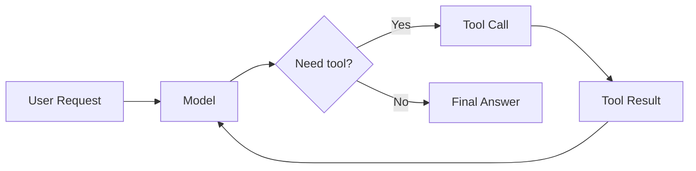
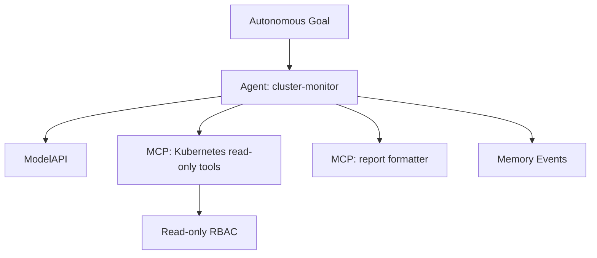

# Autonomous Agents Need More Than a Loop

*A practical guide to agent loops, task state, budgets, cancellation, and Kubernetes-native deployment, using KAOS v0.4.0 as the worked example.*

---

You've built an agent that works well when a user is waiting for the answer. It calls tools, reasons over results, and returns something useful. Then someone asks it to keep going: watch this system, check every few minutes, take action when something changes, and tell me when it matters.

That is not just a longer prompt. It is a different workload.

The hard part of autonomous agents is not making a model call itself again. That takes a loop. The hard part is making that loop safe to run when nobody is staring at the terminal: scoped tools, explicit goals, budgets, cancellation, memory, task state, observability, and an infrastructure layer that treats the agent as something more durable than a request.

In this article, I want to unpack that shift. We'll start with the simple agentic loop, extend it into autonomy, look at how the industry is converging around the same control primitives, and then use KAOS v0.4.0 as a concrete Kubernetes-native example. The KAOS details are useful because they make the abstractions real, but the patterns apply whether you use KAOS, LangGraph, CrewAI, OpenAI's Agents SDK, Google ADK, or a loop you wrote yourself.

## The Simple Agentic Loop

Most tool-using agents begin with a simple loop:

```python
async def run_agent(messages, tools, max_steps=5):
    for step in range(max_steps):
        response = await model.chat(messages, tools=tools)

        if response.tool_calls:
            for call in response.tool_calls:
                result = await tools[call.name](**call.arguments)
                messages.append({
                    "role": "tool",
                    "tool_call_id": call.id,
                    "content": result,
                })
            continue

        return response.text

    raise RuntimeError("agent exceeded max_steps")
```

The pattern is deceptively powerful:

1. The model reads the current context.
2. It decides whether it can answer.
3. If not, it calls a tool.
4. The tool result goes back into context.
5. The model tries again.

This is the basic loop behind a lot of agentic software. It is how an agent checks a database, calls an API, searches documentation, delegates to another agent, or uses a calculator before answering.



But this loop is still usually request/response. A user asks something, the loop runs, and a response comes back. Maybe it takes 500 milliseconds. Maybe it takes 45 seconds. But it still has a caller waiting on the other side.

Autonomy starts when that assumption breaks.

## What Changes When the Loop Becomes Autonomous

An autonomous agent is not just an agentic loop with a bigger `while True`.

The moment the agent can keep working without a user waiting for the answer, the engineering problem changes:

| Request/response agent | Autonomous agent |
| --- | --- |
| User waits for an answer | Work can continue after the caller leaves |
| Loop ends with a response | Loop may continue indefinitely |
| Request context may be enough | Needs task state and memory boundaries |
| Errors are request failures | Errors become operational incidents |
| Tool calls are scoped to one request | Tool calls may become ongoing side effects |
| Debugging starts with one trace/log | Debugging starts with task history, memory, and state |

That means the loop needs a control plane around it.

At minimum, you need to answer:

- What goal is the agent pursuing?
- What started the work?
- What state is the work in?
- How long can it run?
- How many tools can it call?
- How do I cancel it?
- What did it already try?
- What permissions does it have?
- What happens if the process restarts?

A toy autonomous loop looks like this:

```python
async def run_autonomous(goal, tools, interval_seconds=60):
    memory = []

    while True:
        messages = [
            {"role": "system", "content": "You are an autonomous worker."},
            {"role": "user", "content": goal},
            *memory[-20:],
        ]

        response = await run_agent(messages, tools)
        memory.append({"role": "assistant", "content": response})

        await sleep(interval_seconds)
```

It works as a mental model, but it is not something you should deploy. There is no task identity, no state machine, no budget, no cancellation, no clear output contract, and no way for a human or another system to inspect what is happening.

This is the key idea:

> Autonomy is not the loop. Autonomy is the control plane around the loop.

## The Missing Contract: A Unit of Agent Work

Once work can continue in the background, the system needs a unit of work that can be named, inspected, and controlled.

That usually means some version of a task:

```python
class TaskState(str, Enum):
    SUBMITTED = "submitted"
    WORKING = "working"
    COMPLETED = "completed"
    FAILED = "failed"
    CANCELED = "canceled"


@dataclass
class Task:
    id: str
    goal: str
    state: TaskState
    output: str = ""
    history: list[dict] = field(default_factory=list)
    events: list[dict] = field(default_factory=list)
```

This does not look like an AI feature. It looks like ordinary distributed-systems plumbing. That is exactly the point.

Production autonomous agents inherit familiar workload concerns:

- submission,
- state transition,
- output capture,
- error reporting,
- cancellation,
- retention,
- auditing.

If a user starts a long-running research job and closes their laptop, they need a task ID. If an agent is monitoring a Kubernetes namespace, an operator needs to know whether it is working or stuck. If a tool starts failing, you need to know whether the task failed, retried, or kept going.

Autonomous work needs a contract that survives longer than one HTTP response.

## Budgets Are Safety Controls

The most obvious reason to add budgets is cost. Model calls and tool calls cost money.

But cost is only one dimension. Budgets also bound risk:

| Budget | What it controls |
| --- | --- |
| max iterations | runaway loops |
| max runtime | stuck or excessively long work |
| max tool calls | side effects and API pressure |
| token/cost budget | spend and context growth |
| per-iteration timeout | one blocked tool/model call |

The implementation can be simple:

```python
@dataclass
class Budgets:
    max_iterations: int = 10
    max_runtime_seconds: int = 300
    max_tool_calls: int = 50


def budget_exhausted(budgets, started_at, iteration, tool_calls):
    if budgets.max_iterations and iteration >= budgets.max_iterations:
        return "max_iterations"
    if budgets.max_runtime_seconds and time.monotonic() - started_at >= budgets.max_runtime_seconds:
        return "max_runtime_seconds"
    if budgets.max_tool_calls and tool_calls >= budgets.max_tool_calls:
        return "max_tool_calls"
    return None
```

The important design choice is where budgets are checked. A good pattern is to check between iterations, before another round of reasoning or another set of tool calls. That way the system can stop before the next external side effect.

## Cancellation Is the Emergency Brake

Cancellation is not an advanced feature. It is the operator's emergency brake.

```python
async def run_task(task, budgets, cancel_event):
    started_at = time.monotonic()
    iteration = 0
    tool_calls = 0

    task.state = TaskState.WORKING

    while not cancel_event.is_set():
        reason = budget_exhausted(budgets, started_at, iteration, tool_calls)
        if reason:
            task.events.append({"type": "budget.exhausted", "reason": reason})
            task.state = TaskState.COMPLETED
            return

        output, calls = await run_agent_once(task.goal, task.history)
        task.output = output
        tool_calls += calls
        iteration += 1

        if calls == 0:
            task.state = TaskState.COMPLETED
            return

    task.state = TaskState.CANCELED
```

This simplified example shows the key structure:

- check cancellation between iterations,
- update task state visibly,
- preserve output/history,
- exit cleanly.

If you can start autonomous work but cannot stop it, you have not built a production control plane.

## The Industry Is Converging on the Same Primitives

Different agent frameworks approach this from different angles, but they are converging on similar primitives.

OpenClaw is explicitly oriented around always-on personal autonomy. Its docs describe a 24/7 agent with a heartbeat system, integrations, local memory, skills, and private self-hosted execution (<https://clawdocs.org/>). That is the personal assistant version of the problem: an agent that keeps checking tasks, inboxes, channels, and workflows even when you are not prompting it.

LangGraph describes itself as a low-level orchestration framework and runtime for long-running, stateful agents, with durable execution, human-in-the-loop, memory, debugging, and production deployment as core benefits (<https://docs.langchain.com/oss/python/langgraph/overview>). That is the stateful workflow version of the problem.

CrewAI focuses on collaborative agents, crews, and flows, with guardrails, memory, knowledge, observability, stateful flows, callbacks, and human-in-the-loop triggers (<https://docs.crewai.com/>). That is the organizational/team version of the problem.

OpenAI's Agents SDK exposes a managed agent loop, handoffs, guardrails, sessions, MCP tool calling, human-in-the-loop, and tracing (<https://openai.github.io/openai-agents-python/>). That is the lightweight SDK version of the problem.

Google ADK frames itself around production agents, graph workflows, evaluation, debugging, context management, and deployment to Cloud Run or GKE (<https://google.github.io/adk-docs/>). It also describes agent frameworks as managed, repeatable task structures that can run hands-off with minimal human input.

LlamaIndex and Haystack show the data/retrieval side: agents as reasoning engines that plan, choose tools, remember completed tasks, and loop over tool outputs in pipelines (<https://docs.llamaindex.ai/en/stable/use_cases/agents/>, <https://docs.haystack.deepset.ai/docs/agents>).

The abstractions differ, but the direction is the same:

- state,
- tools,
- memory,
- human intervention,
- tracing,
- evaluation,
- deployment,
- resumability,
- task control.

In other words, frameworks are moving beyond "call a model" toward "manage a unit of agent work."

## Why Kubernetes Enters the Conversation

Kubernetes does not make agents intelligent. It makes autonomous agents operable.

That distinction matters. A platform cannot guarantee that the model will reason correctly. But it can help answer practical workload questions:

- Where does the agent run?
- What identity does it have?
- Which network can it access?
- Which secrets can it read?
- Which tools can it call?
- How do we restart it?
- How do we observe it?
- How do we isolate it?
- How do we scale it?

The Kubernetes Agent Sandbox project describes the broader shift well: AI is moving from short-lived stateless requests toward coordinated agents that run constantly, maintain context, use external tools, execute code, and communicate over extended periods (<https://kubernetes.io/blog/2026/03/20/running-agents-on-kubernetes-with-agent-sandbox/>). That project focuses on isolated, stateful, singleton agent workspaces with persistent identity, scratchpads, isolation, suspension/resumption, and stable networking.

Even if you do not use Agent Sandbox, the same platform questions appear.

Kubernetes gives you useful building blocks:

| Need | Kubernetes primitive |
| --- | --- |
| Run the agent process | Pod, Deployment, Job, custom runtime |
| Define desired state | CRD |
| Reconcile runtime state | Controller/operator |
| Expose an endpoint | Service, Gateway, HTTPRoute |
| Scope tool permissions | ServiceAccount, Role, RoleBinding |
| Store credentials | Secret or external secret manager |
| Store state | PVC, database, Redis, vector store |
| Observe health | probes, metrics, logs, traces |
| Limit resources | requests, limits, quotas |
| Isolate networking | NetworkPolicy |

This is where Kubernetes-native agent frameworks become interesting. They do not replace the agentic loop. They wrap it in the platform primitives needed to run it safely.

## A Practical Example with KAOS v0.4.0

To make this concrete, let's use KAOS v0.4.0 as the worked example.

KAOS is a Kubernetes-native agent orchestration framework. It has three main resources:

- **Agent**: an AI agent runtime.
- **MCPServer**: a tool server exposed through the Model Context Protocol.
- **ModelAPI**: the LLM endpoint the agent uses.

In v0.4.0, KAOS added the autonomous/A2A milestone: A2A task lifecycle, JSON-RPC methods, autonomous self-looping execution, budgets, cancellation, task history, UI/CLI debugging, and examples.

The best practical example is a Kubernetes cluster monitor. It has:

- a read-only Kubernetes service account,
- a Kubernetes MCP tool for listing cluster resources,
- a small reporting tool,
- a model API,
- an Agent CRD with an autonomous goal.

The important part of the Agent configuration looks like this:

```yaml
apiVersion: kaos.tools/v1alpha1
kind: Agent
metadata:
  name: cluster-monitor
spec:
  modelAPI: monitor-modelapi
  model: "smollm2:135m"
  mcpServers:
    - monitor-k8s-mcp
    - monitor-report-mcp
  config:
    description: "Autonomous cluster monitoring agent"
    instructions: |
      You are a Kubernetes cluster monitoring agent.
      List pods, check status, and generate a health report.
    autonomous:
      goal: "Monitor the Kubernetes cluster health. List pods, check their status, and generate a health report."
      intervalSeconds: 60
      maxIterRuntimeSeconds: 120
    taskConfig:
      maxIterations: 5
      maxRuntimeSeconds: 300
      maxToolCalls: 20
```

This one snippet contains a lot of the production story:

- The `autonomous.goal` turns the agent into a startup-triggered autonomous workload.
- `intervalSeconds` controls how often the agent loops.
- `maxIterRuntimeSeconds` bounds one iteration.
- `taskConfig` gives bounded defaults for A2A async tasks.
- The MCP tools define what the agent can do.
- Kubernetes RBAC defines what the tools are allowed to access.



The example is intentionally operational. Monitoring is a natural fit for autonomy because the goal persists over time, the environment changes, and the agent needs tools but should be constrained by permissions.

## Continuous Mode vs Async Task Mode

The most important design decision in KAOS v0.4.0 is the split between two kinds of autonomous execution.

### Continuous mode

Continuous mode is configured in the CRD. When the pod starts, the agent starts working toward its goal.

It is daemon-like:

- starts on workload startup,
- loops indefinitely,
- uses per-iteration controls,
- stores results in memory,
- continues until the pod stops, the task is canceled, or a serious failure occurs.

This is the right model for monitoring, maintenance, periodic checks, and background sentinels.

### Async task mode

Async task mode is request-triggered. A caller sends work through A2A `SendMessage`, the runtime returns a task ID, and the agent works in the background.

The caller can poll:

```json
{
  "jsonrpc": "2.0",
  "method": "GetTask",
  "id": 2,
  "params": {"id": "task_abc123"}
}
```

Or cancel:

```json
{
  "jsonrpc": "2.0",
  "method": "CancelTask",
  "id": 3,
  "params": {"id": "task_abc123"}
}
```

The `SendMessage` call can request background autonomous execution:

```json
{
  "jsonrpc": "2.0",
  "method": "SendMessage",
  "id": 1,
  "params": {
    "message": {
      "role": "user",
      "parts": [
        {
          "type": "text",
          "text": "Research recent autonomous agent frameworks and summarize findings."
        }
      ]
    },
    "configuration": {
      "mode": "autonomous"
    }
  }
}
```

Through the CLI, that becomes:

```bash
kaos agent a2a send researcher \
  --message "Research recent autonomous agent frameworks and summarize findings." \
  --async
```

The naming matters. Earlier versions blurred "autonomous" and "async." The final CLI uses `--async` because the flag describes the caller contract: return a task ID and let the work continue. The agent may use autonomous looping internally, but the interface is "run this as a background task."

This gives us a useful distinction:

> Continuous describes the workload. Async describes the caller contract.

Continuous mode is "this agent exists to keep doing this." Async task mode is "start this long-running unit of work and let me check on it later."

## Task State and Memory Are Not the Same Thing

One of the best small design lessons in KAOS v0.4.0 is the separation between task state and memory.

Task state answers:

```text
What is this unit of work doing?
```

Memory answers:

```text
What happened during execution?
```

Task events should be small and stable:

- submitted,
- working,
- completed,
- failed,
- canceled,
- budget exhausted.

Memory can be richer:

- user message,
- agent response,
- tool call,
- tool result,
- delegation,
- conversation/session context.

This separation keeps the task API clean while preserving detailed execution history elsewhere. It also maps nicely to observability: task IDs and session IDs can correlate traces, logs, metrics, and memory events.

## Debugging and Human Control

Autonomous agents need a human control path.

In KAOS v0.4.0, that appears in both the CLI and UI:

```bash
kaos agent a2a send <agent> --message "..." --async
kaos agent a2a get <agent> --task-id <id>
kaos agent a2a cancel <agent> --task-id <id>
```

The UI adds:

- agent card inspection,
- SendMessage,
- task viewer,
- auto-polling,
- cancel button,
- task history sidebar,
- memory conversation view.

This matters because background work breaks the normal debugging flow. If the user is no longer waiting on the HTTP response, you need another way to answer:

- What task did I start?
- Is it still running?
- What did it do?
- Did it call tools?
- What did the tools return?
- Can I stop it?

If you cannot inspect or stop an autonomous agent, you have not deployed an autonomous workload. You have launched a mystery process.

## How You Could Build the Basics Yourself

You do not need a full framework to understand the minimal pieces. Start with the single-iteration primitive:

```python
async def run_agent_once(goal, history) -> tuple[str, int]:
    messages = build_messages(goal, history)
    response = await run_agent(messages, tools)
    return response.text, response.tool_call_count
```

Then build the control loop around it:

```python
async def run_autonomous_task(task, budgets, cancel_event):
    started_at = time.monotonic()
    iteration = 0
    tool_calls = 0

    task.state = TaskState.WORKING

    while True:
        if cancel_event.is_set():
            task.state = TaskState.CANCELED
            return task

        reason = budget_exhausted(budgets, started_at, iteration, tool_calls)
        if reason:
            task.events.append({"type": "budget.exhausted", "reason": reason})
            task.state = TaskState.COMPLETED
            return task

        output, calls = await run_agent_once(task.goal, task.history)
        task.output = output
        task.history.append({"iteration": iteration, "output": output})
        tool_calls += calls
        iteration += 1

        if calls == 0:
            task.state = TaskState.COMPLETED
            return task
```

This is not production-ready. It does not handle persistence, retries, distributed workers, authentication, policy, observability, or state recovery.

But it shows the missing control plane:

- task identity,
- state transitions,
- budgets,
- cancellation,
- completion detection,
- output,
- history.

If you use a framework, look for where these pieces live. If you write your own runtime, add them before the first demo becomes a production dependency.

## When Not to Make It Autonomous

There is a temptation to turn every useful agent into a background process. Resist that.

Autonomy is helpful when:

- the environment changes over time,
- the goal persists beyond one request,
- the agent can safely observe or act with scoped tools,
- the work is too long for a synchronous response,
- the user benefits from periodic or event-driven progress.

Autonomy is a poor fit when:

- the action is high-risk and lacks approval controls,
- the tool permissions are broad or unclear,
- the success criteria are vague,
- the system cannot be inspected,
- cancellation is missing,
- cost or side effects are unbounded.

The default should not be "let it run forever." The default should be "make the loop explicit, bounded, and inspectable."

## Deployment Checklist

Before deploying an autonomous agent, ask:

- What is the goal?
- Is this continuous mode or async task mode?
- What starts it?
- What stops it?
- What budgets apply?
- What tools can it call?
- What permissions do those tools have?
- Where is task state stored?
- Where is memory stored?
- What survives restart?
- How do I inspect progress?
- How do I cancel it?
- What telemetry identifies one task/session across model calls and tools?
- What is the human escalation path?

If you cannot answer these questions, you may have a clever demo, but you do not yet have an operable autonomous system.

## Lessons for Production Autonomous Agents

Here are the patterns I would carry into any autonomous-agent system.

### 1. Start with the loop, but design the task contract early

The agentic loop is the easy part to prototype. The task contract is what makes it operable.

### 2. Separate continuous autonomy from bounded background work

An agent that monitors forever and an agent that writes a report in the background need different controls.

### 3. Treat budgets as safety controls

Budgets bound cost, time, tool side effects, and runaway reasoning.

### 4. Keep task state separate from memory

Task state is the external lifecycle. Memory is the execution context. Mixing them makes APIs noisy and debugging harder.

### 5. Scope tools with permissions

Autonomy becomes risky through tools. Read-only tools, service accounts, roles, network policy, and secret scoping matter more than the prompt.

### 6. Build cancellation into the first version

Cancellation is not an advanced feature. It is the operator's emergency brake.

### 7. Use Kubernetes for workload concerns, not reasoning quality

Kubernetes can help with lifecycle, identity, permissions, isolation, networking, and observability. It cannot guarantee the model makes good decisions.

### 8. Instrument everything

Agent loops are variable, non-deterministic, and tool-heavy. Traces, logs, metrics, task IDs, and memory events are how you understand them later.

## Conclusion

Autonomous agents need more than a loop.

The loop is necessary, but it is only the beginning. The moment an agent can keep working without a user waiting on the answer, you need the surrounding workload machinery: explicit goals, task identity, state transitions, budgets, cancellation, memory, permissions, and observability.

KAOS v0.4.0 is one concrete implementation of those ideas on Kubernetes. OpenClaw shows the always-on assistant direction. LangGraph, CrewAI, OpenAI Agents SDK, Google ADK, LlamaIndex, Haystack, and Semantic Kernel show other parts of the same convergence. The frameworks differ, but the engineering pressure is the same: autonomous agents are becoming units of work that need to be managed.

Calling the model again is easy.

Operating the loop is where the real system begins.

## References

- OpenClaw docs: <https://clawdocs.org/>
- LangGraph overview: <https://docs.langchain.com/oss/python/langgraph/overview>
- CrewAI docs: <https://docs.crewai.com/>
- OpenAI Agents SDK: <https://openai.github.io/openai-agents-python/>
- Google Agent Development Kit: <https://google.github.io/adk-docs/>
- LlamaIndex agents: <https://docs.llamaindex.ai/en/stable/use_cases/agents/>
- Haystack agents: <https://docs.haystack.deepset.ai/docs/agents>
- Kubernetes Agent Sandbox: <https://kubernetes.io/blog/2026/03/20/running-agents-on-kubernetes-with-agent-sandbox/>
- KAOS v0.4.0 release: <https://github.com/axsaucedo/kaos/releases/tag/v0.4.0>

