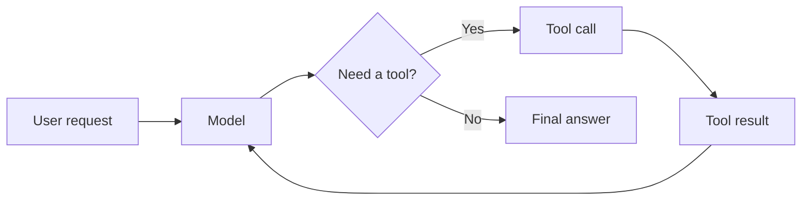
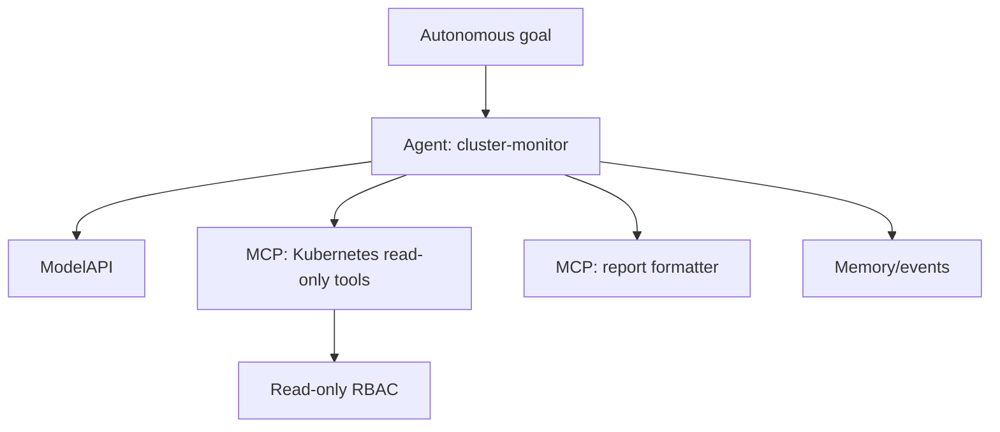

# Autonomous Agents Need an Operating Model, Not Just a Loop

*A practical guide to always-on agents, task state, budgets, cancellation, and Kubernetes-native orchestration, using KAOS v0.4.0 as the worked example.*

---

OpenClaw is an interesting signal for where agentic systems are going.

Not because "an AI assistant that runs all day" is a new idea in isolation. We have had cron jobs, workflow engines, automations, daemons, bots, and background workers for a long time. What is interesting is the combination: a 24/7 agent with local memory, skills, integrations, private self-hosted execution, and a heartbeat-style loop that keeps checking the world even when you are not prompting it.

That is a different shape from the chat UI most people associate with agents.

And OpenClaw is not alone. LangGraph talks about long-running, stateful agents with durable execution. CrewAI frames agents as crews and flows. OpenAI's Agents SDK gives you an agent loop, handoffs, guardrails, sessions, MCP tools, and tracing. Google ADK talks about production agents, graph workflows, evaluation, debugging, and deployment to Cloud Run or GKE. Semantic Kernel brings the Microsoft ecosystem view of agent orchestration and process flows. LlamaIndex and Haystack approach the same problem from the data/retrieval side.

The names differ. The pressure is the same.

We are moving from:

> "Can this agent answer my request?"

to:

> "Can I run many agents, for a long time, with tools, memory, permissions, budgets, debugging, and a way to stop them?"

That second question is the real production problem.

One always-on agent is a fun demo. Ten agents become coordination. A hundred agents become infrastructure. A thousand agents become an operating model.

So in this post I want to explore the thing under the hype: what actually changes when an agentic loop becomes an autonomous workload, and why Kubernetes starts to become relevant once you need to orchestrate many of them. I will use KAOS v0.4.0 as the concrete implementation example, but the goal is not to write KAOS release notes. The goal is to understand the primitives you need whether you use KAOS, OpenClaw, LangGraph, CrewAI, Google ADK, Semantic Kernel, OpenAI's Agents SDK, or a loop you wrote yourself.

## The Useful Part of the Hype

The phrase "autonomous agent" is overloaded enough to be almost useless.

Sometimes it means a personal assistant that keeps working in the background. Sometimes it means a stateful graph workflow. Sometimes it means a coding agent running a long task. Sometimes it means a multi-agent organization with delegation and handoffs. Sometimes it just means "we put `while True` around the model call."

But there is a useful distinction hiding in there.

A normal tool-using agent is usually request/response:

1. User asks a question.
2. Agent calls the model.
3. Model decides whether to use tools.
4. Tools return data.
5. Agent returns an answer.

An autonomous agent breaks the assumption that a human is waiting on the other side of the HTTP response.

The work may continue. The environment may change. The agent may run again. It may call tools repeatedly. It may need to remember what happened last time. It may need to be interrupted. It may need to survive a restart. It may need to run alongside hundreds of other agents that are doing similar things.

This is where the demo starts lying to you.

The hard part is not making the model call itself again. That takes a loop. The hard part is making that loop safe to run when nobody is staring at the terminal.

## AI Agents 101: The Loop Everyone Starts With

Most agent systems begin with a deceptively simple loop:

```python
async def run_agent(messages, tools, max_steps=5):
    for step in range(max_steps):
        response = await model.chat(messages, tools=tools)

        if response.tool_calls:
            for call in response.tool_calls:
                result = await tools[call.name](**call.arguments)
                messages.append({
                    "role": "tool",
                    "tool_call_id": call.id,
                    "content": result,
                })
            continue

        return response.text

    raise RuntimeError("agent exceeded max_steps")
```

This is the core pattern behind a lot of the current wave of agentic software.

The model looks at context, decides it needs a tool, calls the tool, receives the result, and tries again. Maybe it uses one tool. Maybe it chains five. Maybe it delegates to another agent. Maybe it decides it has enough information and returns a final answer.



This loop is powerful, but it is still usually bounded by a request.

You can debug it as one interaction. You can attach one trace. You can return one error. You can put a max-step limit around it. The user is still waiting.

Autonomy starts when that assumption breaks.

## What Changes When the Loop Keeps Running?

The naive autonomous version looks like this:

```python
async def run_autonomous(goal, tools, interval_seconds=60):
    memory = []

    while True:
        messages = [
            {"role": "system", "content": "You are an autonomous worker."},
            {"role": "user", "content": goal},
            *memory[-20:],
        ]

        response = await run_agent(messages, tools)
        memory.append({"role": "assistant", "content": response})

        await sleep(interval_seconds)
```

This is useful as a mental model. It is also not something I would want to deploy.

There is no identity for the work. No state machine. No budget. No cancellation. No inspection path. No ownership model. No persistence story. No scoped task lifecycle. No answer to the question "what is this agent doing right now?"

Once the loop runs without a synchronous caller, the engineering problem changes:

| Request/response agent | Autonomous agent |
| --- | --- |
| User waits for an answer | Work continues after the caller leaves |
| Loop ends with a response | Loop may run periodically or indefinitely |
| Failure is a request error | Failure becomes an operational incident |
| Context can be request-local | Needs task state, memory, and persistence boundaries |
| Tool calls happen inside one request | Tool calls may become ongoing side effects |
| Debugging starts with one trace | Debugging starts with task history, memory, state, and logs |

This is the main thesis:

> Autonomy is not the loop. Autonomy is the operating model around the loop.

That sounds less exciting than "self-directed AI worker." It is also the difference between a useful background agent and a mystery process that spends money while calling tools.

## The Missing Primitive: A Unit of Agent Work

If the agent can keep working after the caller leaves, you need something that can be named, inspected, and controlled.

In practice, that means a task.

```python
class TaskState(str, Enum):
    SUBMITTED = "submitted"
    WORKING = "working"
    COMPLETED = "completed"
    FAILED = "failed"
    CANCELED = "canceled"


@dataclass
class Task:
    id: str
    goal: str
    state: TaskState
    output: str = ""
    history: list[dict] = field(default_factory=list)
    events: list[dict] = field(default_factory=list)
```

This does not look like an AI breakthrough. It looks like ordinary distributed-systems plumbing.

Good.

Production autonomous agents inherit all the boring concerns that make systems operable:

- submission,
- lifecycle state,
- output capture,
- error reporting,
- cancellation,
- retention,
- auditing,
- ownership.

If a user starts a long-running research task and closes the browser, they need a task ID. If an agent monitors a Kubernetes namespace, an operator needs to know whether it is working, stuck, failed, or canceled. If a tool starts returning bad data, you need to know which tasks used it.

The loop is internal. The task is the external contract.

## Budgets Are Not Just About Cost

The first reason people add budgets is usually cost. Model calls and tool calls are not free.

But budgets are also safety controls.

| Budget | What it bounds |
| --- | --- |
| max iterations | runaway reasoning loops |
| max runtime | stuck or excessively long work |
| max tool calls | API pressure and side effects |
| token/cost budget | spend and context growth |
| per-iteration timeout | one blocked tool/model call |

A minimal check can be boring:

```python
def budget_exhausted(budgets, started_at, iteration, tool_calls):
    if budgets.max_iterations and iteration >= budgets.max_iterations:
        return "max_iterations"
    if budgets.max_runtime_seconds and time.monotonic() - started_at >= budgets.max_runtime_seconds:
        return "max_runtime_seconds"
    if budgets.max_tool_calls and tool_calls >= budgets.max_tool_calls:
        return "max_tool_calls"
    return None
```

The design detail that matters is where you check it.

Check between iterations, before another reasoning step or another external tool call. That gives the system a chance to stop before the next side effect.

Again, this is not glamorous. But if you are running many autonomous agents, boring controls compound quickly.

## Cancellation Is the Emergency Brake

If you can start autonomous work but cannot stop it, you have not built a production feature. You have built a trap.

Cancellation should be part of the first version:

```python
async def run_task(task, budgets, cancel_event):
    started_at = time.monotonic()
    iteration = 0
    tool_calls = 0

    task.state = TaskState.WORKING

    while not cancel_event.is_set():
        reason = budget_exhausted(budgets, started_at, iteration, tool_calls)
        if reason:
            task.events.append({"type": "budget.exhausted", "reason": reason})
            task.state = TaskState.COMPLETED
            return task

        output, calls = await run_agent_once(task.goal, task.history)
        task.output = output
        task.history.append({"iteration": iteration, "output": output})
        tool_calls += calls
        iteration += 1

        if calls == 0:
            task.state = TaskState.COMPLETED
            return task

    task.state = TaskState.CANCELED
    return task
```

The important pieces are:

- check cancellation between iterations,
- update visible task state,
- keep enough history to diagnose what happened,
- exit cleanly.

That pattern shows up whether the agent is a personal assistant, a research agent, a cluster monitor, or a coding agent.

## Why OpenClaw, LangGraph, CrewAI, ADK and the Others Point in the Same Direction

This is why the current framework landscape is interesting.

OpenClaw's always-on personal agent framing makes the background nature explicit. It is not just answering a prompt. It is meant to keep a private, self-hosted agent running with memory, integrations, skills, and a heartbeat.

LangGraph approaches the problem as durable, stateful agent orchestration. CrewAI approaches it through crews, flows, memory, guardrails, and human-in-the-loop controls. OpenAI's Agents SDK gives developers a managed loop with sessions, tracing, guardrails, handoffs, and MCP tools. Google ADK frames the problem around production agents, graph workflows, evaluation, debugging, context management, and deployment. Semantic Kernel adds the enterprise application angle with agents and process orchestration. LlamaIndex and Haystack add the retrieval-heavy view of agents that reason over data and tools.

The abstractions are different, but the same primitives keep reappearing:

- state,
- tools,
- memory,
- guardrails,
- tracing,
- human intervention,
- deployment,
- resumability,
- task control.

This is not an accident.

Once agents stop being one-off prompt handlers, frameworks have to become work managers. They need to manage units of agent work, not just model calls.

## Where Kubernetes Enters the Picture

Kubernetes does not make agents intelligent.

It makes them operable.

That distinction matters. A platform cannot guarantee that the model will reason correctly. But it can answer practical questions that become unavoidable when you run many agents:

- Where does each agent run?
- What identity does it have?
- Which tools can it reach?
- Which secrets can it read?
- What network is it allowed to access?
- How do we restart it?
- How do we observe it?
- How do we isolate it?
- How do we scale it?

This is where Kubernetes-native agent orchestration starts to make sense.

The Kubernetes Agent Sandbox project describes the broader shift well: AI workloads are moving from short-lived stateless requests toward coordinated agents that run constantly, maintain context, use tools, execute code, and communicate over longer periods. Its framing around isolated, stateful, singleton workspaces with persistent identity, scratchpads, suspension/resumption, and stable networking is very close to the operating-model problem.

Even if you never use that project directly, the same platform primitives show up:

| Need | Kubernetes primitive |
| --- | --- |
| Run the agent process | Pod, Deployment, Job, custom runtime |
| Define desired state | CRD |
| Reconcile runtime state | Controller/operator |
| Expose an endpoint | Service, Gateway, HTTPRoute |
| Scope tool permissions | ServiceAccount, Role, RoleBinding |
| Store credentials | Secret or external secret manager |
| Store state | PVC, database, Redis, vector store |
| Observe health | probes, metrics, logs, traces |
| Limit resources | requests, limits, quotas |
| Isolate networking | NetworkPolicy |

If OpenClaw is one vision of the always-on agent, Kubernetes is one answer to the fleet question:

> What happens when every team, service, workflow, or tenant wants its own autonomous agents?

At that point you need scheduling, identity, isolation, policy, rollouts, configuration, and observability. In other words, you need the same things we already learned to need for microservices, except the workload is now non-deterministic, tool-using, and stateful.

Great.

We made infrastructure interesting again.

## A Concrete Example: KAOS v0.4.0

To make this less abstract, let's use KAOS v0.4.0 as the worked example.

KAOS is a Kubernetes-native agent orchestration framework. It defines agents, MCP tool servers, and model APIs as Kubernetes resources. In v0.4.0, the project added its autonomous/A2A milestone: task lifecycle, JSON-RPC task methods, autonomous self-looping execution, budgets, cancellation, task history, CLI/UI debugging, and examples.

The useful thing about KAOS here is not that everyone should use it. The useful thing is that it makes the operating model visible.

The example that best captures the pattern is a Kubernetes cluster monitor:

- an agent with a monitoring goal,
- a read-only Kubernetes service account,
- an MCP server exposing Kubernetes tools,
- a reporting tool,
- a model API,
- budgets and task controls,
- an endpoint for async task interaction.

The key part of the Agent configuration looks like this:

```yaml
apiVersion: kaos.tools/v1alpha1
kind: Agent
metadata:
  name: cluster-monitor
spec:
  modelAPI: monitor-modelapi
  model: "smollm2:135m"
  mcpServers:
    - monitor-k8s-mcp
    - monitor-report-mcp
  config:
    description: "Autonomous cluster monitoring agent"
    instructions: |
      You are a Kubernetes cluster monitoring agent.
      List pods, check status, and generate a health report.
    autonomous:
      goal: "Monitor the Kubernetes cluster health. List pods, check their status, and generate a health report."
      intervalSeconds: 60
      maxIterRuntimeSeconds: 120
    taskConfig:
      maxIterations: 5
      maxRuntimeSeconds: 300
      maxToolCalls: 20
```

This is where the abstract pieces become concrete:

- `autonomous.goal` defines the persistent objective.
- `intervalSeconds` controls the loop cadence.
- `maxIterRuntimeSeconds` bounds one iteration.
- `taskConfig` gives bounded defaults for async tasks.
- MCP servers define the tools.
- Kubernetes RBAC defines what those tools can actually access.



Monitoring is a good autonomy use case because the goal persists over time, the environment changes, and the agent needs tools but should be heavily constrained.

That last part matters. The autonomy risk is usually not the text generation. It is the tools.

## Continuous Mode vs Async Task Mode

One design decision in KAOS v0.4.0 is worth copying conceptually: it separates continuous autonomous execution from async task execution.

Continuous mode describes the workload.

An agent is configured with a goal in the Kubernetes resource. When the pod starts, it begins working toward that goal. It is daemon-like: monitoring, checking, reporting, maintaining, watching.

Async task mode describes the caller contract.

A caller sends a task, gets a task ID, and the agent continues working in the background. The caller can later inspect or cancel it.

```json
{
  "jsonrpc": "2.0",
  "method": "SendMessage",
  "id": 1,
  "params": {
    "message": {
      "role": "user",
      "parts": [
        {
          "type": "text",
          "text": "Research recent autonomous agent frameworks and summarize findings."
        }
      ]
    },
    "configuration": {
      "mode": "autonomous"
    }
  }
}
```

Through the KAOS CLI, that becomes:

```bash
kaos agent a2a send researcher \
  --message "Research recent autonomous agent frameworks and summarize findings." \
  --async
```

Then the caller can poll:

```json
{
  "jsonrpc": "2.0",
  "method": "GetTask",
  "id": 2,
  "params": {"id": "task_abc123"}
}
```

Or cancel:

```json
{
  "jsonrpc": "2.0",
  "method": "CancelTask",
  "id": 3,
  "params": {"id": "task_abc123"}
}
```

The naming matters more than it first appears.

Continuous is "this agent exists to keep doing this." Async is "start this unit of work and let me check on it later."

Those are different operating modes, and mixing them tends to create confusing APIs.

## Task State Is Not Memory

Another small but important lesson: task state and memory are not the same thing.

Task state answers:

```text
What is this unit of work doing?
```

Memory answers:

```text
What happened during execution?
```

Task state should be small and stable:

- submitted,
- working,
- completed,
- failed,
- canceled,
- budget exhausted.

Memory can be richer:

- user messages,
- agent responses,
- tool calls,
- tool results,
- delegations,
- observations,
- session history.

If you mix them, your task API becomes noisy and your memory system becomes responsible for lifecycle control. That is a bad trade.

Keep task state external and crisp. Keep memory useful for reasoning and debugging.

## Debugging Many Autonomous Agents

The debugging story changes as soon as the work is no longer attached to one waiting user.

You need to answer:

- What task did I start?
- Is it still running?
- What did it do?
- Which tools did it call?
- What did those tools return?
- Did it hit a budget?
- Can I stop it?

KAOS exposes that through CLI and UI paths:

```bash
kaos agent a2a send <agent> --message "..." --async
kaos agent a2a get <agent> --task-id <id>
kaos agent a2a cancel <agent> --task-id <id>
```

The UI adds agent-card inspection, SendMessage, task viewer, auto-polling, cancellation, task history, and memory conversation views.

This is not just a nice developer experience. It is operational hygiene.

When you scale from one autonomous agent to many, mystery processes become expensive quickly. A background task without inspection is a support ticket waiting to happen.

## How You Could Build the Basics Yourself

You do not need a full framework to understand the minimal shape.

Start with a single-iteration primitive:

```python
async def run_agent_once(goal, history) -> tuple[str, int]:
    messages = build_messages(goal, history)
    response = await run_agent(messages, tools)
    return response.text, response.tool_call_count
```

Then wrap it in the smallest useful control loop:

```python
async def run_autonomous_task(task, budgets, cancel_event):
    started_at = time.monotonic()
    iteration = 0
    tool_calls = 0

    task.state = TaskState.WORKING

    while True:
        if cancel_event.is_set():
            task.state = TaskState.CANCELED
            return task

        reason = budget_exhausted(budgets, started_at, iteration, tool_calls)
        if reason:
            task.events.append({"type": "budget.exhausted", "reason": reason})
            task.state = TaskState.COMPLETED
            return task

        output, calls = await run_agent_once(task.goal, task.history)
        task.output = output
        task.history.append({"iteration": iteration, "output": output})
        tool_calls += calls
        iteration += 1

        if calls == 0:
            task.state = TaskState.COMPLETED
            return task
```

This is not production-ready. It does not handle persistence, retries, distributed workers, authentication, policy, observability, or recovery after process restart.

But it shows the skeleton:

- task identity,
- state transitions,
- budgets,
- cancellation,
- output,
- history,
- completion detection.

If you use an existing framework, look for where these pieces live. If you write your own runtime, add them before the first demo becomes a production dependency.

## When Not to Make It Autonomous

There is a temptation to turn every useful agent into a background process.

Resist that.

Autonomy is helpful when:

- the environment changes over time,
- the goal persists beyond one request,
- the work is too long for a synchronous response,
- the agent can safely observe or act with scoped tools,
- the user benefits from periodic or event-driven progress.

Autonomy is a poor fit when:

- the action is high-risk and lacks approval controls,
- tool permissions are broad or unclear,
- success criteria are vague,
- cancellation is missing,
- progress cannot be inspected,
- cost or side effects are unbounded.

The default should not be "let it run forever."

The default should be "make the loop explicit, bounded, inspectable, and boring enough to operate."

## Deployment Checklist

Before deploying an autonomous agent, ask:

- What is the goal?
- Is this continuous mode or async task mode?
- What starts it?
- What stops it?
- What budgets apply?
- What tools can it call?
- What permissions do those tools have?
- Where is task state stored?
- Where is memory stored?
- What survives restart?
- How do I inspect progress?
- How do I cancel it?
- What telemetry identifies one task/session across model calls and tools?
- What is the human escalation path?
- How many of these agents can run safely at once?
- What happens when ten teams copy this pattern?

That last question is the platform question.

It is also why I think Kubernetes will keep showing up in this conversation. Not because every agent needs Kubernetes. Many do not. But because fleets of autonomous agents eventually become workload orchestration problems.

## Lessons for Production Autonomous Agents

Here are the patterns I would carry into any autonomous-agent system.

### 1. Start with the loop, but design the task contract early

The agentic loop is the easy part to prototype. The task contract is what makes it operable.

### 2. Separate continuous autonomy from bounded background work

An agent that monitors forever and an agent that writes a report in the background need different controls.

### 3. Treat budgets as safety controls

Budgets bound cost, time, tool side effects, API pressure, and runaway reasoning.

### 4. Keep task state separate from memory

Task state is the external lifecycle. Memory is the execution context. Mixing them makes APIs noisy and debugging harder.

### 5. Scope tools with permissions

Autonomy becomes risky through tools. Read-only service accounts, scoped roles, network policy, and secret boundaries matter more than the prompt.

### 6. Build cancellation into the first version

Cancellation is not an advanced feature. It is the operator's emergency brake.

### 7. Use Kubernetes for workload concerns, not reasoning quality

Kubernetes can help with lifecycle, identity, permissions, isolation, networking, rollouts, and observability. It cannot make the model wise.

### 8. Instrument everything

Agent loops are variable, non-deterministic, and tool-heavy. Traces, logs, metrics, task IDs, and memory events are how you understand them later.

## Final Thought

The future autonomous-agent stack will not be defined only by better prompts or smarter models.

It will be defined by the operating layer around the loop.

OpenClaw points at the always-on personal agent. LangGraph, CrewAI, OpenAI Agents SDK, Google ADK, LlamaIndex, Haystack, and Semantic Kernel point at different parts of the same convergence. KAOS v0.4.0 is one Kubernetes-native implementation of the workload side of that convergence.

The interesting question is no longer whether an agent can call tools and loop.

The interesting question is whether we can run many of them without losing control.

Calling the model again is easy.

Operating the loop is where the real system begins.

## References

- OpenClaw docs: <https://clawdocs.org/>
- LangGraph overview: <https://docs.langchain.com/oss/python/langgraph/overview>
- CrewAI docs: <https://docs.crewai.com/>
- OpenAI Agents SDK: <https://openai.github.io/openai-agents-python/>
- Google Agent Development Kit: <https://google.github.io/adk-docs/>
- Semantic Kernel overview: <https://learn.microsoft.com/en-us/semantic-kernel/overview/>
- LlamaIndex agents: <https://docs.llamaindex.ai/en/stable/use_cases/agents/>
- Haystack agents: <https://docs.haystack.deepset.ai/docs/agents>
- Kubernetes Agent Sandbox: <https://kubernetes.io/blog/2026/03/20/running-agents-on-kubernetes-with-agent-sandbox/>
- KAOS v0.4.0 release: <https://github.com/axsaucedo/kaos/releases/tag/v0.4.0>
