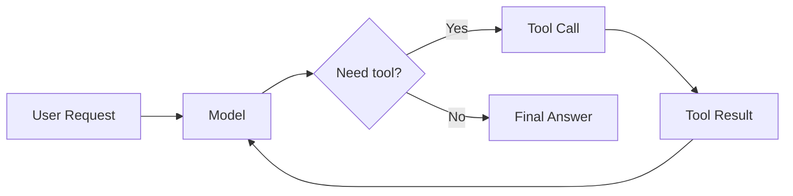
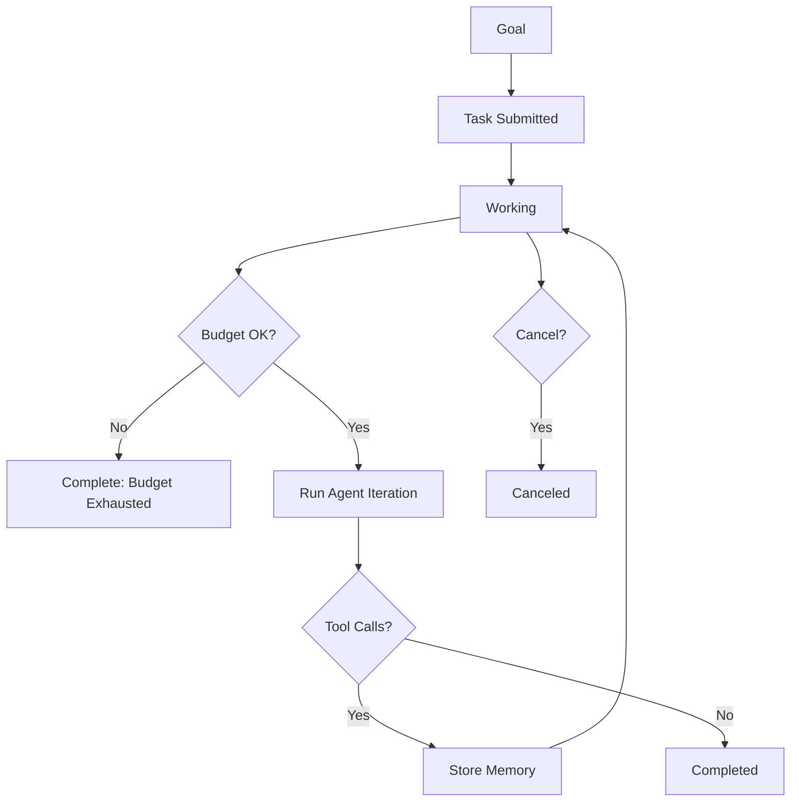
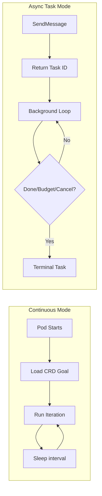
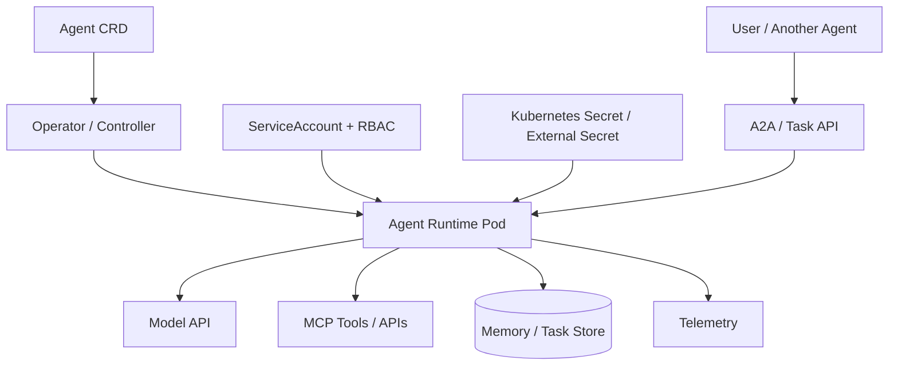
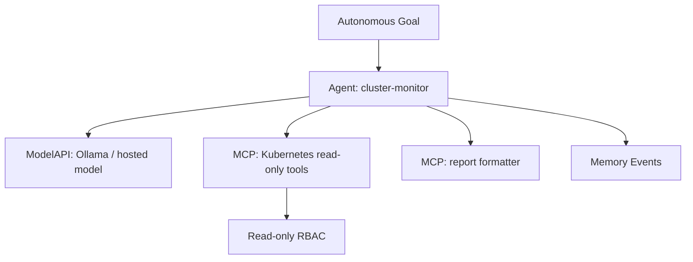

# Image and Visual Plan

The final article should be diagram-rich like the OTel post, but visuals should clarify the broader autonomous-agent engineering story rather than advertise KAOS.

## Visual 1: Basic Agentic Loop

Purpose:

Show the baseline loop before autonomy.

Diagram:

Caption:

> A basic agentic loop is still request/response: the model calls tools until it can answer.

## Visual 2: Autonomous Loop with Control Plane

Purpose:

Show the new operational pieces.

Caption:

> Autonomy is the control plane around the loop: task state, budgets, memory, and cancellation.

## Visual 3: Continuous vs Async Task Mode

Purpose:

Show the article's central distinction.

Caption:

> Continuous mode is a daemon-like workload. Async task mode is a bounded background job with a caller-visible task contract.

## Visual 4: Kubernetes Autonomous-Agent Architecture

Purpose:

Explain why Kubernetes is relevant.

Caption:

> Kubernetes does not solve reasoning, but it provides lifecycle, identity, permissions, secrets, networking, and observability for autonomous workloads.

## Visual 5: KAOS Cluster Monitor Case Study

Purpose:

Show the practical example.

Caption:

> A practical autonomous agent needs a goal, tools, permissions, model access, memory, and a way to inspect output.

## Screenshots to Capture If Environment Is Available

Optional, not blocking:

1. KAOS UI agent list with autonomous badge.
2. Agent detail page showing autonomous config.
3. A2A debug screen with agent card and SendMessage.
4. A2A task viewer with task state/history.
5. Memory conversation view showing tool calls/results.

## Optional GIF

Mirror the OTel post style with a short GIF:

1. Open Agent detail page.
2. Send async A2A message.
3. Watch task state update.
4. Open task history.
5. Open memory view.

Caption:

> Sending and inspecting an autonomous A2A task through the KAOS UI.

## Visual Style

- Prefer clean Mermaid diagrams for conceptual sections.
- Use screenshots only for KAOS-specific sections.
- Keep captions explanatory.
- Avoid visuals that require the reader to already know KAOS.

