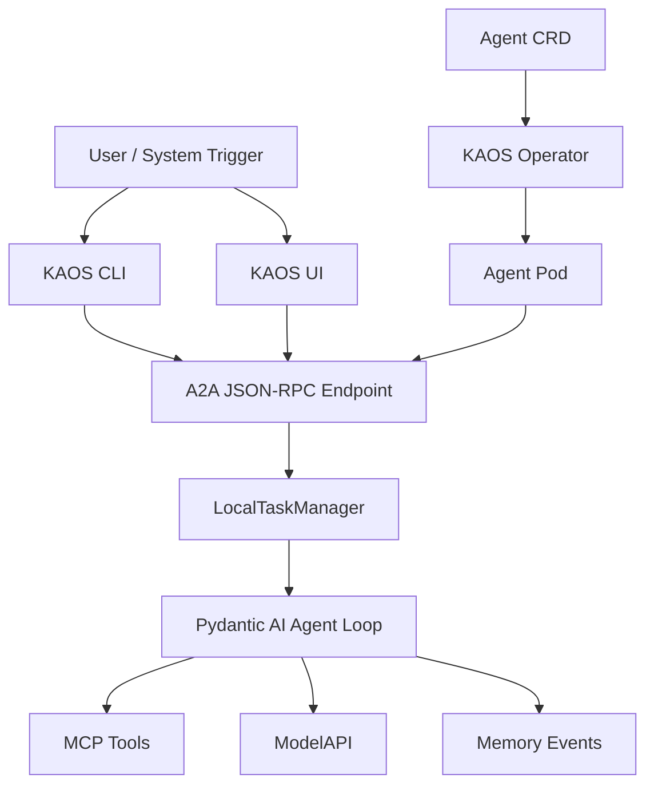

# KAOS Autonomous Architecture Overview

This document summarizes KAOS v0.4.0 as the concrete implementation case study for the article.

## Architecture at a Glance



## Core Runtime Components

### `AgentServer`

Source: `pydantic-ai-server/pais/server.py`

Responsibilities:

- Exposes health and readiness probes.
- Exposes OpenAI-compatible `/v1/chat/completions`.
- Exposes A2A discovery at `/.well-known/agent.json`.
- Mounts A2A JSON-RPC routes.
- Starts autonomous execution during lifespan startup if an autonomous goal is configured.
- Shuts down running tasks, sub-agent clients, MCP connections, and memory.

Article use:

AgentServer is the bridge between traditional request/response serving and autonomous workload behavior.

### `TaskManager` / `LocalTaskManager`

Source: `pydantic-ai-server/pais/a2a.py`

Responsibilities:

- Create task IDs and session IDs.
- Retain task state in memory.
- Validate state transitions.
- Run synchronous A2A messages.
- Submit autonomous background tasks.
- Track running asyncio tasks for cancellation.
- Record OpenTelemetry task metrics/spans when telemetry is enabled.

Article use:

This is the clearest implementation of the "task contract" concept.

### `RemoteAgent`

Source: `pydantic-ai-server/pais/serverutils.py`

Responsibilities:

- Fetch remote agent cards.
- Detect whether the remote agent supports JSON-RPC A2A.
- Use A2A `SendMessage` for delegation when possible.
- Fall back to `/v1/chat/completions` when A2A is unavailable.
- Inject OpenTelemetry trace context into outbound calls.

Article use:

Autonomous and multi-agent systems need both protocol adoption and graceful fallback.

## Continuous Autonomous Mode

Continuous mode is configured through the Kubernetes Agent CRD.

```yaml
apiVersion: kaos.tools/v1alpha1
kind: Agent
metadata:
  name: cluster-monitor
spec:
  modelAPI: monitor-modelapi
  model: smollm2:135m
  mcpServers:
    - monitor-k8s-mcp
    - monitor-report-mcp
  config:
    autonomous:
      goal: "Monitor the Kubernetes cluster health. List pods, check their status, and generate a health report."
      intervalSeconds: 60
      maxIterRuntimeSeconds: 120
```

Runtime behavior:

1. Operator converts CRD config into environment variables.
2. Agent pod starts.
3. `AgentServer` sees `AUTONOMOUS_GOAL`.
4. `TaskManager.submit_autonomous()` starts a background loop with `AutonomousConfig`.
5. Each iteration runs the agent toward the goal.
6. The loop sleeps for `intervalSeconds`.
7. The loop continues until pod shutdown, cancellation, or unrecoverable failure.

Good fit:

- Monitoring.
- Maintenance.
- Scheduled checks.
- Ongoing operational reports.
- Inbox or queue watching.

Important distinction:

Continuous mode does not have an overall iteration/runtime/tool-call budget. It has per-iteration controls.

## A2A Async Task Mode

A2A async task mode is request-triggered:

```json
{
  "jsonrpc": "2.0",
  "method": "SendMessage",
  "id": 1,
  "params": {
    "message": {
      "role": "user",
      "parts": [{"type": "text", "text": "Research recent AI agent frameworks and summarize findings"}]
    },
    "configuration": {
      "mode": "autonomous"
    }
  }
}
```

CLI equivalent:

```bash
kaos agent a2a send researcher \
  --message "Research recent AI agent frameworks and summarize findings" \
  --async
```

Runtime behavior:

1. Caller sends an A2A request.
2. Runtime returns a task object instead of blocking until all work finishes.
3. Caller polls `GetTask` or uses the UI task viewer.
4. The background loop checks budgets.
5. The loop exits when no more tool calls are made, a budget is exhausted, the task is canceled, or execution fails.

Good fit:

- Research jobs.
- Report generation.
- Long-running analysis.
- Multi-step workflows initiated by users or other agents.

## Task and Memory Boundary

KAOS v0.4.0 clarifies two layers:

| Layer | Question | Examples |
| --- | --- | --- |
| Task state/events | What state is this unit of work in? | submitted, working, completed, failed, canceled, budget exhausted |
| Memory | What happened during execution? | user message, agent response, tool call, tool result, delegation |

This distinction should be presented as a design lesson.

## Debugging Surfaces

### CLI

Commands:

```bash
kaos agent a2a send <agent> --message "..." [--async]
kaos agent a2a get <agent> --task-id <id>
kaos agent a2a cancel <agent> --task-id <id>
```

### UI

Components added in v0.4.0:

- `AgentA2ADebug`
- `A2AAgentCard`
- `A2ASendMessage`
- `A2ATaskViewer`
- `AgentMemory`
- `MemoryConversationView`

Capabilities:

- inspect agent cards,
- send messages,
- start async work,
- poll task state,
- cancel tasks,
- view task history,
- inspect memory as conversation.

Article use:

These surfaces demonstrate that autonomy needs a human control plane.

## Kubernetes-Specific Lessons

KAOS demonstrates several Kubernetes-native autonomy patterns:

1. **Autonomy as desired state**: the Agent CRD defines the goal and loop settings.
2. **Operator-owned wiring**: the controller translates CRD fields into pod configuration.
3. **Tool permissions through RBAC**: the cluster-monitor sample uses read-only Kubernetes permissions.
4. **Runtime as pod**: autonomous work inherits Kubernetes lifecycle semantics.
5. **Debugging through service proxy/port-forward/UI**: operators can interact without bespoke infrastructure.

## What to Use in the Article

Best examples:

- Basic agentic loop -> KAOS `_run_agent(message, session_id) -> (response_text, tool_call_count)`.
- Minimal task model -> KAOS `Task`, `TaskState`, `TaskStatus`.
- Budget checks -> KAOS `TaskBudgets`.
- Continuous mode -> Agent CRD `autonomous.goal`.
- Async mode -> A2A `SendMessage` + `--async`.
- Human control -> UI task viewer and CLI cancel.
- Kubernetes opportunity -> cluster-monitor sample with RBAC and MCP tools.

