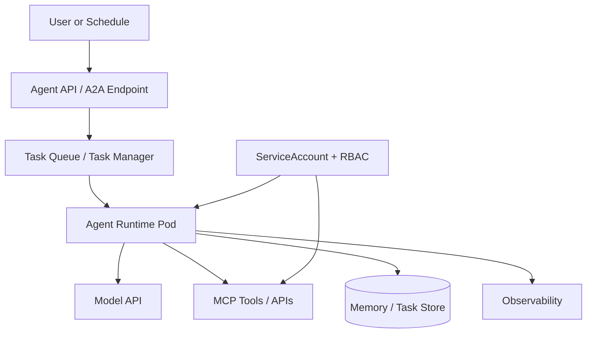

# Kubernetes Opportunity for Autonomous Agents

This document captures why Kubernetes is relevant to autonomous agents and how the article should frame the opportunity.

## The Shift: From Function Call to Workload

The Kubernetes Agent Sandbox blog summarizes the shift clearly: generative AI started as short-lived, stateless model calls, but the ecosystem is moving toward coordinated agents that run constantly, maintain context, use tools, execute code, and communicate with one another.

Source: <https://kubernetes.io/blog/2026/03/20/running-agents-on-kubernetes-with-agent-sandbox/>

That shift makes Kubernetes relevant because autonomous agents start to look like workloads:

- they have identity,
- they need lifecycle management,
- they use network and storage,
- they need secrets and permissions,
- they need isolation,
- they may be idle and then burst,
- they need observability,
- they need operator control.

## Kubernetes Strengths

Kubernetes is useful not because it understands reasoning, but because it already solves many workload problems:

| Need | Kubernetes primitive |
| --- | --- |
| Run the agent process | Pod / Deployment / Job / custom runtime |
| Define desired state | CRD |
| Reconcile runtime state | Controller/operator |
| Expose agent endpoint | Service / Gateway / HTTPRoute |
| Scope tool permissions | ServiceAccount / Role / RoleBinding |
| Store credentials | Secret / external secret manager |
| Store state | PVC / database / Redis / vector DB |
| Observe health | probes, metrics, logs, traces |
| Limit resources | requests/limits/quotas |
| Isolate network | NetworkPolicy |
| Scale workers | HPA / KEDA / custom autoscaler |

## The Abstraction Gap

Traditional Kubernetes primitives are not always a perfect fit for autonomous agents.

The Agent Sandbox project frames AI agents as isolated, stateful, singleton workloads that need:

- persistent identity,
- secure scratchpads,
- code execution isolation,
- suspension/resumption,
- stable networking,
- scale-to-zero / rapid resume patterns.

Source: <https://kubernetes.io/blog/2026/03/20/running-agents-on-kubernetes-with-agent-sandbox/>

This supports the article's Kubernetes thesis:

> Kubernetes is a strong substrate, but autonomous agents need higher-level abstractions on top of it.

KAOS is one such abstraction for agent orchestration. Agent Sandbox is another emerging abstraction for isolated agent workspaces.

## CRDs as Autonomy Contracts

A CRD can express:

- the agent's model,
- the tools it can use,
- the goal it should pursue,
- loop interval,
- iteration limits,
- task budgets,
- telemetry settings,
- memory configuration,
- network exposure.

This is more useful than raw container configuration because it lets platform teams reason about intent.

Example concept:

```yaml
kind: Agent
spec:
  modelAPI: monitor-modelapi
  mcpServers:
    - kubernetes-tools
  config:
    autonomous:
      goal: "Monitor cluster health and summarize unhealthy workloads."
      intervalSeconds: 60
      maxIterRuntimeSeconds: 120
    taskConfig:
      maxIterations: 5
      maxRuntimeSeconds: 300
      maxToolCalls: 20
```

## Operators as Lifecycle Control

An operator can:

- validate configuration,
- create deployments/services/routes,
- inject env vars,
- wire model APIs and tools,
- set RBAC/service accounts,
- update status,
- reconcile drift.

For autonomous agents, reconciliation matters because the desired behavior may be ongoing, not a one-time start command.

## RBAC and Tool Permissions

Autonomous agents should not receive broad cluster credentials.

Pattern:

1. Create a ServiceAccount for the agent or tool runtime.
2. Bind only the verbs/resources needed.
3. Prefer read-only access for monitoring examples.
4. Separate dangerous write tools from read tools.
5. Use namespace boundaries where possible.

KAOS v0.4.0's cluster-monitor sample follows the right shape: a read-only role over pods, services, events, namespaces, deployments, and replicasets for the monitoring tool.

## Secrets and Identity

Agents often need:

- model provider API keys,
- SaaS API tokens,
- database credentials,
- cloud credentials,
- tool-specific secrets.

Best practices:

- scope secrets per agent or per tool,
- avoid baking secrets into images,
- rotate credentials,
- use external secret managers for production,
- prefer workload identity where the platform supports it,
- keep generated tool/code execution isolated from secrets unless explicitly required.

## State and Memory

Autonomous agents may need several kinds of state:

| State | Storage option |
| --- | --- |
| Task state | in-memory for demo, Redis/Postgres for production |
| Conversation memory | local memory, Redis, database |
| Long-term facts | vector DB / document store |
| Scratch workspace | PVC / sandbox volume |
| Audit trail | logs/traces/events |

The article should be honest: KAOS v0.4.0's local task manager is a good implementation case study, but production-grade cross-pod task durability would require a durable backend.

## Autoscaling Patterns

Autonomous agents do not always scale like stateless web APIs.

Possible scaling signals:

- task queue depth,
- number of active tasks,
- model/tool latency,
- CPU/memory,
- token budget consumption,
- pending scheduled work,
- warm sandbox pool size.

KEDA or custom controllers may be more appropriate than CPU-only HPA for some agent workloads.

## Observability

A Kubernetes-native autonomous agent should expose:

- task metrics,
- loop iteration metrics,
- tool-call metrics,
- model-call latency,
- error/cancel counts,
- traces across model/tool/delegation calls,
- logs correlated with task/session IDs.

The prior KAOS OpenTelemetry article is a natural companion. This article should reference observability as a prerequisite for autonomy, not re-explain the full OTel stack.

## Deployment Pattern for the Article

Use this example architecture:



Then show KAOS as one concrete realization:

- Agent CRD = desired autonomous behavior.
- Operator = reconciliation.
- Agent pod = runtime.
- A2A = task protocol.
- MCP = tool boundary.
- Memory = execution inspection.
- UI/CLI = human control.

## Bottom Line

Kubernetes does not make agents smart. It makes autonomous agents operable:

- deployable,
- inspectable,
- isolated,
- permissioned,
- restartable,
- observable,
- scalable.

That is the opportunity the article should communicate.

