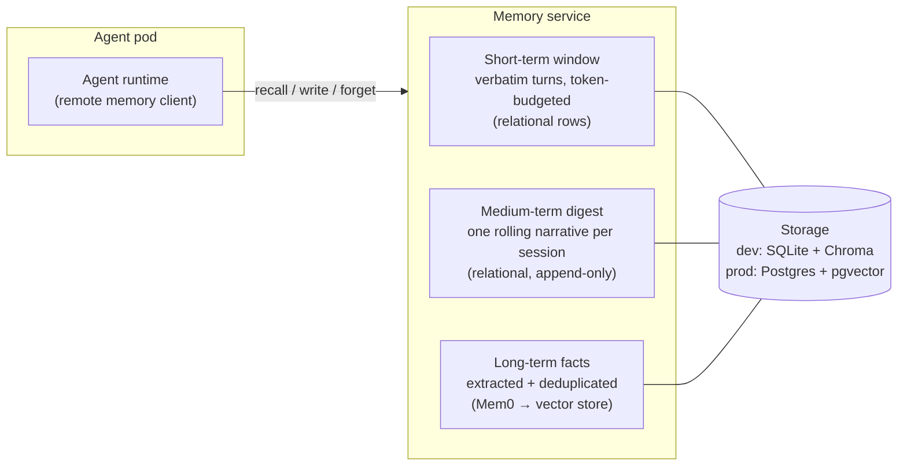
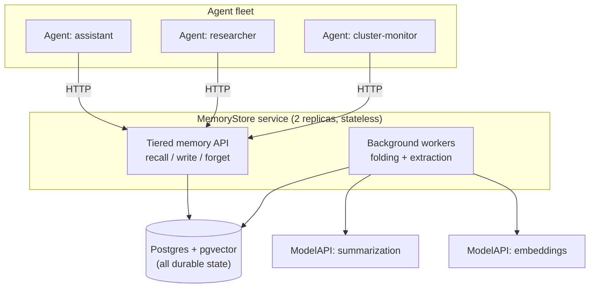
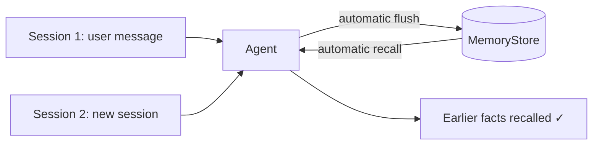

_A practical guide to memory tiers, multi-tenant scoping, engine selection, and Kubernetes-native memory infrastructure — using KAOS as the worked example._

---

There is a rush across the agentic ecosystem to fix the same embarrassing problem: agents are goldfish. Every session starts from zero, every hard-won fact evaporates when the conversation ends, and the "personal assistant" you configured yesterday greets you today like a stranger.

The ecosystem's answer has been an explosion of dedicated memory layers — [Mem0](https://github.com/mem0ai/mem0), [Zep/Graphiti](https://github.com/getzep/graphiti), [Letta (MemGPT)](https://www.letta.com/), [Cognee](https://github.com/topoteretes/cognee), [Memobase](https://github.com/memodb-io/memobase), the [Redis Agent Memory Server](https://github.com/redis/agent-memory-server) — plus memory features landing natively in [OpenAI's products](https://openai.com/index/memory-and-new-controls-for-chatgpt/), [LangGraph](https://docs.langchain.com/oss/python/langgraph/overview), [CrewAI](https://docs.crewai.com/introduction), and [Google ADK](https://google.github.io/adk-docs/).

As part of building the Kubernetes Agent Orchestration System (KAOS), we went through this journey end to end: a research phase surveying ~38 tools, a scored selection, a set of architecture decision records, and an implementation that now ships as a `MemoryStore` resource that any agent can bind to. Along the way we hit most of the traps — narrative digests shredded into vector fragments, scope models that leak across tenants, memory backends that take serving agents down with them.

In this post we want to share those learnings. As with our previous posts on [observability for agentic systems](https://hackernoon.com/production-observability-for-multi-agent-ai-with-kaos-otel-signoz) and [autonomous always-on agentic patterns](https://hackernoon.com/), we will use KAOS as the concrete implementation example, but the goal is for the primitives — tiers, scopes, folding, degradation — to be useful whether you use KAOS, Mem0 directly, LangGraph, CrewAI, or a memory layer you wrote yourself.

## The Useful Part of the Hype

"Memory" is one of the most overloaded words in agentic systems, so it is worth being precise about what it is *not*.

Memory is not the context window — that is working state for one model call. It is not RAG — that is retrieval over a corpus the agent did not produce. It is not session history — that is a transcript, not knowledge. And it is not task state — as we argued in the [autonomous agents post](https://hackernoon.com/), task lifecycle is an external contract, while memory is the execution context the agent reasons with. Mixing these gives you noisy APIs and a memory system responsible for lifecycle control.

The research literature gives us a more useful taxonomy, echoing how [MemGPT](https://arxiv.org/abs/2310.08560) framed the OS-style memory hierarchy and how [Generative Agents](https://arxiv.org/abs/2304.03442) framed reflection over an event stream:

| Memory type | What it holds | Example |
| --- | --- | --- |
| Short-term / working | verbatim recent turns of the live conversation | "the user just said port 8080" |
| Episodic | records of specific past events | "on Tuesday the deploy failed twice" |
| Semantic | distilled, durable facts | "the user prefers blue-green deploys" |
| Procedural | learned skills and how-tos | "here is how we roll back this service" |
| Temporal | facts with validity intervals | "Alice *was* on-call until March" |

But the distinction that matters most in practice is simpler, and it is the one that gets conflated constantly:

**Conversational continuity** — the agent remembers what was said three turns ago — is a *same-session* problem. **Learned knowledge** — the agent remembers what it figured out last week — is a *cross-session* problem. They feel like one feature ("the agent remembers things") but they need different machinery, different storage, and different lifecycle rules. Most of the design mistakes we made early came from treating them as one thing.

## Memory 101: The Version Everyone Starts With

Almost every agent system starts with the same memory implementation:

```python
memory = []

async def handle_message(user_message):
    memory.append({"role": "user", "content": user_message})
    response = await run_agent(memory[-20:], tools)
    memory.append({"role": "assistant", "content": response})
    return response
```

A list, a slice, done. And to be honest about our own history: the original KAOS memory was exactly this — an in-process `deque` bounded by `maxlen`, replaying the last N events into the prompt. It worked fine, right up until it didn't.

The second version everyone builds is "just embed everything":

```python
async def handle_message(user_message):
    hits = await vector_store.search(embed(user_message), top_k=5)
    context = "\n".join(h.text for h in hits)
    response = await run_agent([context, user_message], tools)
    await vector_store.add(embed(user_message), user_message)
    return response
```

Both are useful mental models. Neither survives contact with production:

| Naive memory | Production memory |
| --- | --- |
| Last-N turns, unbounded token growth | Token-budgeted window with principled eviction |
| Verbatim replay of everything | Distilled facts, separated from the transcript |
| One user, one process | Many tenants, many agents, many replicas |
| Memory lives inside the agent pod | Memory survives restarts and is shared across the fleet |
| Writes block the response | Extraction runs off the hot path |
| Nothing is ever forgotten | Decay, retention, and right-to-erasure |
| Memory failure crashes the turn | Memory failure degrades the turn |

Which brings us to the thesis of this post:

> Memory is not a vector database bolted onto an agent. Memory is a tiered, scoped, degradable subsystem — and the hard part is not storing memories, it is deciding who sees them, when they fold, and how the agent behaves when memory fails.

## What Changes at Scale: The Fleet Questions

A single hobby agent can get away with the naive version. The problem changes shape the moment you run many agents, for many users, across many sessions — the same inflection point we described for [autonomous agents](https://hackernoon.com/), where the loops that never stop are also the ones producing memory events 24/7.

At that point, a set of questions becomes unavoidable:

- **Whose memory is it?** The agent's? The user's? The team's? The whole fleet's?
- **Who is allowed to recall it?** And critically — can a model-controlled tool call *choose* which scope it reads from?
- **What happens to a serving agent when the memory backend dies?** Does the agent go down with it?
- **Where does extraction run?** Distilling facts requires LLM calls. Do they run on the request path, while the user waits?
- **How do you delete a user's memory everywhere, on demand?** Across every tier, every store, every replica?

Notice that none of these are machine-learning questions. They are tenancy, topology, and failure-mode questions — the same "ordinary distributed-systems plumbing" that showed up when we made agent loops autonomous. The model is the least of your problems.

## Choosing an Engine: Build, Adopt, or Wrap

Before designing anything, we surveyed the landscape properly — roughly 38 tools, from dedicated memory layers to vector substrates to framework-native memory. Most of them fell to three hard filters:

1. **Self-hostable in a customer Kubernetes cluster.** This removes SaaS-only options (Mem0 Platform, Zep Cloud, Letta Cloud, OpenAI memory) as primary choices, though their OSS counterparts stay in scope.
2. **A dedicated memory layer** — not a bare substrate (pgvector, Qdrant, Chroma, Neo4j are backend choices *within* a design, not the design), and not a whole agent framework whose memory you can only get by adopting a second runtime.
3. **Actively maintained.**

That left a shortlist chosen deliberately for architectural diversity — five genuinely different answers to the same question:

| Candidate | Architecture | License | Store | Notable strength | Notable cost |
| --- | --- | --- | --- | --- | --- |
| [Mem0](https://github.com/mem0ai/mem0) | vector-first fact extraction | Apache-2.0 | Qdrant / pgvector / others | most adopted, cleanest library integration | no OTel, app-level isolation only |
| [Zep / Graphiti](https://github.com/getzep/graphiti) | temporal knowledge graph | Apache-2.0 | Neo4j / FalkorDB | richest model: provenance, time-aware invalidation | heaviest to operate, costliest writes |
| [Cognee](https://github.com/topoteretes/cognee) | hybrid graph + vector | Apache-2.0 | pluggable | multi-tenancy + OTel built in | early, heavy, churn-prone API |
| [Memobase](https://github.com/memodb-io/memobase) | profile-first | Apache-2.0 | Postgres + Redis | cheapest write path, no embedding on hot path | profile-only recall, weak self-hosted multi-tenancy |
| [Redis Agent Memory Server](https://github.com/redis/agent-memory-server) | two-tier working + long-term | MIT | Redis | the two-tier model mirrors what agents actually need | young project, no OTel |
| Build it yourself | whatever you design | — | whatever you run | perfect fit, zero new deps | every capability built and maintained in-house |

We then scored these against twelve criteria derived from actual requirements — long-term capability coverage, retrieval quality, Kubernetes deployability, infrastructure delta, integration fit, multi-tenancy, observability, licensing, maturity, and write-path cost. The full matrix is too long for a blog post, but the reading of it is the useful part:

**No candidate dominates.** The graph-first leaders (Graphiti, Cognee) buy the most capability at the highest operational cost — you are importing a graph database and an LLM-heavy ingestion pipeline. The low-delta options (Redis AMS) buy fit at maturity cost. Building it yourself buys perfect fit at the cost of rebuilding mature extraction and retrieval that already exists under permissive licenses.

We selected **Mem0 as the long-term engine — as a library, behind our own interface**. It maximized capability with the lowest integration friction, the strongest ecosystem maturity, and pluggable backends. But the equally important half of the decision is the second clause, because it reflects what production systems actually do:

> You are not choosing a memory product. You are choosing which 60% you don't have to build — and signing up to build the rest.

Agent frameworks like Pydantic AI provide message history, not memory; surveying production systems shows the norm is an external engine wrapped behind the application's own contract, not adopted wholesale. And every gap you accept in the selection becomes your integration layer. For Mem0 that meant: it has no OpenTelemetry — we instrument every operation ourselves; its tenant isolation is application-level — we enforce scope in our service, fail-closed; it has no Kubernetes packaging — the operator deploys it like any other KAOS component; and it has **no short-term tier at all** — which turned out to be a feature, as the next section explains.

## The Three Tiers

Here is the memory architecture that KAOS converged on. An agent binds to a store and talks to one service; behind that one contract sit three tiers with very different characters:



- **Short-term** is the verbatim recent-turn window: session-scoped, plain relational rows, no embeddings. It is bounded by a **token budget** — not a turn count — because the context window is the real constraint, and turns vary wildly in size. This tier is also the fallback when everything else is on fire.
- **Medium-term** is a single rolling narrative digest per session: when older turns fall out of the window, they are folded into a summary so continuity survives eviction. Append-only and versioned.
- **Long-term** is where the engine earns its keep: Mem0 extracts atomic facts from evicted turns, deduplicates and revises them, and serves them back by semantic relevance, across sessions, keyed by scope.

The tier that generated the most debate — and the insight we would most want you to take away — is the medium-term digest:

> **Keep the narrative digest OUT of the vector store.** An extraction engine like Mem0 decomposes input into atomic, individually-revisable facts, because that is what vector retrieval wants. A rolling digest is the opposite: a coherent narrative whose value *is* its continuity. Index it into the engine and you shred the story into fragments and pollute semantic search with summary-of-summary noise. The digest is stored as a plain relational row and injected verbatim at recall time; only the raw evicted turns are handed to the engine for fact extraction.

The second design rule that pays for itself daily: **folding and extraction are always off the write path.** The active window is computed lazily on read. When a compaction threshold is crossed, folding older turns into the digest and handing them to Mem0 for extraction happen as background work. The user is already waiting on one LLM; they should never wait on the memory system's LLM too.

And in the spirit of honesty about scope: temporal (bi-temporal validity) and procedural (skill) memory are deliberately **deferred** in KAOS — they are real tiers with real value, but they want a graph/temporal engine like Graphiti underneath, and shipping them half-baked on a vector store would be worse than not shipping them. The committed set is short-term plus a unified semantic-and-episodic long-term store.

## Scopes: Whose Memory Is It Anyway?

Every memory operation in a multi-tenant fleet needs an answer to "whose memory?" — and the answer has to be structural, not a convention. KAOS lands on a deliberately flat model: a single `scope` value per agent, mapped by the service onto exactly one owner key.

| `scope` | Owner key | Who shares it |
| --- | --- | --- |
| `private` (default) | `agent_id = <the agent's own identity>` | only this agent |
| `user` | `user_id = <principal>` | every agent serving the same user |
| `shared` | `agent_id = "kaos:shared"` (reserved sentinel) | every agent on the same store |
| `session` | `run_id = <session id>` | one conversation |

Two design choices here did more work than we expected.

**The store is the group.** We never built a "memory group" resource. The set of agents bound to the same `MemoryStore` *is* the sharing boundary, and the four scope levels already express agent-private, per-user, fleet-shared, and per-session memory within it. When we drafted a richer model — hierarchical scope paths, group CRDs, membership indirection — every version added authorization machinery that the flat model plus deployment topology already covered.

**Isolation strength is a deployment choice, not a code path.** The default is one shared store with scope filtering. If a tenant needs hard guarantees, you deploy them their own `MemoryStore` — now their data is not co-located at all, and no filtering defect *can* leak across tenants. There is no isolation-mode flag; there is just how many stores you run.

And then there is the rule that we would put in bold in any memory system's security review:

> **Never let the model choose the scope.** Scope is derived server-side from the authenticated agent identity and request context — never from model- or tool-supplied arguments. When the agent's `search_memory` tool fires, the model supplies the *query*; the service supplies the *scope*. Enforcement is fail-closed: an operation that cannot resolve a usable owner key fails, rather than falling through to an unscoped query over everyone's memories.

One more property worth checking in whatever store you use: the scope filter must be applied **inside** the vector query, not as a post-filter. Pre-filtered search means a tenant's relevant memories are never silently dropped because an unfiltered nearest-neighbour window filled up with other tenants' vectors. We validated this against both Chroma and pgvector before committing to the design.

Finally, scope is also where right-to-erasure lives: a single `forget` operation fans out synchronously across all three tiers — the session's short-term rows, the medium-term digests, and the scope-filtered long-term facts — in one pass. If you cannot answer "delete everything you know about this user" with one operation, you have a compliance incident waiting for a trigger.

## Kubernetes Enters the Picture: Memory as Infrastructure

So far everything has been framework-agnostic. Now for the part where running fleets makes the topology decision for you.

The first fork in the road: does the memory engine run **inside every agent** (as a library) or as a **central service**? Embedding is seductive — no new workload, no network hop. We rejected it, and the reasons compound with fleet size: extraction's LLM calls land on the serving process; every agent replica opens its own datastore connections; every agent image carries the engine and its dependencies; and replicas of the same agent silently diverge in what they remember. Centralizing inverts all four:



In KAOS this is declared as a `MemoryStore` resource, and the operator deploys and operates the service:

```yaml
apiVersion: kaos.tools/v1alpha1
kind: MemoryStore
metadata:
  name: shared-memory
spec:
  engine: mem0
  storage:
    type: external          # or "local" for dev: Chroma + SQLite on a PVC
    external:
      provider: pgvector
      connectionSecretRef:
        name: pgvector-dsn
        key: dsn
  models:
    summarization:
      modelAPI: my-modelapi
      model: gpt-4o-mini
    embedding:
      modelAPI: my-modelapi
      model: text-embedding-3-small
```

Two storage modes cover the dev-to-prod arc: `local` packs embedded Chroma plus a SQLite short-term table into one container on a PersistentVolume — a single-replica, zero-external-dependency on-ramp — while `external` puts long-term vectors *and* the short-term table on the same Postgres, which makes the service stateless and lets it run two replicas behind a disruption budget. Note the models are references to `ModelAPI` resources, not provider keys: the memory system is an LLM consumer like any other component, and it should go through the same gateway, quotas, and observability as everything else.

But the design decision we would defend hardest is the failure contract:

> **Memory is augmentation, not a dependency.** A memory outage should degrade an agent, never stop it.

Concretely, in KAOS: **recall is always soft** — if the long-term tier is unavailable, recall returns short-term-only context and the turn proceeds; a recall failure can never fail a user's request. Writes honour a configurable `soft | strict` failure mode (soft tolerates and retries in the background; strict surfaces the error for agents where an unrecorded fact is unacceptable). A store outage flips a *running* agent to a `MemoryDegraded` condition while it keeps serving on its short-term window — only *initial creation* waits for the store to be ready, so an agent never starts life degraded but also never dies from memory loss.

One deliberately contrarian call to close the section: background extraction is **in-process fire-and-forget — there is no durable job queue.** A bounded executor, bounded retries, graceful drain on shutdown, and that's it. The justification is quantitative, not aspirational: turn latency is dominated by the model call, the short-term tier is the durable record from which extraction can always be recomputed, and a lost extraction costs one fact-distillation, not data. A durable at-least-once queue is a recorded follow-up to build *if measurement ever shows it is needed* — resisting the reflex to build Kafka-shaped infrastructure before the failure mode has been observed even once.

The rationale at a glance — the format we wish more architecture write-ups used:

| Decision | Why |
| --- | --- |
| Central service, engine as a library | thin agents, extraction isolated from serving, one connection pool, no replica divergence |
| KAOS owns short/medium tiers relationally | cheap append-and-scan; a narrative digest must not be shredded into vector fragments |
| Flat four-value scope, no group CRD | the store is the group; deployment topology expresses isolation |
| Server-side, fail-closed scope | scope is non-spoofable; unresolved scope never widens to an unscoped query |
| Token budgets, not turn counts | the context window is the real constraint |
| Fire-and-forget extraction, no queue | turn latency is LLM-dominated; durability built only when measured |
| Memory is augmentation | an outage degrades, never stops, an agent |

## Worked Example: Memory Across Sessions

Let's make it concrete with the flow every memory-enabled KAOS agent gets automatically — recall before the run, persist after it:



Deploy a store and bind an agent to it (a `local`-mode store, so this runs on any cluster with no external database):

```yaml
apiVersion: kaos.tools/v1alpha1
kind: Agent
metadata:
  name: memory-agent
spec:
  modelAPI: memory-modelapi
  model: gpt-4o-mini
  config:
    instructions: |
      You are a helpful assistant with long-term memory. Remember facts the
      user tells you and recall them in later conversations.
    memory:
      type: remote
      memoryStore: shared-memory
      scope: shared
      tools: all
      failureMode: soft
```

Session 1 — tell the agent a fact. An ordinary chat request; the runtime persists the conversation to the central store after the run:

```bash
kaos agent invoke memory-agent -m "My favourite deployment port is 8080"
```

Now verify the integration by asking the **memory service** directly, rather than trusting the agent's word for it:

```bash
kubectl port-forward svc/memorystore-shared-memory 18080:8080 &
curl -s http://localhost:18080/v1/recall \
  -H 'content-type: application/json' \
  -d '{"scope": {"level": "shared"}, "query": "deployment port", "include_short_term": true}'
```

The response contains the turn we just sent — proof the write path works. Then open a **completely new session**:

```bash
kaos agent invoke memory-agent -m "What deployment port did I choose earlier?"
```

The automatic recall pulls the earlier turns from the store and injects them before the model runs — the agent answers from memory it was never handed in this session. Recall from the service again and both sessions' turns are there: one cross-session memory, read and written by both.

On top of that automatic baseline, the `tools` knob hands the *model* explicit memory tools:

| `tools` | Exposed | The model can… |
| --- | --- | --- |
| _(unset)_ | none | rely purely on automatic recall/persist |
| `read` | `search_memory` | look facts up mid-reasoning |
| `write` | `save_memory` | distil and save a durable fact on demand |
| `all` | both | save and search explicitly |

And note what the tools do **not** take: a scope. The model supplies queries and content; the service derives the scope from the agent's identity — the fail-closed rule from earlier, applied at the tool boundary where it matters most.

## How You Could Build the Basics Yourself

As with the autonomous loop, you don't need a framework to understand the minimal shape. Tiered memory is a wrapper around the agent run:

```python
async def run_with_memory(session_id, user_message, memory, agent):
    # 1. RECALL — assemble the memory block (never let this fail the turn)
    try:
        window = await memory.window(session_id, token_budget=4000)
        digest = await memory.digest(session_id)
        facts = await memory.search(scope=memory.scope, query=user_message, top_k=5)
    except MemoryError:
        window, digest, facts = await memory.window_only(session_id), None, []

    context = build_memory_block(digest, facts)   # structured block, injected once

    # 2. RUN
    response = await agent.run(context, window, user_message)

    # 3. PERSIST — append is cheap and synchronous; distillation is not
    await memory.append(session_id, user_message, response)

    # 4. FOLD + EXTRACT — always off the response path
    if await memory.over_budget(session_id):
        background(memory.fold_and_extract, session_id)

    return response
```

The skeleton shows the load-bearing choices: recall wrapped so failure degrades instead of raising; the digest and facts injected as one structured block rather than fake conversation turns; the cheap verbatim append on the hot path; and the expensive fold-and-extract pushed to the background the moment the token budget trips.

What it deliberately does not show — and what you must add before this becomes a production dependency: server-side scope enforcement, the erasure fan-out across tiers, the soft/strict write contract, OpenTelemetry on every operation, and a service boundary so a fleet shares one memory instead of one process hoarding it.

## When NOT to Add Long-Term Memory

Like autonomy, memory has become a checkbox feature, and the temptation is to switch it on for everything. Long-term memory earns its cost when:

- users or goals persist across sessions and personalization compounds,
- a fleet of agents benefits from shared operational knowledge,
- agents run [always-on autonomous loops](https://hackernoon.com/) — the biggest memory producers and consumers, since nobody is there to repeat the context to them,
- the same facts keep being re-established at the start of every session.

It is a poor fit when:

- interactions are genuinely single-shot — session history already covers it,
- you cannot yet answer the erasure question — memory without deletion is a liability, not a feature,
- tenancy boundaries are unclear — every memory becomes a potential leak across them,
- you cannot afford the extraction cost — every remembered conversation is additional LLM calls,
- an outage of the memory path would be treated as an outage of the agent — if memory is a hard dependency in your design, redesign before you scale.

## Lessons for Production Agentic Memory

Here are the patterns we would carry into any agentic memory system.

### 1. Memory is augmentation, not a dependency

Design the outage path first: recall degrades to the short-term window, writes retry in the background, and a memory outage never takes a serving agent down.

### 2. Separate conversational continuity from learned knowledge

Same-session verbatim windows and cross-session distilled facts are different tiers with different stores, lifecycles, and failure modes — conflating them is the root of most memory design mistakes.

### 3. Keep narrative digests out of the vector store

Extraction engines shred input into atomic facts; a rolling summary's value is its continuity. Store digests relationally, inject them whole, and feed the engine raw turns only.

### 4. Never let the model choose the scope

Derive scope server-side from authenticated identity, fail closed, and make sure the filter runs inside the vector query — a tool call should only ever be able to touch memory its agent is entitled to.

### 5. The store is the group

Sharing topology can be a deployment choice instead of an authorization system: scope filtering within a store, physical isolation by deploying a store per tenant.

### 6. Keep extraction off the hot path

The user is already waiting on one LLM call; never make them wait on the memory system's LLM too. Append synchronously, distil in the background.

### 7. Adopt the engine, own the contract

Wrap the memory engine behind your own interface. Every gap in the engine you select — observability, isolation, packaging — becomes your integration layer, so choose the gaps you know how to fill.

### 8. Budget memory in tokens, not turns

The context window is the real constraint and turns vary wildly in size. Token budgets belong to the same family of safety controls as the iteration and cost budgets from the autonomous post.

### 9. Build erasure before you need it

"Forget everything about this user" must be one operation that fans out across every tier. Retrofitting it across a live system is far harder than designing it in.

## Closing: Boring Memory

In the observability post we argued the goal is *boring debugging*; for autonomy, that the loop is easy and the operating model is the work. Memory completes the trilogy, and the shape of the lesson is the same.

The extraction models and retrieval tricks will keep improving underneath you. What makes agent memory production-grade is none of that — it is the tiered structure, the non-spoofable scopes, the degradation contract, the background write path, and the one-shot erasure. Plumbing, in other words.

If your memory system is boring — if a store outage is a degraded condition instead of an incident, if "whose memory is this?" has a structural answer, if deletion is one operation — then your agents get to be the interesting part.

That's the bar.

---

### Appendix: Quick Checklist

**Tiers**
- [ ] short-term window bounded by tokens, not turns
- [ ] rolling digest stored relationally, injected whole — never indexed into the vector store
- [ ] long-term facts extracted in the background, deduplicated, scope-keyed

**Scoping**
- [ ] scope derived server-side from authenticated identity — never from model/tool arguments
- [ ] fail-closed: unresolvable scope fails rather than widening
- [ ] scope filter applied inside the vector query (pre-filtered, not post-filtered)
- [ ] physical isolation available by deploying separate stores

**Degradation**
- [ ] recall is always soft — falls back to short-term-only
- [ ] write failure mode explicit (soft with retry / strict surface)
- [ ] memory outage degrades serving agents, never removes them

**Operations**
- [ ] extraction and folding off the response path
- [ ] memory's LLM/embedding calls routed through the same model gateway as agents
- [ ] every memory operation emits telemetry (see the observability post)
- [ ] erasure fans out across all tiers in one operation
