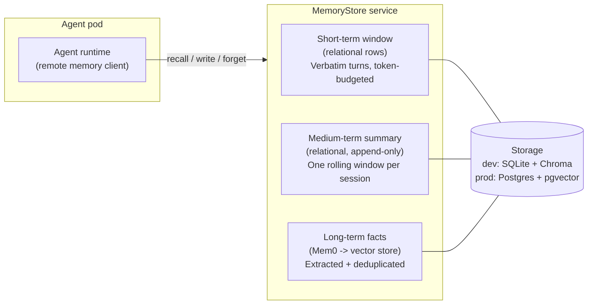
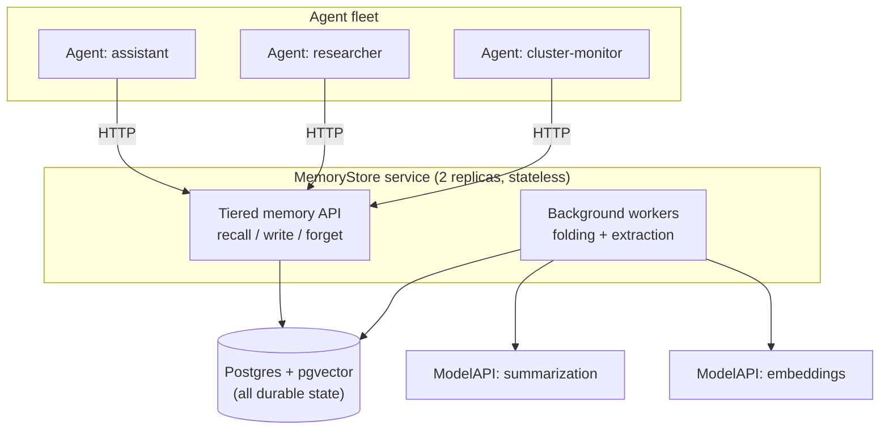
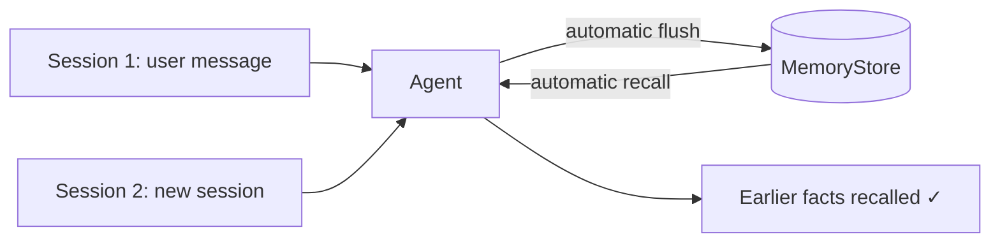

_A practical guide to memory tiers, multi-tenant scoping, engine selection, and Kubernetes-native memory infrastructure, using KAOS as the worked example._

---

LLMs are stateless by design, and without added memory logic every session starts from zero. 

A number of dedicated memory layers have emerged (and continue emerging almost daily) to tackle this, each with different approaches and tradeoffs. Which one should you adopt?

Recently I spent some time extending the Kubernetes Agent Orchestration System (KAOS) to support multi-tiered memory persistence (aka short-, medium- and long-term memory). Along the way I hit most of the same issues that anyone would whilst building or integrating multi-tiered memory into an agentic system, so I thought it would be useful to compile all the learnings, design choices and examples. 

Hopefully this post is useful for anyone looking to do this on their own project.

This post includes the research findings from exploring ~38 tools, including tools like [Mem0](https://github.com/mem0ai/mem0), [Zep/Graphiti](https://github.com/getzep/graphiti), [Letta (MemGPT)](https://www.letta.com/), [Cognee](https://github.com/topoteretes/cognee), [Memobase](https://github.com/memodb-io/memobase), [Redis Agent Memory Server](https://github.com/redis/agent-memory-server), as well as native implementations in [OpenAI's products](https://openai.com/index/memory-and-new-controls-for-chatgpt/), [Claude](https://claude.com/blog/memory), [LangGraph](https://docs.langchain.com/oss/python/langgraph/overview), [CrewAI](https://docs.crewai.com/introduction), and [Google ADK](https://google.github.io/adk-docs/), among many others.

I also share the learnings and best practices that came out of navigating through a large number of architecture tradeoffs, and getting my hands dirty on the implementation that now ships as a distributed, highly available, and scalable `MemoryStore` resource that any agent can bind to. 

As with my previous posts on [observability for agentic systems](https://hackernoon.com/production-observability-for-multi-agent-ai-with-kaos-otel-signoz) and [autonomous always-on agentic patterns](https://hackernoon.com/), I will use KAOS as the concrete implementation example, but the goal is to provide practical intuition for the primitives (tiers, scopes, folding, degradation), so that it applies whether you use KAOS, Mem0 directly, LangGraph, CrewAI, or a memory layer you wrote yourself.

## A Working Taxonomy of Agent Memory

"Memory" is one of the most overloaded words in agentic systems, so it is worth separating it from the concepts it gets conflated with, such as:

- The **context window**, which holds working state for a single model call.
- **Session history**, which holds an auditable transcript of what was said.
* **Prompt telemetry**, which holds the specific prompts relative to events in the system.

To be more precise we can look at Princeton University's paper on [Cognitive Architectures for Language Agents (CoALA)](https://arxiv.org/abs/2309.02427) to provide a more precise definition for "Memory" in agentic systems. We can define "Memory" as the component that holds the short-, medium- and long-term information an agent carries across turns and sessions to inform its reasoning.

This research paper quoted also provides a useful taxonomy for "memory types" that we will use to reason about the latter sections. This includes the memory types for episodic, semantic, procedural and temporal memory. 

These memory types are also mentioned in the Berkeley paper that released [MemGPT](https://arxiv.org/abs/2310.08560), as well as how the Stanford paper on large-scale LLM simulations [Generative Agents: Interactive Simulacra of Human Behavior](https://arxiv.org/abs/2304.03442) structured their memory event stream.

The formal definition of these memory types (+ a few examples) is outlined as follows:

| Memory type          | What it holds                                  | Example                                                     |
| -------------------- | ---------------------------------------------- | ----------------------------------------------------------- |
| Short-term (working) | verbatim recent turns of the live conversation | "the user just said port 8080"                              |
| Episodic             | records of specific past events                | "on Tuesday the deploy failed twice"                        |
| Semantic             | distilled, durable facts                       | "the user prefers blue-green deploys"                       |
| Procedural           | learned skills and how-tos                     | "here is how we roll back this service"                     |
| Temporal             | facts with validity intervals                  | "Joe *was* in a relationship until March, but not anymore." |

In practice what I found out however is that most frameworks only implement a small number of these, namely **short-term** is always present, **episodic and semantic** are bundled (the only difference is whether time is preserved), **procedural** tends to be present mainly in coding agents (eg creating skills, commands, extensions), and **temporal** tends to be replaced with "forgetting memory" functionality instead, or embedded with episodic/semantic.

These appear more informally defined as:
* **Conversational continuity**: The agent remembers what was said three turns ago; a *same-session* problem. 
* **Learned knowledge**: The agent remembers what it figured out last week; a *cross-session* problem. 

For example, frameworks like [LangGraph](https://docs.langchain.com/oss/python/langgraph/persistence) separate thread-scoped checkpointers from a cross-thread store. Another example is [Letta](https://docs.letta.com/guides/core-concepts/memory/memory-blocks), which separates always-in-context memory blocks from an archival tier. 

Most of the design mistakes I made early came from either trying to tackle all of these "memory-types" separately, by bundling sub-optimally, or by oversimplifying too much. 

But before we dive into the implementation, let's cover the basics.

## Memory 101: The Version Everyone Starts With

Almost every agent system starts with the same memory implementation:

```python
memory = []

async def handle_message(user_message):
    memory.append({"role": "user", "content": user_message})
    response = await run_agent(memory[-20:], tools)
    memory.append({"role": "assistant", "content": response})
    return response
```

And to be honest, the original KAOS memory was exactly this. It was an in-process queue with a max length, which ensured it was replaying the last N events into the next prompt.

The second version everyone builds is "just embed everything":

```python
async def handle_message(user_message):
    hits = await vector_store.search(embed(user_message), top_k=5)
    context = "\n".join(h.text for h in hits)
    response = await run_agent([context, user_message], tools)
    await vector_store.add(embed(user_message), user_message)
    return response
```

This is better, but this is not memory in the form that we introduced eariler, it is just a better search mechanism across the prompt history.

Another tempting alternative as the next step is "context windows are huge now, just replay everything". 

However this is not a great approach, and there are some benchmarks like [UCLA's Bench on Long-Term Interactive Memory](https://arxiv.org/abs/2410.10813), which showed that models reasoning over full ~115K-token interaction histories lose 30-60% accuracy versus the same models given oracle retrieval. 

If we look at it from a feature / functionality standpoint, we can summarise the gaps between the base and the production implementation as follows:

| Naive memory                         | Production memory                                                      |
| ------------------------------------ | ---------------------------------------------------------------------- |
| Last-N turns, unbounded token growth | Token-budgeted window with principled eviction                         |
| Verbatim replay of everything        | Distilled facts, separated from the transcript (eg long- / short-term) |
| One user, one process                | Many tenants, many agents, many replicas                               |
| Memory lives inside the agent pod    | Memory survives restarts and is shared across the fleet                |
| Writes block the response            | Extraction runs off the hot path                                       |
| Nothing is ever forgotten            | Decay, retention, and right-to-erasure                                 |
| Memory failure crashes the turn      | Memory failure degrades the turn                                       |

In this case we can position "production memory" a tiered, scoped, context-specific and dynamic store, as opposed to purely a vector database connected to an agent. 

Achieving this in a way that scales does get complex, as we need to decide who can see each memory tier, when we store facts, and how the agent behaves when memory fails. 

However now that we have the conceptual foundation in place, we can start looking at these functionalities relative to the frameworks available.

## Choosing an Engine: Build, Adopt, or Wrap

Before designing anything, I surveyed the landscape thoroughly, assessing dozens of tools across three tiers, and we will cover the scope, approach and learnings in this section, starting with an overview of all the tiers as follows.

**Tier 1: Dedicated memory frameworks.** 
This tier encompasses purpose-built frameworks whose whole job is agent memory. From the longer list, we reduced it to the actively maintained ones:

| Candidate | Approach | Store | Strength | Weakness |
| --- | --- | --- | --- | --- |
| [Mem0](https://github.com/mem0ai/mem0) | extracts facts from conversations into a vector store and recalls them by similarity | Qdrant, pgvector, others | most adopted, cleanest library integration | no OTel, tenant isolation only at application level |
| [Zep / Graphiti](https://github.com/getzep/graphiti) | builds a temporal knowledge graph where facts carry validity intervals and provenance | Neo4j or FalkorDB | richest memory model, time-aware fact invalidation | heaviest to operate, costliest writes |
| [Cognee](https://github.com/topoteretes/cognee) | combines a knowledge graph with vector search, populated by an extract-and-load pipeline | LanceDB by default, Postgres or Neo4j optional | multi-tenancy and OTel built in | early stage, heavy dependencies, changing API |
| [Memobase](https://github.com/memodb-io/memobase) | maintains structured user profiles and event timelines, with no embeddings on the hot path | Postgres + Redis | cheapest write path | profile-only recall, weak self-hosted multi-tenancy |
| [Redis Agent Memory Server](https://github.com/redis/agent-memory-server) | serves two memory tiers (working and long-term) behind one REST API | Redis | the two-tier model mirrors what agents actually need | young project, no OTel |

What this tier taught me is that the architectural differences are really differences in recall pattern and write cost. Vector-first designs answer "what do we know about X" cheaply, graph-first designs answer "how did this fact change over time" at the price of an LLM-heavy ingestion pipeline plus a graph database. The profile-first designs answer "who is this user" with no embeddings on the hot path at all, and the two-tier designs bake in the working-versus-long-term split directly. 

There were also clear shared gaps, mainly at the infrastructure level; none of them enforces tenant isolation below the application level, and almost none ships OpenTelemetry, so whichever one you pick, scope enforcement and observability become your integration work. That shared gap shaped the KAOS design more than any individual feature did.

It's also worth noting that several of these libraries also offer an enterprise tier, so it was important to validate that basic features are not gated behind a paywall (similar to what we previously experienced with Google ADK and Vertex). More specificaly [Mem0's own platform-versus-OSS documentation](https://docs.mem0.ai/platform/platform-vs-oss) gates temporal reasoning, memory decay, webhooks, export, analytics, and auto-scaling behind the managed platform, and [Zep draws the line](https://www.getzep.com/platform/graphiti/) at governed multi-tenancy and compliance, with the OSS Graphiti engine giving you a single context graph to run yourself. The pattern across vendors is that the memory algorithms are open while the operational maturity is the commercial product, which previews the exact layer a platform adopting one of these engines has to build.

**Tier 2. Agent frameworks with native memory.** 
This tier encompasses the embedded memory functionality across end-to-end agentic frameworks, and included the usual suspect / popular frameworks like [LangGraph's Store and LangMem](https://docs.langchain.com/oss/python/langgraph/persistence), [CrewAI memory](https://docs.crewai.com/introduction), [LlamaIndex memory](https://docs.llamaindex.ai/), [Google ADK](https://google.github.io/adk-docs/)'s MemoryService, and the [Microsoft Agent Framework](https://github.com/microsoft/agent-framework). These were reviewed for their design choices, but adopting one for its memory means importing a second agent runtime next to your own, so they served as references and not as candidates.

The learning from this tier is actually what they all had in common. Every framework independently separates session-scoped state and cross-session knowledge, such as how LangGraph has thread-scoped checkpointers versus its cross-thread Store. 

There was also a clear separation between "local playground" and "production grade" when it comes to memory for all frameworks. 

* [LangGraph](https://docs.langchain.com/oss/python/langgraph/add-memory): In-memory store is for development, but it's recommended to use a database-backed checkpointer and store for production. 
* [Google ADK](https://adk.dev/sessions/memory/): Heavier paywall, as it only offers the `InMemoryMemoryService` as open source, but anything serious would need to use Vertex AI. 
* [Microsoft Agent Framework](https://learn.microsoft.com/en-us/agent-framework/get-started/memory): Defaults to an in-memory context provider and ships first-party.
* Cosmos: Checkpoint storage plus a first-party `Mem0ContextProvider`
* CrewAI: Community documented replacing its native store with Mem0 after hitting redeploy and user-isolation gaps. 

Also interesting learnings from coding agents:

* [OpenClaw](https://docs.openclaw.ai/reference/AGENTS.default): layers markdown memory files (`MEMORY.md`, dated notes, per-skill `SKILL.md`) and runs a "Skill Workshop" where the agent proposes new skills from successful conversations for human approval. 
* [Hermes agent](https://github.com/NousResearch/hermes-agent/blob/main/website/docs/user-guide/features/skills.md): Uses skills explicitly as procedural memory, which are auto-proposed after repeated successful tool-call patterns, carry semver versions bumped on each self-improvement, and follow an anti-sediment principle where a skill should get shorter and sharper over time.

Native memory is increasingly an extensible interface where the shipped default is a placeholder, which means memory is being externalized by design across the ecosystem, and the dominant production pattern is framework plus engine. This is something that we had to take into consideration as well.

**Tier 3. Managed and commercial services.** 
This tier included commercial services with managed memory platforms, which provided insights on the broader design of the system and the interactions with the memory, as opposed to just the design of the memory capability itself. These included the [Mem0 Platform](https://mem0.ai/), [Zep Cloud](https://www.getzep.com/), [Letta Cloud](https://www.letta.com/), [OpenAI memory](https://openai.com/index/memory-and-new-controls-for-chatgpt/), and [Google's Vertex Memory Bank](https://docs.cloud.google.com/vertex-ai/generative-ai/docs/agent-engine/memory-bank/overview). 

The learnings from this tier were also quite helpful to undersand some of the architectural and feature tradeoffs that were done at the platform level. Every managed platform has the same two-layer model: namely 1) an explicit, user-curated layer (eg. OpenAI's saved memories, Claude's editable memory summary) that is visible/available at the surface, and that is build on top of; 2) an automatically inferred and consolidated layer (eg. OpenAI's chat-history reference, Vertex Memory Bank's LLM extraction with per-scope deduplication and contradiction checks) where the memory store/retrieval algorithms live.

There was however a clear distinction on the scope in which memory is available across each platform: For Claude, memory scope is per project, in Vertex scope is per identity with configurable memory "topics", and Zep scopes per subject graph. None of them defaults to one global memory per account, which makes it clear that there is a design decision required on the isolation boundary.

#### Conclusions from Surveying the Ecosystem

Given the review was done in context of KAOS, the lens / considerations through which these were reviewed included the following non-exhaustive list:
* Long-term capability coverage
* Retrieval quality
* Embeddability as a library
* Pluggable storage backends
* Infrastructure delta / overhead
* Multi-tenancy hooks
* Observability
* Licensing
* Maturity
* Write-path cost

Based on these, the library that clearly stood out was **Mem0**. At least at the time of writing, Mem0 maximized the features and capabilities with the lowest integration friction. Mem0 also has the strongest ecosystem maturity, and pluggable stores. 

It's however worth noting that despite Mem0 being the right choice for this context, one learning that may seem obvious in retrospect was that **there is no "Perfect Candidate".** The graph-first leaders (Graphiti, Cognee) have the most features but at the highest cost. Low-delta options (Redis AMS) buy fit at maturity cost. Building it yourself buys allows you to have all the features and fit, but at the cost of rebuilding mature extraction and retrieval that already exists under permissive licenses.

This also applies to the numbers the frameworks publish about themselves. Interestingly enough, Mem0's own research supports that extraction-based memory improves latency and cost, however it does not improve raw accuracy: in [Mem0's own evaluation](https://arxiv.org/abs/2504.19413) on LoCoMo, a full-context baseline beats Mem0 on raw accuracy (72.9% vs 66.9%), while memory buys a 91% cut in p95 latency (1.44s vs 17.1s) and over 90% fewer tokens per conversation. At fleet scale that trade is exactly right, since you cannot ship 17-second turns and 26K-token replays, but it is a trade you should make knowingly.

As part of this, despite Mem0 being the strongest choice, it became clear that **adopting a memory engine means choosing which 60% of the system you do not have to build, and committing to build the remaining 40% around it**. 

For Mem0, this meant working on the bridge to close some of the gaps, particularly at the infrastructure and interoperability layer. These included:

* Enabling telemetry by instrumenting every operation and ensure correlation+consistency with the broader KAOS telemetry.
* Introduce tenant isolation, as this is enforced at the Mem0 application level, so enforce scope through the memory service.
* Bundle up the kubernetes packaging to ensure high availability and scalability as a distributed service.
* Bridge the short- and medium-term memory with a native integration with the Pydantic AI server that we have built as part of KAOS.

Based on these initial decisions we were able to proceed with the architectural choices at the end-to-end agent level.

## Designing our Memory Architecture: The Three Tiers

As we now locked the decision to go forward with Mem0 as the memory library, we can move to the broader design architecture for the distributed memory tiers in KAOS.

Based on the requirements we have in we needed to support basically three tiers, a short-term window, a medium-term summary and long-term "facts". These are intuitively used as follows: 
 
 [TODO: Convert to table]
 
- **Short-term memory** is the session window, basically the context of the conversation itself. It is bounded by a **token budget** analogous to how you would see this in your coding agent. This tier is also the fallback when the long-term store is unavailable.
- **Medium-term memory** is the rolling summary that is triggered when the short-term window reaches its **context limit**. This is analogous to what you see in your agentic coding agent when compaction triggers, which is [research backed as effective](https://arxiv.org/abs/2308.15022). In this case we also refer to it as medium term as we also store each summary meaning that it can be accessed.
- **Long-term memory** is the **"atomic facts"** that can be extracted from the conversation, which are stored semantically as vectors, and available across sessions, keyed by scope. Retrieval is also ranked by relevance-importance-recency as per the [Stanford research shared previously](https://arxiv.org/abs/2304.03442).

Defining these tiers allow us to formalise the following design decisions:

* Long-term memory functionality is enabled via Mem0; short- and medium-term memory are custom; These three tiers should cohesively integrate as a single interoperable unit.
* Medium- and long-term extraction **is lossy**. T There's definitely some interesting approaches where [we could enable provenance](https://arxiv.org/abs/2605.04897), however I decided to keep this out of scope at least for now.
* Medium- and long-term extraction are always **off the write path**; when compaction threshold is crossed, as opposed to in every insert [TODO: link here where mem0 also recommends this].
* Temporal (bi-temporal validity) and procedural (aka skill persistence) memory are deliberately **deferred** in its explicit form; but achievable through the long-term memory.

This allowed the actual distributed design to land on a service that offers the short-, medium- and long-term memory tiers through a single coherent interface; **"The MemoryStore Service".




We will cover more on the `MemoryStore` service in the kubernetes section below, but before we do that, we need to talk about another important (+ tricky) topic; access scopes.

## Scopes: Whose Memory Is It Anyway?

Every memory operation in a multi-tenant fleet needs an answer to "whose memory?". The answer has to come from the structure of the system instead of from purely convention. 

In KAOS the choice was to go for a deliberately flat model: a single `scope` value per agent, mapped by the service onto exactly one owner key, as follows:

[TODO: i've updated the scope names as these are not intuitive; let's reflect this in the rest of the blog post. ALso let's discuss if we need to update in the codebase]

| `scope`   | Owner key                    | Who shares it                         |
| --------- | ---------------------------- | ------------------------------------- |
| `session` | `run_id = <session id>`      | Only this conversation session        |
| `agent`   | `agent_id = <agen identity>` | Only this agent.                      |
| `user`    | `user_id = <user identity>`  | Every agent serving the same user.    |
| `group`   | `agent_id = "kaos:shared"`   | Every agent + user in the same group. |

This scope is probably the obvious choice; the important question that arises here is, how do we enable this "shared memory" functionality? There are multiple flavours in which this can be achieved:

[TODO: restructure these bulletpoints to cohesive]
* Multiple Groups per MemoryStore; This would require... multiple shared groups... multitenency supported in mem0... api functionality for segregation... etc... tradeoffs: ... [TODO: expand, also add other actions]
* One Group per MemoryStore; ... tradeoffs... [TODO: quote how mem0 managed platform also approaches like this, or quote othres; also do this for the one above]
* [TODO: if relevant add other options]

Based on the tradeoffs, it was decided to go for one group per MemoryStore. This means that the four scope levels are supported via the same store. 

[TODO: this is not true is it? As it uses the same postgres database; is it the case that we are saying it's a differnt table? Let's clarify this if it's the case. Make a proposal.]
The strength of tenant isolation turned out to be an architectural tradeoff that goes beyond the code implementation, and is expressed through deployment topology. Namely if a tenant needs hard guarantees, you deploy them their own `MemoryStore`, so their data is not co-located at all and no filtering defect can leak across tenants. There is no isolation-mode flag, only the choice of how many stores you run.

This is beneficial as also diving into this space, it was clear that memory is now a documented attack surface. There's a few interesting papers like [AgentPoison](https://arxiv.org/abs/2407.12784) that show the impact of poisoning memory (ie 0.1% poisoned memory yields over 80% attack success), as well as [MINJA](https://arxiv.org/abs/2503.03704) which shows that an attacker needs no write access at all, because if the agent writes its own memory from conversations then every user is a write path.

Now that we have sorted the tiers and the access scopes, we can move forward to the end-to-end platform implementation.

[TODO: The next two paragraphs I no longer see how they fit. Review and make a proposal if they still do. but should be max a sentence or a few words on an existing sentence. REview how papers have been updated to fit.]

One more property worth checking in whatever store you use is that the scope filter must be applied **inside** the vector query instead of as a post-filter. The failure mode is silent, as shown in [a concrete pgvector demonstration](https://dev.to/franckpachot/no-pre-filtering-in-pgvector-means-reduced-ann-recall-1aa1) where an HNSW query asked for 15 filtered results returned only 11, because post-filtering discards non-matching candidates from a fixed search window. Engines like [Qdrant apply the tenant filter inside the graph traversal](https://qdrant.tech/documentation/manage-data/multitenancy/) for exactly this reason. Pre-filtered search means a tenant's relevant memories are never silently dropped because the nearest-neighbour window filled up with other tenants' vectors. I validated this against both Chroma and pgvector before committing to the design.

Finally, scope is also where right-to-erasure lives. A single `forget` operation fans out synchronously across all three tiers in one pass, deleting the session's short-term rows, the medium-term digests, and the scope-filtered long-term facts. Note that this is a genuinely different operation from temporal supersession, since a bi-temporal engine *invalidates* superseded facts but keeps them for history and audit, while right-to-erasure must *destroy* them everywhere, derived projections included. If you cannot answer "delete everything you know about this user" with one operation, you have a compliance incident waiting for a trigger.

## Kubernetes Enters the Picture: Memory as Infrastructure

So far everything has been framework-agnostic. Now for the part where running fleets makes the topology decision for you.

The first fork in the road is whether the memory engine runs **inside every agent** (as a library) or as a **central service**. Embedding the engine looks attractive at first, since it adds no new workload and no network hop. I rejected it, and the reasons compound with fleet size: extraction's LLM calls land on the serving process, every agent replica opens its own datastore connections, every agent image carries the engine and its dependencies, and replicas of the same agent silently diverge in what they remember. Centralizing inverts all four:



In KAOS this is declared as a `MemoryStore` resource, and the operator deploys and operates the service:

```yaml
apiVersion: kaos.tools/v1alpha1
kind: MemoryStore
metadata:
  name: shared-memory
spec:
  engine: mem0
  storage:
    type: external          # or "local" for dev: Chroma + SQLite on a PVC
    external:
      provider: pgvector
      connectionSecretRef:
        name: pgvector-dsn
        key: dsn
  models:
    summarization:
      modelAPI: my-modelapi
      model: gpt-4o-mini
    embedding:
      modelAPI: my-modelapi
      model: text-embedding-3-small
```

Two storage modes cover the dev-to-prod arc: `local` packs embedded Chroma plus a SQLite short-term table into one container on a PersistentVolume (a single-replica, zero-external-dependency on-ramp), while `external` puts long-term vectors *and* the short-term table on the same Postgres, which makes the service stateless and lets it run two replicas behind a disruption budget. Note the models are references to `ModelAPI` resources instead of provider keys, so the memory system is an LLM consumer like any other component and goes through the same gateway, quotas, and observability as everything else.

But the design decision I would defend hardest is the failure contract:

> **Memory is augmentation and not a hard dependency**, so a memory outage should degrade an agent and never stop it.

Concretely, in KAOS, **recall is always soft**. If the long-term tier is unavailable, recall returns short-term-only context and the turn proceeds, so a recall failure can never fail a user's request. Writes honour a configurable `soft | strict` failure mode (soft tolerates and retries in the background, while strict surfaces the error for agents where an unrecorded fact is unacceptable). A store outage flips a *running* agent to a `MemoryDegraded` condition while it keeps serving on its short-term window. Only *initial creation* waits for the store to be ready, so an agent never starts life degraded but also never dies from memory loss.

The decision I expect readers to push back on is that background extraction is **in-process fire-and-forget, with no durable job queue**. The implementation is a bounded executor with bounded retries and a graceful drain on shutdown. Turn latency is dominated by the model call, and [systems-level characterizations of agent memory workloads](https://arxiv.org/abs/2606.06448) confirm the economics, showing that the expensive side of memory is the LLM-driven write path, which is precisely the part you amortize in the background (the [Redis Agent Memory Server](https://github.com/redis/agent-memory-server) independently converged on the same pattern, running extraction through a background task queue). And because the short-term tier is the durable source of truth, a lost extraction costs one recomputable projection as opposed to any actual data, since the facts can be re-extracted from the retained turns. A durable at-least-once queue is a recorded follow-up to build *if measurement ever shows it is needed*, instead of building durable queue infrastructure before the failure mode has been observed even once.

The rationale at a glance, in the format I wish more architecture write-ups used:

| Decision | Why |
| --- | --- |
| Central service, Mem0 as a library | thin agents, extraction isolated from serving, one connection pool, no replica divergence |
| KAOS owns short and medium tiers relationally | cheap append-and-scan, and a narrative digest must not be shredded into vector fragments |
| Raw turns are the source of truth | digest, facts, and embeddings are recomputable projections, which hedges the lossy-extraction debate |
| Flat four-value scope with no group CRD | the store is the group, and deployment topology expresses isolation |
| Server-side, fail-closed scope | scope is non-spoofable, and an unresolved scope never widens to an unscoped query |
| Windows bounded by token budgets | context-window space is the limiting resource and turns vary in size |
| Fire-and-forget extraction with no queue | turn latency is LLM-dominated, and durability is built only when measured |
| Memory as augmentation | an outage degrades an agent and never stops it |

## Worked Example: Memory Across Sessions

Let's make it concrete with the flow every memory-enabled KAOS agent gets automatically, which is recall before the run and persistence after it.



Deploy a store and bind an agent to it (a `local`-mode store, so this runs on any cluster with no external database):

```yaml
apiVersion: kaos.tools/v1alpha1
kind: Agent
metadata:
  name: memory-agent
spec:
  modelAPI: memory-modelapi
  model: gpt-4o-mini
  config:
    instructions: |
      You are a helpful assistant with long-term memory. Remember facts the
      user tells you and recall them in later conversations.
    memory:
      type: remote
      memoryStore: shared-memory
      scope: shared
      tools: all
      failureMode: soft
```

Session 1: tell the agent a fact. This is an ordinary chat request, and the runtime persists the conversation to the central store after the run:

```bash
kaos agent invoke memory-agent -m "My favourite deployment port is 8080"
```

Now verify the integration by asking the **memory service** directly, instead of trusting the agent's word for it:

```bash
kubectl port-forward svc/memorystore-shared-memory 18080:8080 &
curl -s http://localhost:18080/v1/recall \
  -H 'content-type: application/json' \
  -d '{"scope": {"level": "shared"}, "query": "deployment port", "include_short_term": true}'
```

The response contains the turn we just sent, which proves the write path works. Then open a **completely new session**:

```bash
kaos agent invoke memory-agent -m "What deployment port did I choose earlier?"
```

The automatic recall pulls the earlier turns from the store and injects them before the model runs, so the agent answers from memory it was never handed in this session. Recall from the service again and both sessions' turns are there, giving one cross-session memory read and written by both.

On top of that automatic baseline, the `tools` knob hands the *model* explicit memory tools:

| `tools` | Exposed | The model can… |
| --- | --- | --- |
| _(unset)_ | none | rely purely on automatic recall/persist |
| `read` | `search_memory` | look facts up mid-reasoning |
| `write` | `save_memory` | distil and save a durable fact on demand |
| `all` | both | save and search explicitly |

Note two deliberate conservatisms here. The tools are **additive and off by default**, and that default is now empirically backed, since [a 2026 systematic study of memory poisoning](https://arxiv.org/abs/2606.04329) found that the agents which write to and retrieve from memory most aggressively are the most exploitable. And the tools do **not** take a scope, because the model supplies queries and content while the service derives the scope from the agent's identity, the fail-closed rule from earlier applied at the tool boundary where it matters most.

## How You Could Build the Basics Yourself

As with the autonomous loop, you don't need a framework to understand the minimal shape. Tiered memory is a wrapper around the agent run:

```python
async def run_with_memory(session_id, user_message, memory, agent):
    # 1. RECALL: assemble the memory block (never let this fail the turn)
    try:
        window = await memory.window(session_id, token_budget=4000)
        digest = await memory.digest(session_id)
        facts = await memory.search(scope=memory.scope, query=user_message, top_k=5)
    except MemoryError:
        window, digest, facts = await memory.window_only(session_id), None, []

    context = build_memory_block(digest, facts)   # structured block, injected once

    # 2. RUN
    response = await agent.run(context, window, user_message)

    # 3. PERSIST: append is cheap and synchronous; distillation is not
    await memory.append(session_id, user_message, response)

    # 4. FOLD + EXTRACT: always off the response path
    if await memory.over_budget(session_id):
        background(memory.fold_and_extract, session_id)

    return response
```

The skeleton shows the load-bearing choices: recall wrapped so failure degrades instead of raising, the digest and facts injected as one structured block instead of fake conversation turns, the cheap verbatim append on the hot path, and the expensive fold-and-extract pushed to the background the moment the token budget trips.

What it deliberately does not show, and what you must add before this becomes a production dependency: server-side scope enforcement, the erasure fan-out across tiers, the soft/strict write contract, OpenTelemetry on every operation, and a service boundary so a fleet shares one memory instead of one process hoarding it.

## When NOT to Add Long-Term Memory

Like autonomy, memory has become a checkbox feature, and the temptation is to switch it on for everything. It has a measurable break-even, as [a 2026 cost-performance analysis](https://arxiv.org/abs/2603.04814) finds long-context actually wins on raw recall for short interactions, with fact-based memory becoming cost-favorable only after roughly ten turns at 100K-token scale. Long-term memory earns its cost when:

- users or goals persist across sessions and personalization compounds,
- a fleet of agents benefits from shared operational knowledge,
- agents run [always-on autonomous loops](https://hackernoon.com/), the biggest memory producers and consumers, since nobody is there to repeat the context to them,
- the same facts keep being re-established at the start of every session.

It is a poor fit when:

- interactions are genuinely single-shot, where session history already covers it,
- you cannot yet answer the erasure question, since memory without deletion is a liability and not a feature,
- tenancy boundaries are unclear, where every memory becomes a potential leak vector,
- you cannot afford the extraction cost of additional LLM calls for every remembered conversation,
- an outage of the memory path would be treated as an outage of the agent, in which case memory has become a hard dependency and the design should be revisited before scaling.

One caution applies even when memory *is* the right call, which is that remembering and staying current are different problems. The newest agentic-memory evaluations find a distinctive failure mode where agents treat stale prior-session state as if it were still true instead of re-checking it ([Momento](https://arxiv.org/abs/2606.00832)), meaning a recalled fact is a hypothesis about the present state that may require re-validation.

## Lessons for Production Agentic Memory

Here are the patterns I would carry into any agentic memory system.

### 1. Memory is augmentation

Design the outage path first, so that recall degrades to the short-term window, writes retry in the background, and a memory outage never takes a serving agent down.

### 2. Separate conversational continuity from learned knowledge

Same-session verbatim windows and cross-session distilled facts are different tiers with different stores, lifecycles, and failure modes. Conflating them is the root of most memory design mistakes.

### 3. Raw turns are the source of truth and everything else is a projection

Digests, facts, and embeddings are lossy, recomputable views. Keep the verbatim record durable and you can survive both a lost extraction and a change of mind about your extraction strategy.

### 4. Keep narrative digests out of the vector store

Extraction engines shred input into atomic facts, whereas a rolling summary's value is its continuity. Store digests relationally, inject them whole, and feed the engine raw turns only.

### 5. Never let the model choose the scope, and never let recall become policy

Derive scope server-side from authenticated identity, fail closed, with the filter inside the vector query. Treat what comes back as untrusted data with provenance, since memory poisoning and cross-session injection are demonstrated attacks with published success rates.

### 6. The store is the group

Sharing topology can be a deployment choice instead of an authorization system, with scope filtering within a store and physical isolation by deploying a store per tenant.

### 7. Keep extraction off the hot path

The user is already waiting on one LLM call, so never make them wait on the memory system's LLM too. Append synchronously and distil in the background.

### 8. Adopt the engine and own the contract

Wrap the memory engine behind your own interface, and adopt it for the right reason, which is latency and token cost at scale, since raw accuracy can actually favour full-context baselines. Every gap in the engine you select becomes your integration layer, so choose the gaps you know how to fill.

### 9. Budget memory in tokens

The context window is the real constraint and turns vary wildly in size, which makes turn counts a poor proxy. Token budgets belong to the same family of safety controls as the iteration and cost budgets from the autonomous post.

### 10. Build erasure before you need it

"Forget everything about this user" must be one operation that fans out across every tier and every derived projection, and it is a different operation from temporal supersession, which preserves history. Retrofitting either across a live system is far harder than designing them in.

## Closing: Boring Memory

In the observability post I argued the goal is *boring debugging*, and in the autonomy post that the loop is easy while the operating model is the work. Memory completes the trilogy, and the shape of the lesson is the same.

The extraction models and retrieval tricks will keep improving underneath you, and the research is still openly arguing about where memory systems lose information. What makes agent memory production-grade is instead the tiered structure, the durable source of truth, the non-spoofable scopes, the degradation contract, the background write path, and the one-shot erasure.

If your memory system is boring (a store outage is a degraded condition instead of an incident, "whose memory is this?" has a structural answer, and deletion is one operation) then your agents get to be the interesting part.

---

### Appendix: Quick Checklist

**Tiers**
- [ ] short-term window bounded by a token budget
- [ ] rolling digest stored relationally and injected whole, never indexed into the vector store
- [ ] long-term facts extracted in the background, deduplicated, scope-keyed
- [ ] raw turns retained as the durable source of truth, with projections recomputable

**Scoping**
- [ ] scope derived server-side from authenticated identity and never from model or tool arguments
- [ ] fail-closed behaviour where an unresolvable scope fails instead of widening
- [ ] scope filter applied inside the vector query (pre-filtered)
- [ ] recalled memory treated as untrusted data with provenance
- [ ] physical isolation available by deploying separate stores

**Degradation**
- [ ] recall is always soft, falling back to short-term-only
- [ ] write failure mode explicit (soft with retry, or strict surfacing)
- [ ] memory outage degrades serving agents and never removes them

**Operations**
- [ ] extraction and folding off the response path
- [ ] memory's LLM and embedding calls routed through the same model gateway as agents
- [ ] every memory operation emits telemetry (see the observability post)
- [ ] erasure fans out across all tiers and derived projections in one operation
