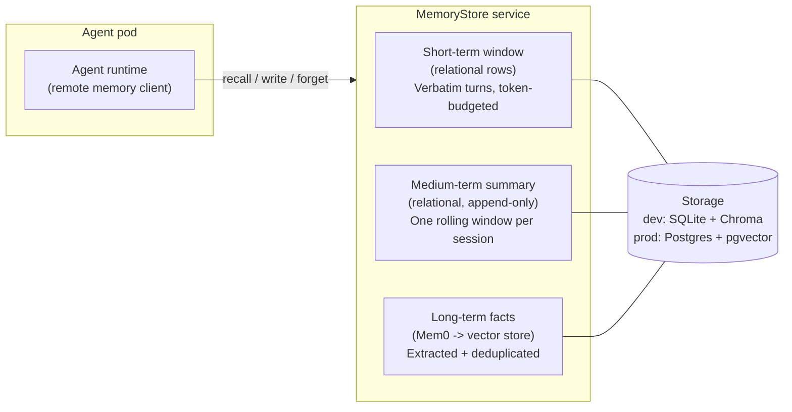
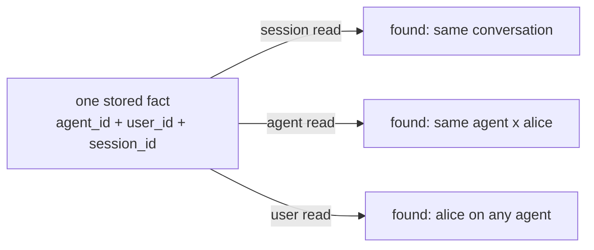
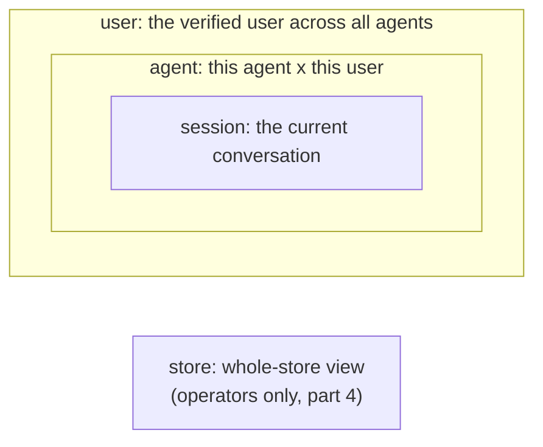
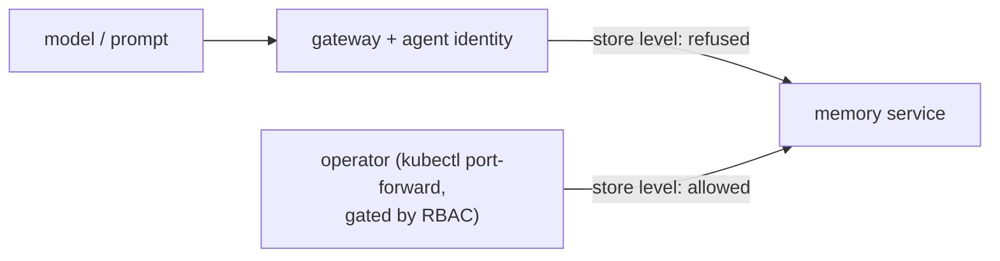
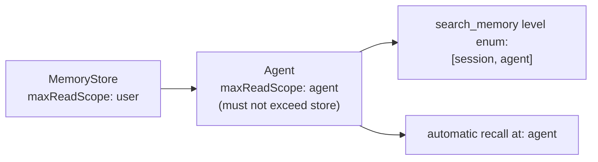

# Whose Memory Is It? Building Multi-Tenant, Multi-Tier Memory for AI Agents (Part 2)

_This is a 4-part series on how agents remember: building short-, medium- and long-term memory that scales across users, agents, and kubernetes clusters._

---

Alice and bob are talking to the same agents. Alice interacts with various agents for infra management. Bob interacts with various agents for app development. Both are able to build on learnings from the last month. But how far should this go? Should Alice be able to recall memories from Bob's interactions? Should a user allow a single agent to recall memories from across their agents? 

> This captures the design choices required in multi-tenancy for agentic memory management

Recently I spent some time extending the [Kubernetes Agent Orchestration System (KAOS)](https://github.com/axsaucedo/agentic-kubernetes-operator) to support multi-tiered memory persistence (aka short-, medium- and long-term memory). Along the way I hit most of the same issues that anyone would whilst building or integrating multi-tiered memory into a multi-tenant system, so I thought it would be useful to compile the learnings, design choices and examples into this series. 

This is Part 2 of the series, and here I go through some of the design choices made for 3-tier multi-tenant memory. This follows [Part 1](link-when-published), where we surveyed ~30 memory engines, built a working taxonomy, and landed on adopting [Mem0](https://github.com/mem0ai/mem0) as a library behind our own interface, together with the list of gaps (observability, tenant isolation, kubernetes packaging, framework bridging) that become our integration work.

The objective throughout the series is:

> Let's make the memory layer BORING, so that the agents can continue to be the fun part.

This part consists of two sections: 
1. **Three memory tiers**: Defining the memory adopted, which includes a short-term window memory, a medium-term rolling summary, and long-term semantic "facts".
2. **Scope model**: A hierarchical multi-tenant read model scope, that spans across `session > agent > user`, defined by a verified identity and a `maxReadScope` ceiling

Finally we wrap up with five hard lessons we learned about tier and scope design that carry beyond KAOS.

As with my previous posts on [observability for agentic systems](https://hackernoon.com/production-observability-for-multi-agent-ai-with-kaos-otel-signoz) and [autonomous always-on agentic patterns](https://hackernoon.com/autonomous-agentic-systems-a-practical-guide-to-always-on-agents), I use KAOS as the concrete implementation example, but the goal is to provide practical intuition for the primitives (tiers, scopes, folding, degradation), so that it applies whether you use KAOS, Mem0 directly, LangGraph, CrewAI, or a memory layer you wrote yourself.

A refresher on this 4-part series on Multi-Tiered / Multi-Tenant Agent Memory:

* **Part 1: What agent memory is and what to build on.** The taxonomy, the baseline implementations everyone starts with, and the engine landscape from surveying ~30 tools.
* **Part 2 (this post): Tiers and scopes for multi-tenant agents.** The three-tier design and the answer to whose memory it is.
* **Part 3: Memory as infrastructure.** The Kubernetes `MemoryStore` resource, its deployment topology, and how to integrate it in your own agent (coming soon...).
* **Part 4: Agent memory in action.** A worked example that runs end to end on a secured cluster, with real outputs (coming soon...).

## Designing our Memory Architecture: The Three Tiers

As we now locked the decision to go forward with Mem0 as the memory library in [Part 1](link-when-published), we can move to the broader design architecture for the distributed memory tiers.

Based on the requirements, we needed to support three tiers: a short-term window, a medium-term summary, and long-term "facts". These are intuitively used as follows:

| Tier        | What it holds                                                                     | When it updates                                      | Backing                      |
| ----------- | --------------------------------------------------------------------------------- | ---------------------------------------------------- | ---------------------------- |
| Short-term  | The context window of the live session, bounded by a token budget                 | Every turn (cheap append)                            | Relational rows              |
| Medium-term | Rolling summary per session, versioned so past summaries stay accessible          | On compaction, when the window hits its token budget | Relational rows, append-only |
| Long-term   | Atomic facts extracted from context window, keyed by scope, recalled semantically | In the background, after compaction                  | Mem0 into the vector store   |

Defining these tiers allow us to formalise the following design decisions:

* Long-term memory functionality is enabled via Mem0; short- and medium-term memory are built custom.
* These three tiers should cohesively integrate as a single interoperable unit.
* Medium- and long-term extraction **is lossy**; [we could enable provenance](https://arxiv.org/abs/2605.04897), however this adds significant complexity so I decided to keep this out of scope for now.
* Medium- and long-term extraction are always **off the write path**; it triggers when compaction threshold is crossed as opposed to in every insert, which is also how [Mem0's own platform behaves](https://docs.mem0.ai/core-concepts/memory-operations).
* The medium-term summary stays **out of the vector store**: Mem0 wants atomic, individually revisable facts, whereas a summary is a narrative whose whole value is its continuity.
* Underneath all three tiers, the **raw turns are the source of truth** and everything else (summaries, facts, embeddings) is a recomputable projection, which is also what makes lossy extraction and fire-and-forget background processing acceptable.
* [Temporal](https://arxiv.org/abs/2501.13956) (bi-temporal validity) and [procedural](https://arxiv.org/abs/2309.02427) (aka skill persistence) memory are deliberately **deferred** in their explicit form, but achievable through the long-term memory.

These definitions also allow us to design the single coherent service that offers the short-, medium- and long-term memory tiers; the **"MemoryStore Service"**.

We will cover more on the `MemoryStore` service in Part 3, where it becomes a kubernetes resource. Before we get there however, we need to talk about another important (+ tricky) topic: 

> **Access Scopes**: or **who** should be able to remember **what**?

## Access Scopes: Whose Memory Is It Anyway?

Every memory operation in a multi-tenant fleet needs an answer to "whose memory is it?". And the answer has to come from the design of the system components. 

We first have to start on the **write path** before we can define a solution for the **read path access**. The key thing to remember is that: 

> A single conversation is authored by an agent, on behalf of a user (or autonomous agent), inside a session, on one memory store. 

This means the service records all of these as metadata provenance for every memory input stored. Writes are therefore compound and invariant, while a read resolves to a single scope level and is a matter of policy. 

That separation is what lets one write be recalled at several levels later without being duplicated, because the same fact an agent stored for Alice carries her `user_id`, the agent identity, and the session at once, so recalls at different levels each find it through a different owner key.

For reads, KAOS uses three concentric levels, where each wider level contains the previous one:

The level chooses the radius of the view; the identity always comes from the gateway-verified request headers, never from the request body or the model. This gives each level one documented meaning under each security posture:

| Level     | Meaning                                            | With user auth on             | With user auth off             |
| --------- | -------------------------------------------------- | ----------------------------- | ------------------------------ |
| `session` | the current conversation                           | current agent x user x session | current agent x session       |
| `agent`   | this agent's memory of the verified context        | current agent x user          | this agent's whole pool        |
| `user`    | the verified user across all agents on the store   | current user, across agents   | rejected at deploy time        |

Two properties of this table are worth pausing on. First, every level is principal-bound: `agent` narrows to a two-key `{agent_id, user_id}` partition whenever a verified principal is present, so Alice and Bob get separate memory on the same agent with no per-agent configuration, and it widens to the agent's whole pool only when there is no user identity to bind to. Second, even `session` reads check the principal: a request that presents a session id together with the wrong identity gets an empty result, so knowing a session id is never enough to read a conversation.

One more view exists, and it is deliberately absent from the table. The whole-store view (`store`: everything every agent and user wrote to the store) is for operators: inspection and erasure across the entire store. The memory service refuses it on any request arriving through an agent, so no grant, tool, or prompt can reach it; the only path to it is the cluster-operator one that Kubernetes RBAC already gates. A terminology note that saved us real confusion: identity groups (the `groups` claim in a token, used for authorization grants) and the memory store are different things, which is why the whole-store scope is named `store` and never "group".

Because the read levels are totally ordered, an agent's entitlement does not need to be a list of allowed levels; it collapses to a single maximum, `maxReadScope`. The automatic baseline recall runs at that effective ceiling, and the `search_memory` tool's `level` enum becomes every level up to and including it, so an unentitled level is not something the model can even express, which is the fail-closed rule from earlier applied to the read path. The `MemoryStore` carries its own `maxReadScope` ceiling (default `agent`), and an agent may not claim above its store's, so cross-agent `user` reads exist only where the store owner deliberately raised the ceiling.

Who must be identified is not something an agent declares; it follows from the cluster's security posture. When the cluster runs user authentication, every write must carry a verified principal, and the store rejects one that arrives without it; when agent authentication is on, a stable agent identity is required the same way. Agents can neither opt out of these requirements nor demand more than the cluster provides, which removes a whole class of misconfiguration: an agent claiming `maxReadScope: user` on a cluster with no user identity is rejected at its own deploy time instead of failing at runtime. The rejection lives on the reader only, since a store's ceiling grants permission and performs no reads, so a store declaring `user` on such a cluster stays healthy and its ceiling simply remains unclaimed. Autonomous agents need no exception, because a self-initiated iteration runs with the agent's own identity as its principal, satisfying the same requirements uniformly, so a loop's memory stays private to the loop.

This scope model is probably the obvious choice; the trickier question is how do we enable the sharing boundary itself. There were a few design options for this:

1. **Many groups inside one MemoryStore.** One store holds the memories of several groups at once. This sounds efficient, however it means building and operating a whole group-management layer: an API to create and delete groups and to add and remove members, per-group quotas, and a single store whose failure affects every group in it. The storage side of this is actually straightforward, as a group key on every record is all the data layer needs. The real cost is the management surface around it.
2. **One group per MemoryStore.** The store itself is the group: whichever agents are bound to the same store share it, so membership is just the existing binding and no new API is needed. The cost is that every group needs its own store deployment, and sharing across two groups means binding to a second store. 
3. **Hierarchical scope paths.** A richer model where scopes are nested paths (for example `org:team:agent`) and agents share memory up to the point where their paths diverge. Every version of this I drafted ended up re-creating an authorization system that the two simpler options already covered.

Interestingly enough, when looking at how the managed platforms handle this, they expose a two-level version of the same tradeoff. Each one has a hard container that their control plane creates and manages, and lighter logical partitions inside it. A few examples:
* [Mem0 platform](https://docs.mem0.ai/platform/platform-vs-oss): A project is the container that memories cannot cross, and the user and agent partitions live within it, with API keys scoped to the project.
* [Vertex Memory Bank](https://docs.cloud.google.com/agent-builder/agent-engine/memory-bank/overview): Provisions one Memory Bank per Agent Engine instance, and within it memories are partitioned by scope, with retrieval only returning memories whose scope exactly matches the request.
* [Zep Cloud](https://www.getzep.com/platform/graphiti/): Each subject (a user, or a group via their group-graph API) gets its own isolated context graph, and the cloud platform is the control plane that manages millions of them.

Based on these tradeoffs, I went for one group per MemoryStore, which enforces this at the control plane: the store itself is the sharing boundary, which is exactly why the whole-store read scope is named `store`. This meant that I don't have to build a full intra-store group management layer, and the data layer simply records the store's group key as internal metadata on each record. 

The way it's designed to is set up to support finer grouping at the `MemoryStore` level by design, as we basically are storing everything under one global group per store.

Now that we adopted these design choices, we realised that there were a few caveats that came up, which we had to accept / address:

* **Security Attack Surfaces**: Interesting research such as [AgentPoison](https://arxiv.org/abs/2407.12784)  show the impact of poisoning memory (ie 0.1% poisoned memory yields over 80% attack success), as well as [MINJA](https://arxiv.org/abs/2503.03704) which shows that an attacker needs no write access at all, because if the agent writes its own memory from conversations then every user is a write path. **To mitigate this**, KAOS  derives the scope server-side from the authenticated agent identity, fail-closed, and never from model- or tool-supplied arguments.
* **Right to Erasure**: Compliance requirements such as GDPR mean you must be able to answer "delete everything you know about this user" reliably, and in a multi-tier design the same information lives in several derived forms at once (raw turns, summaries, extracted facts, and their embeddings), so deleting from one tier is not enough. **To mitigate this**, KAOS implements `forget` as a single operation that fans out across all three tiers in one pass, deleting the short-term rows, the summaries, and the scope-filtered long-term facts. Note this is destruction, which is different from supersession, where facts are merely marked invalid but kept for history.

Now that we have sorted the tiers and the access scopes, let's distil the lessons from this part before we make it all run as infrastructure in part 3.

## Lessons for Production Agentic Memory

Here are the patterns from this part that I would carry into any agentic memory system.

### 1. Separate conversational continuity from learned knowledge

Same-session verbatim windows and cross-session distilled facts are different tiers with different stores, lifecycles, and failure modes. Conflating them is the root of most memory design mistakes.

### 2. Raw turns are the source of truth and everything else is a projection

Digests, facts, and embeddings are lossy, recomputable views. Keep the verbatim record durable and you can survive both a lost extraction and a change of mind about your extraction strategy.

### 3. Keep narrative digests out of the vector store

Extraction engines shred input into atomic facts, whereas a rolling summary's value is its continuity. Store digests relationally, inject them whole, and feed the engine raw turns only.

### 4. Never let the model choose the scope, and never let recall become policy

Derive scope server-side from authenticated identity, fail closed, with the filter inside the vector query. When the model is allowed to search, bound the levels it can reach with a `maxReadScope` ceiling rendered as the tool's own enum, so an injection cannot widen the reach beyond what the agent was granted. Treat what comes back as untrusted data with provenance, since memory poisoning and cross-session injection are demonstrated attacks with published success rates.

### 5. The store is the group

Sharing topology can be a deployment choice instead of an authorization system, with scope filtering within a store and physical isolation by deploying a store per tenant.

## Closing Thoughts for Part 2

This part turned the engine decision from Part 1 into a memory model: three tiers with distinct lifecycles and stores, and a scope model that derives the answer to "whose memory is it?" from verified identity rather than from anything the model says. Together they are the conceptual core of the series.

A model on paper is not a system. In part 3 we make this design exist as infrastructure: the `MemoryStore` kubernetes resource, the topology decision behind it, the degradation contract that keeps a memory outage from taking an agent down, and how you can integrate the same pattern in your own agent from scratch. Stay tuned.

**The series:**

* **Part 1: What agent memory is and what to build on.** The taxonomy, the baseline implementations everyone starts with, and the engine landscape from surveying ~30 tools.
* **Part 2 (this post): Tiers and scopes for multi-tenant agents.** The three-tier design and the answer to whose memory it is.
* **Part 3: Memory as infrastructure.** The Kubernetes `MemoryStore` resource, its deployment topology, and how to integrate it in your own agent (coming soon...).
* **Part 4: Agent memory in action.** A worked example that runs end to end on a secured cluster, with real outputs (coming soon...).
