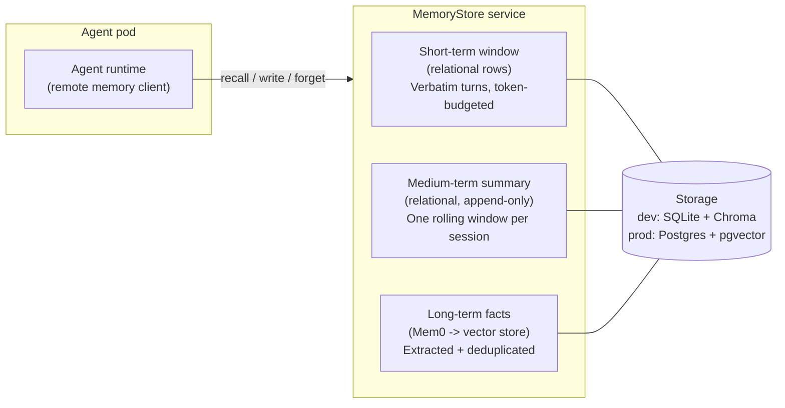

# Whose Memory Is It? Tiers and Scopes for Multi-Tenant Agents (Part 2)

_This is a 4-part series on how agents remember: building short-, medium- and long-term memory that scales across users, agents, and kubernetes clusters._

---

In Part 1 we built the foundation: a working taxonomy of agent memory, the naive implementations everyone starts with, and the survey of ~30 memory engines that ended with the decision to adopt Mem0 as a library behind our own interface, together with the list of gaps (observability, tenant isolation, kubernetes packaging, framework bridging) that become our integration work.

This part is where we design the memory system itself. First the three tiers that separate the verbatim conversation window, the rolling narrative digest, and the extracted long-term facts. Then the scope model that answers the question in the series title: whose memory is it, who is allowed to recall it, and how that is enforced so that neither the model nor a compromised prompt can widen it.

The series:

* **Part 1: What agent memory is and what to build on.**
* **Part 2 (this post): Tiers and scopes for multi-tenant agents.**
* **Part 3: Memory as infrastructure.** (coming soon...)
* **Part 4: Agent memory in action.** (coming soon...)

## Designing our Memory Architecture: The Three Tiers

As we now locked the decision to go forward with Mem0 as the memory library, we can move to the broader design architecture for the distributed memory tiers in KAOS.

Based on the requirements, we needed to support three tiers: a short-term window, a medium-term summary, and long-term "facts". These are intuitively used as follows:

| Tier        | What it holds                                                                     | When it updates                                      | Backing                      |
| ----------- | --------------------------------------------------------------------------------- | ---------------------------------------------------- | ---------------------------- |
| Short-term  | The context window of the live session, bounded by a token budget                 | Every turn (cheap append)                            | Relational rows              |
| Medium-term | Rolling summary per session, versioned so past summaries stay accessible          | On compaction, when the window hits its token budget | Relational rows, append-only |
| Long-term   | Atomic facts extracted from context window, keyed by scope, recalled semantically | In the background, after compaction                  | Mem0 into the vector store   |

Defining these tiers allow us to formalise the following design decisions:

* Long-term memory functionality is enabled via Mem0; short- and medium-term memory are custom; These three tiers should cohesively integrate as a single interoperable unit.
* Medium- and long-term extraction **is lossy**. There's definitely some interesting approaches where [we could enable provenance](https://arxiv.org/abs/2605.04897), however I decided to keep this out of scope at least for now.
* Medium- and long-term extraction are always **off the write path**; when compaction threshold is crossed, as opposed to in every insert, which is also how [Mem0's own platform behaves](https://docs.mem0.ai/core-concepts/memory-operations), processing memory additions in the background and returning a pending event to poll.
* The medium-term summary stays **out of the vector store**: Mem0 wants atomic, individually revisable facts, whereas a summary is a narrative whose whole value is its continuity, so it is stored as a plain relational row and injected verbatim, and only the raw evicted turns are handed to Mem0 for extraction.
* Underneath all three tiers, the **raw turns are the source of truth** and everything else (summaries, facts, embeddings) is a recomputable projection, which is also what makes lossy extraction and fire-and-forget background processing acceptable.
* Temporal (bi-temporal validity) and procedural (aka skill persistence) memory are deliberately **deferred** in its explicit form; but achievable through the long-term memory.

 These definitions also allow us to design the singel coherent service that offers the short-, medium- and long-term memory tiers; the **"MemoryStore Service"**.

We will cover more on the `MemoryStore` service in the kubernetes section below, but before we do that, we need to talk about another important (+ tricky) topic; access scopes.

## Scopes: Whose Memory Is It Anyway?

Every memory operation in a multi-tenant fleet needs an answer to "whose memory is it?". And the answer has to come from the design of the system components. 

In KAOS the choice was to go for a deliberately flat model: four scope levels, each mapped by the service onto exactly one owner key, as follows:

| Level     | Owner key                     | Who shares it                         |
| --------- | ----------------------------- | ------------------------------------- |
| `session` | `run_id = <session id>`       | Only this conversation session        |
| `agent`   | `agent_id = <agent identity>` | Only this agent.                      |
| `user`    | `user_id = <user identity>`   | Every agent serving the same user.    |
| `group`   | `kaos_group = <group id>`     | Every agent + user in the same group. |

The table reads as the recall view, where one scope resolves to one owner key. The write path is the mirror image. A single conversation is authored by an agent, on behalf of a user, inside a session, and within a group, so the service records all of that attribution on every stored record as provenance. Writes are therefore compound and invariant, while a read resolves to a single scope and is a matter of policy. That separation is what lets one write be recalled at several levels later without being duplicated, because the same fact an agent stored for Alice carries her `user_id`, the agent identity, the session, and the group at once, so a `user` recall and a `group` recall each find it through a different owner key.

The read side then needs its own answer to which of those levels a given agent may reach, and this is the only scope configuration an agent carries. The automatic baseline recall uses the agent's `defaultReadScope`, which falls back to the store's `defaultReadScope` and finally to `session`. The memory search tool is where breadth becomes a deliberate grant. An agent's `readScopes` lists the levels its `search_memory` tool may target, and the model chooses among those and only those. An agent with `defaultReadScope: user` and `readScopes: [session, user, group]` recalls the user's memory automatically and may additionally search the session or the shared group on its own, yet can never reach another agent's private partition, because `agent` is absent from its list. The model selects the level from the tool's own enum, so an unentitled level is not something it can even express, which is the fail-closed rule from earlier applied to the read path.

Who must be identified is not something an agent declares; it follows from the cluster's security posture. When the cluster runs user authentication, every write must carry a verified principal, and the store rejects one that arrives without it; when agent authentication is on, a stable agent identity is required the same way. Agents can neither opt out of these requirements nor demand more than the cluster provides, which removes a whole class of misconfiguration, since an agent asking to read `user` memory on a cluster with no user identity is rejected at deploy time instead of failing at runtime. The `agent` read level narrows accordingly on user-identity clusters: it derives a two-key `{agent_id, user_id}` partition from the gateway-verified principal, so Alice and Bob get separate memory on the same agent with no per-agent configuration, and `group` stays the one deliberate cross-user surface. Autonomous agents need no exception, because a self-initiated iteration runs with the agent's own identity as its principal, satisfying the same requirements uniformly, so a loop's memory stays private to the loop and publishing to the fleet remains a deliberate `group`-level write.

This scope model is probably the obvious choice; the trickier question is how do we enable these shared scopes. There were a few design options for this:

1. **Many groups inside one MemoryStore.** One store holds the memories of several groups at once. This sounds efficient, however it means building and operating a whole group-management layer: an API to create and delete groups and to add and remove members, per-group quotas, and a single store whose failure affects every group in it. The storage side of this is actually straightforward, as a group key on every record is all the data layer needs. The real cost is the management surface around it.
2. **One group per MemoryStore.** The store itself is the group: whichever agents are bound to the same store share it, so membership is just the existing binding and no new API is needed. The cost is that every group needs its own store deployment, and sharing across two groups means binding to a second store. 
3. **Hierarchical scope paths.** A richer model where scopes are nested paths (for example `org:team:agent`) and agents share memory up to the point where their paths diverge. Every version of this I drafted ended up re-creating an authorization system that the two simpler options already covered.

Interestingly enough, when looking at how the managed platforms handle this, they expose a two-level version of the same tradeoff. Each one has a hard container that their control plane creates and manages, and lighter logical partitions inside it. A few examples:
* [Mem0 platform](https://docs.mem0.ai/platform/platform-vs-oss): A project is the container that memories cannot cross, and the user and agent partitions live within it, with API keys scoped to the project.
* [Vertex Memory Bank](https://docs.cloud.google.com/agent-builder/agent-engine/memory-bank/overview): Provisions one Memory Bank per Agent Engine instance, and within it memories are partitioned by scope, with retrieval only returning memories whose scope exactly matches the request.
* [Zep Cloud](https://www.getzep.com/platform/graphiti/): Each subject (a user, or a group via their group-graph API) gets its own isolated context graph, and the cloud platform is the control plane that manages millions of them.

Based on these tradeoffs, I went for one group per MemoryStore, which enforces this at the control plane. This meant that I don't have to build a full intra-store group management layer, and the data layer simply records the group as metadata on each record. 

The way it's designed to is set up to support finer grouping at the `MemoryStore` level by design, as we basically are storing everything under one global group per store.

Now that we adopted these design choices, we realised that there were a few caveats that came up, which we had to accept / address:

* **Security Attack Surfaces**: Interesting research such as [AgentPoison](https://arxiv.org/abs/2407.12784)  show the impact of poisoning memory (ie 0.1% poisoned memory yields over 80% attack success), as well as [MINJA](https://arxiv.org/abs/2503.03704) which shows that an attacker needs no write access at all, because if the agent writes its own memory from conversations then every user is a write path. **To mitigate this**, KAOS  derives the scope server-side from the authenticated agent identity, fail-closed, and never from model- or tool-supplied arguments.
* **Right to Erasure**: Compliance requirements such as GDPR mean you must be able to answer "delete everything you know about this user" reliably, and in a multi-tier design the same information lives in several derived forms at once (raw turns, summaries, extracted facts, and their embeddings), so deleting from one tier is not enough. **To mitigate this**, KAOS implements `forget` as a single operation that fans out across all three tiers in one pass, deleting the short-term rows, the summaries, and the scope-filtered long-term facts. Note this is destruction, which is different from supersession, where facts are merely marked invalid but kept for history.

Now that we have sorted the tiers and the access scopes, we can move forward to the end-to-end platform implementation.

## Lessons for Production Agentic Memory

Here are the patterns from this part that I would carry into any agentic memory system.

### 2. Separate conversational continuity from learned knowledge

Same-session verbatim windows and cross-session distilled facts are different tiers with different stores, lifecycles, and failure modes. Conflating them is the root of most memory design mistakes.

### 3. Raw turns are the source of truth and everything else is a projection

Digests, facts, and embeddings are lossy, recomputable views. Keep the verbatim record durable and you can survive both a lost extraction and a change of mind about your extraction strategy.

### 4. Keep narrative digests out of the vector store

Extraction engines shred input into atomic facts, whereas a rolling summary's value is its continuity. Store digests relationally, inject them whole, and feed the engine raw turns only.

### 5. Never let the model choose the scope, and never let recall become policy

Derive scope server-side from authenticated identity, fail closed, with the filter inside the vector query. When the model is allowed to search, bound the levels it can reach to a declared `readScopes` entitlement rendered as the tool's own enum, so an injection cannot widen the reach beyond what the agent was granted. Treat what comes back as untrusted data with provenance, since memory poisoning and cross-session injection are demonstrated attacks with published success rates.

### 6. The store is the group

Sharing topology can be a deployment choice instead of an authorization system, with scope filtering within a store and physical isolation by deploying a store per tenant.

## Closing Thoughts for Part 2

This part turned the engine decision from Part 1 into a memory model: three tiers with distinct lifecycles and stores, and a scope model that derives the answer to "whose memory is it?" from verified identity rather than from anything the model says. Together they are the conceptual core of the series.

A model on paper is not a system. In part 3 we make this design exist as infrastructure: the `MemoryStore` kubernetes resource, the topology decision behind it, the degradation contract that keeps a memory outage from taking an agent down, and how you can integrate the same pattern in your own agent from scratch. Stay tuned.

**The series:**

* Part 1: What agent memory is and what to build on.
* Part 2 (this post): Tiers and scopes for multi-tenant agents.
* Part 3: Memory as infrastructure (coming soon...).
* Part 4: Agent memory in action (coming soon...).
