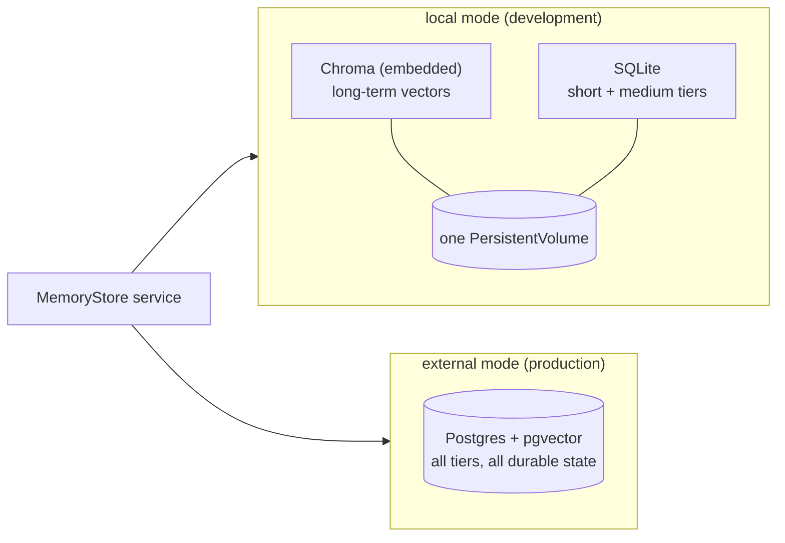
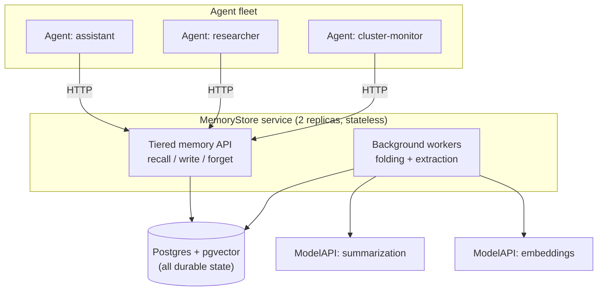

# Memory as Infrastructure: A MemoryStore for Kubernetes Agents (Part 3)

_This is a 4-part series on how agents remember: building short-, medium- and long-term memory that scales across users, agents, and kubernetes clusters._

---

In Part 1 we surveyed the memory engine landscape and adopted Mem0 as a library behind our own interface. In Part 2 we designed the memory model on top of it: three tiers (a verbatim short-term window, a rolling medium-term digest, and extracted long-term facts) and a scope model that derives "whose memory is it?" from verified identity, fail-closed.

A design is only useful once it runs, and this part is about making memory exist as infrastructure. We go through the deployment topology decision (a central memory service per store rather than an engine embedded in every agent), the `MemoryStore` kubernetes resource and its storage profiles, and the degradation contract that treats memory as augmentation so that a store outage degrades an agent instead of taking it down. We then close the loop for readers not on KAOS by converting the naive snippet from Part 1 into a production-shaped integration you can build into your own agent, and finish with the cases where you should not add long-term memory at all.

The series:

* **Part 1: What agent memory is and what to build on.**
* **Part 2: Tiers and scopes for multi-tenant agents.**
* **Part 3 (this post): Memory as infrastructure.**
* **Part 4: Agent memory in action.** (coming soon...)

## Kubernetes Enters the Picture: Memory as Infrastructure

Now that we have all the separate pieces, it's required make a decision on how do we stitch them together; as part of this, I needed to go through several architectural design choices. We'll go through a few of these in this section.

**Decision 1: Choosing the Storage**

The first design decision was, which data store should we go for? Should we go for FAISS? Chroma? pgvector? Milvus? Pinecone? 

The answer did not need to be a single store, because the requirements differ between a local development loop and a production fleet. 

* **For development** the priority is zero external dependencies, so the store should be embeddable in the service container. 
* **For production** the priorities are durability, horizontal scaling, and reusing infrastructure you already operate. 

This ruled out SaaS-only options like Pinecone for the first iteration, as well as library-only indexes with no persistence or filtering (eg FAISS), or also dedicated clusters that would add heavy new infrastructure (Milvus, Weaviate). For this we landed on two storage modes with the same service code on top of both:

One interesting caveat that I ran into, was learning that some database engines apply scope filters after the retrieval step, which means that in some cases a query expecting a number of results may return less than expected. This is a known consideration on [pgvector as it post-filters by default](https://dev.to/franckpachot/no-pre-filtering-in-pgvector-means-reduced-ann-recall-1aa1), and it is why engines like [Qdrant filter inside the index traversal](https://qdrant.tech/documentation/manage-data/multitenancy/). 

To mitigate this, I validated the pre-filtering behaviour on both Chroma and pgvector before committing to the design, for which both passed. Mem0's FAISS path post-filters, which is why I decided to go for Chroma instead for the local path.



**Decision 2: Designing the Data Plane**

The second design decision was where, and how, the memory layer runs. Should it run **inside every agent** as a library? As a **side-car** next to every pod? Or as a **central service component**?

Integrating the Mem0 Python SDK directly in the agent service looks attractive at first, but the challenges compound with the number of agents. Namely as LLM calls for fact-extraction/summarization land on the serving process, every agent replica opens its own datastore connections, every agent image carries the engine and its dependencies, and replicas of the same agent silently diverge in what they remember. 

Instead, going for the central option gives us the opposite: LLM extraction lands on the `MemoryStore` service, agents only interact with the respective store, agent images can use only the client, and scales with replicas horizontally.

The "how" mattered as much as the "where", however. Had the requirement been long-term memory alone, the central option could have been as easy as "just deploy Mem0". 

The requirements went beyond what any single engine exposes though: we needed a unified layer for short-, medium- and long-term memory where we could interact with it as one integrated contract, server-side scope enforcement, telemetry on every operation, as well as scoped access control. 

For this we had to introduce a new layer through the `kaos-memory` Python package, which provides both the runtime client and the `MemoryStore` service. We will cover the package in more detail in the integration section below.

Here's the visual overview of how it all fits together in the data plane:



**Decision 3: Designing the Custom Resource**

The third design decision involved designing the architectural abstraction of "Memory" as an infrastructure component in Kubernetes. In this case it meant codifying the `MemoryStore` resources into a specification that brings together all the points that we covered thus far. We settled on the following:

```yaml
apiVersion: kaos.tools/v1alpha1
kind: MemoryStore
metadata:
  name: shared-memory
spec:
  engine: mem0
  storage:
    type: external          # or "local" for dev: Chroma + SQLite on a PVC
    external:
      provider: pgvector
      connectionSecretRef:
        name: pgvector-dsn
        key: dsn
  models:
    summarization:
      modelAPI: my-modelapi
      model: gpt-4o-mini
    embedding:
      modelAPI: my-modelapi
      model: text-embedding-3-small
  shortTerm:
    tokenBudget: 4096       # verbatim window bound
  mediumTerm:
    enabled: true           # fold overflow into a rolling summary
  longTerm:
    extraction:
      concurrency: 4        # background extraction workers
```

To provide the intuition on the one we landed on, here's what these mean:
* `storage.type`: provides the `local` type for dev and `external` for prod.
* `storage.local.provider` / `storage.external.provider`: embedded Chroma plus SQLite for local (one container on a PersistentVolume, single replica); Postgres with pgvector for external, referenced through a `connectionSecretRef` as a bring-your-own database.
* `storage.external.embeddingDims`: the vector dimensions of the embedding model.
* `replicas`: defaults by mode, 1 for local (the volume is single-writer) and 2 for external (the service is stateless over Postgres, guarded by a disruption budget).
* `models.summarization` / `models.embedding`: references to `ModelAPI` resources instead of provider keys, so the memory system's LLM calls go through the same gateway, quotas, and observability as every other component.
* `shortTerm` / `mediumTerm` / `longTerm`: one typed block per tier, with the cross-tier compaction invariant validated at apply time instead of pod startup.
* `defaultReadScope`: the store-wide default read level for bound agents that set none; the final fallback is `session`.
* `defaultFailureMode`: `soft` or `strict` write behaviour for bound agents, overridable per agent.

These were some of the major design decisions worth highlighting - there were of course a much longer list of tradeoff decisions which are out of the scope of this post, as otherwise I'd never finish the blog post if we cover all of them. However to mention a few honorable mentions are: 
* Treating memory as augmentation and not a hard dependency: recall is always soft, so a memory outage degrades an agent and never stops it (the `degraded` flag on every recall in the worked example is where this surfaces)
* Wrapping Mem0 as a library inside the service instead of running the stock Mem0 server
* Serializing compaction through database locks so multiple service replicas can fold the same session without double-folds
* Shipping without a durable extraction queue (for now), since the short-term tier is the recoverable source of truth and a queue is only worth building once needed

Now that we have all the major pieces threaded together, we can now dive into a hands on example to show how it all works in practice.

## How You Can Integrate It In Your Agent From Scratch

Let's take look at the snippet that we shared at the beginning of this post which showed a framework-agnostic skeleton for memory. We can then see how we convert this into a production level integration for any agent, enabling for the tiered memory that we saw:

```python
async def run_with_memory(session_id, user_message, memory, agent):
    # 1. RECALL: assemble the memory block (never let this fail the turn)
    try:
        window = await memory.window(session_id, token_budget=4000)
        medium_term_summary = await memory.medium_term_summary(session_id)
        facts = await memory.search(scope=memory.scope, query=user_message, top_k=5)
    except MemoryError:
        window, digest, facts = await memory.window_only(session_id), None, []

    context = build_memory_block(digest, facts)   # structured block, injected once

    # 2. RUN
    response = await agent.run(context, window, user_message)

    # 3. PERSIST: append is cheap and synchronous; distillation is not
    await memory.append(session_id, user_message, response)

    # 4. FOLD + EXTRACT: always off the response path
    if await memory.over_budget(session_id):
        background(memory.fold_and_extract, session_id)

    return response
```

The skeleton shows the load-bearing choices: recall wrapped so failure degrades instead of raising, the digest and facts injected as one structured block instead of fake conversation turns, the cheap verbatim append on the hot path, and the expensive fold-and-extract pushed to the background the moment the token budget trips.

What it deliberately does not show, and what you must add before this becomes a production dependency: server-side scope enforcement, the erasure fan-out across tiers, the soft/strict write contract, OpenTelemetry on every operation, and a service boundary so a fleet shares one memory instead of one process hoarding it.

Alternatively, you can adopt the packaged version of exactly this design: the `kaos-memory` package mentioned in the design section. It is pip-installable and deliberately layered behind extras. The core carries the wire contract and the `MemoryServiceClient`, `[service]` adds Mem0, the vector store, and the FastAPI service, and `[pydantic-ai]` adds the runtime adapters, server-side scope derivation, and the memory toolset:

```bash
pip install kaos-memory                  # wire contract + MemoryServiceClient
pip install "kaos-memory[pydantic-ai]"   # + runtime adapters and the memory toolset
```

The part of the package I would call genuinely novel relative to the ecosystem is that **medium-term memory is a first-class tier**. The two-tier (working plus long-term) split is the industry norm, and the rolling, versioned session summary that keeps continuity across compaction is a concept the surveyed engines do not ship. The package owns the short- and medium-term tiers relationally, wraps Mem0 for the long-term tier, and exposes all three behind the single recall, write, and forget contract used throughout this post.

The core install gives you the `MemoryServiceClient` against a running MemoryStore service:

```python
from kaos_memory import Attribution, MemoryServiceClient, Scope

client = MemoryServiceClient(endpoint="http://memorystore-shared-memory:8080")
scope = Scope(level="group")                        # reads select one level
attribution = Attribution(                          # writes carry identities, no level
    agent_client_id=agent_identity, session_id=session_id,
)

recalled = await client.recall(scope, query=user_message, include_short_term=True)
response = await agent.run(recalled, user_message)
await client.write(attribution, turns=[("user", user_message), ("assistant", response)])
```

Recall degrades to empty context on failure instead of raising, writes honour the soft or strict failure mode, and every call emits the `kaos.memory.*` telemetry spans covered in the observability post.

If your agent runs on Pydantic AI, the `[pydantic-ai]` extra adds the helpers that wire the pieces from this post together: server-side scope derivation, the explicit memory tools, and full-fidelity history replay.

```python
from kaos_memory.pydantic_ai import (
    attribution_from_deps, scope_from_deps,
    build_memory_toolset, reconstruct_message_history,
)
from kaos_memory.pydantic_ai.toolset import MemoryTools

# reads derive a scope from the authenticated request context; by design
# there is no way for the model or a tool to pass a scope in
scope = scope_from_deps(deps, level="group", agent_identity=agent_identity)

# writes derive an attribution: the verified identities, no level
attribution = attribution_from_deps(deps, agent_identity=agent_identity)

# expose save_memory / search_memory to the model (the tools carry no scope argument)
toolset = build_memory_toolset(MemoryTools.ALL, read_scopes=[scope.level], agent_identity=agent_identity)

# rebuild message history from the short-term turns plus the rolling summary,
# so overflow is represented by summarization instead of truncation
history = reconstruct_message_history(recalled.short_term.recent, recalled.medium_term.summary)

result = await agent.run(user_message, message_history=history, toolsets=[toolset])
```

## When NOT to Add Long-Term Memory

Like autonomy, memory has become a checkbox feature, and the temptation is to switch it on for everything. It has a measurable break-even, as [a 2026 cost-performance analysis](https://arxiv.org/abs/2603.04814) finds long-context actually wins on raw recall for short interactions, with fact-based memory becoming cost-favorable only after roughly ten turns at 100K-token scale. Long-term memory earns its cost when:

- users or goals persist across sessions and personalization compounds,
- a fleet of agents benefits from shared operational knowledge,
- agents run [always-on autonomous loops](https://hackernoon.com/), the biggest memory producers and consumers, since nobody is there to repeat the context to them,
- the same facts keep being re-established at the start of every session.

It is a poor fit when:

- interactions are genuinely single-shot, where session history already covers it,
- you cannot yet answer the erasure question, since memory without deletion is a liability and not a feature,
- tenancy boundaries are unclear, where every memory becomes a potential leak vector,
- you cannot afford the extraction cost of additional LLM calls for every remembered conversation,
- an outage of the memory path would be treated as an outage of the agent, in which case memory has become a hard dependency and the design should be revisited before scaling.

One caution applies even when memory *is* the right call, which is that remembering and staying current are different problems. The newest agentic-memory evaluations find a distinctive failure mode where agents treat stale prior-session state as if it were still true instead of re-checking it ([Momento](https://arxiv.org/abs/2606.00832)), meaning a recalled fact is a hypothesis about the present state that may require re-validation.

## Lessons for Production Agentic Memory

Here are the patterns from this part that I would carry into any agentic memory system.

### 8. Adopt the engine and own the contract

Wrap the memory engine behind your own interface, and adopt it for the right reason, which is latency and token cost at scale, since raw accuracy can actually favour full-context baselines. Every gap in the engine you select becomes your integration layer, so choose the gaps you know how to fill.

## Closing Thoughts for Part 3

This part made the memory model operational: a central `MemoryStore` service per store with the engine embedded as a library, storage profiles for the dev-to-production path, posture projected by the operator, and a degradation contract that keeps memory an augmentation rather than a dependency. We also walked the same shape as a from-scratch integration, so the pattern applies whether or not KAOS is your platform.

What remains is proof. In part 4 we run the whole system end to end on a secured cluster: two users, three agents with different read entitlements, every tier and scope boundary exercised with real captured outputs, plus the operational lessons that close the series. Stay tuned.

**The series:**

* Part 1: What agent memory is and what to build on.
* Part 2: Tiers and scopes for multi-tenant agents.
* Part 3 (this post): Memory as infrastructure.
* Part 4: Agent memory in action (coming soon...).
