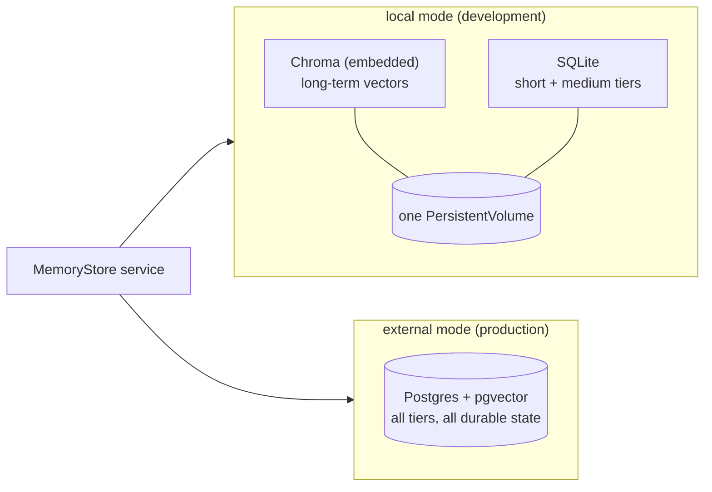
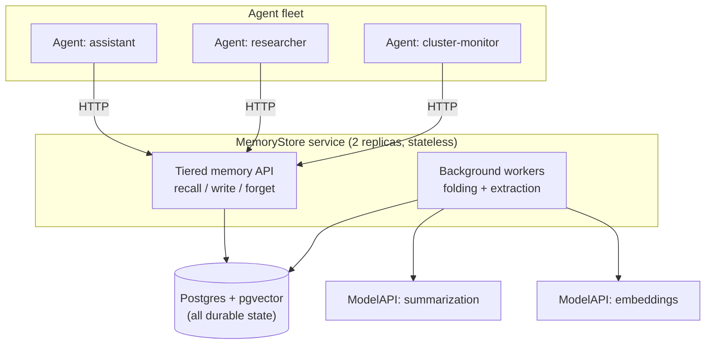
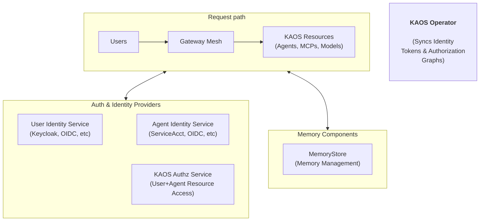

# Whose Memory Is It? Building Multi-Tenant, Multi-Tier Memory for AI Agents (Part 3)

_This is a 4-part series on how agents remember: building short-, medium- and long-term memory that scales across users, agents, and kubernetes clusters._

---

It is 2am and the memory database just crashed. Thirty agents are mid-conversation across your cluster. The impact your users feel depends entirely on earlier design choices: Which storage does the memory layer sit on? Does it run inside each agent or as a service they share? What does the resource declare about replicas and availability? And what did everyone agree happens when a dependency disappears? In this post we design multi-tenant memory as native Kubernetes infrastructure, then probe that design failure by failure.

> This captures why the memory layer deserves the same treatment as any other infrastructure component: a resource, a topology, and a failure contract.

Recently I spent some time extending the [Kubernetes Agent Orchestration System (KAOS)](https://github.com/axsaucedo/agentic-kubernetes-operator) to support multi-tiered memory persistence (aka short-, medium- and long-term memory). Along the way I hit most of the same issues that anyone would whilst building or integrating multi-tiered memory into a multi-tenant system, so I thought it would be useful to compile the learnings, design choices and examples into this series.

This is Part 3 of the series, and here we make the memory design run as infrastructure. It follows [Part 1](https://www.linkedin.com/pulse/whose-memory-building-multi-tenant-multi-tier-ai-agents-saucedo-kvcsf/), where we surveyed ~30 memory engines and adopted [Mem0](https://github.com/mem0ai/mem0) as a library behind our own interface, and [Part 2](https://www.linkedin.com/pulse/whose-memory-building-multi-tenant-multi-tier-ai-agents-saucedo-qx9uf/), where we designed the three memory tiers (a verbatim short-term window, a rolling medium-term summary, and extracted long-term facts) and the scope model that derives "whose memory is it?" from verified identity.

The objective throughout the series is:

> Let's make the memory layer BORING, so that the agents can continue to be the fun part.

This part consists of three sections:

1. **Memory as infrastructure**: The three architecture decisions behind the `MemoryStore` Kubernetes resource, covering the storage profiles, the deployment topology, and the resource specification itself.
2. **Standing it up on a cluster**: The installation with identity enabled, how auth is wired into the memory path, and the CLI that renders the resources.
3. **The failure contract**: What actually happens when a database node dies, a service replica bounces mid-compaction, the whole memory path disappears, or the auth service goes down.

Finally we wrap up with the cases where you should not add long-term memory at all, and the lessons that carry beyond KAOS. The hands-on walkthrough of integrating the same pattern in your own agent now lives in Part 4, next to the running example.

Here's a refresher on this 4-part series on Multi-Tiered / Multi-Tenant Agent Memory:

* **[Part 1: What agent memory is and what to build on.](https://www.linkedin.com/pulse/whose-memory-building-multi-tenant-multi-tier-ai-agents-saucedo-kvcsf/)** The taxonomy, the baseline implementations everyone starts with, and the engine landscape from surveying ~30 tools.
* **[Part 2: Tiers and scopes for multi-tenant agents.](https://www.linkedin.com/pulse/whose-memory-building-multi-tenant-multi-tier-ai-agents-saucedo-qx9uf/)** The three-tier design and the answer to whose memory it is.
* **Part 3 (this post): Memory as infrastructure.** The Kubernetes `MemoryStore` resource, its deployment topology, and the failure contract probed scenario by scenario.
* **Part 4: Agent memory in action.** A worked example that runs end to end on a secured cluster with real outputs, plus how to integrate the same pattern in your own agent (coming soon...).

Let's get started.

## Kubernetes Enters the Picture: Memory as Infrastructure

Now that we have all the separate pieces, we need to decide how to stitch them together, and this involved several architectural design choices. We'll go through the three biggest ones in this section.

**Decision 1: Choosing the Storage**

The first design decision was, which data store should we go for? Should we go for FAISS? Chroma? pgvector? Milvus? Pinecone? 

The answer did not need to be a single store, because the requirements differ between a local development loop and a production fleet. 

* **For development** the priority is zero external dependencies, so the store should be embeddable in the service container. 
* **For production** the priorities are durability, horizontal scaling, and reusing infrastructure you already operate. 

This ruled out SaaS-only options like Pinecone for the first iteration, as well as library-only indexes with no persistence or filtering (eg FAISS), or also dedicated clusters that would add heavy new infrastructure (Milvus, Weaviate). For this we landed on two storage modes with the same service code on top of both:

One interesting caveat that I ran into, was learning that some database engines apply scope filters after the retrieval step, which means that in some cases a query expecting a number of results may return less than expected. This is a known consideration on [pgvector as it post-filters by default](https://dev.to/franckpachot/no-pre-filtering-in-pgvector-means-reduced-ann-recall-1aa1), and it is why engines like [Qdrant filter inside the index traversal](https://qdrant.tech/documentation/manage-data/multitenancy/). 

To mitigate this, I validated the pre-filtering behaviour on both Chroma and pgvector before committing to the design, for which both passed. Mem0's FAISS path post-filters, which is why I decided to go for Chroma instead for the local path.

One more property of the storage boundary is worth stating explicitly: isolation **between** stores is a connection decision. Two `MemoryStore` resources pointing at the same DSN share the same underlying tables, and only the scope filtering from Part 2 separates their data. When a tenant needs physical isolation, you give it its own store with its own DSN, which is the "store is the group" lesson from Part 2 applied at the infrastructure layer. Within a shared database, the service applies scope-key filtering on every query and ships Postgres row-level security as hardening behind it.



**Decision 2: Designing the Data Plane**

The second design decision was where, and how, the memory layer runs. Should it run **inside every agent** as a library? As a **side-car** next to every pod? Or as a **central service component**?

Integrating the Mem0 Python SDK directly in the agent service looks attractive at first, but the challenges compound with the number of agents. Namely as LLM calls for fact-extraction/summarization land on the serving process, every agent replica opens its own datastore connections, every agent image carries the engine and its dependencies, and replicas of the same agent silently diverge in what they remember. 

Instead, going for the central option gives us the opposite: LLM extraction lands on the `MemoryStore` service, agents only interact with the respective store, agent images can use only the client, and scales with replicas horizontally.

The "how" mattered as much as the "where", however. Had the requirement been long-term memory alone, the central option could have been as easy as "just deploy Mem0". 

The requirements went beyond what any single engine exposes though: we needed a unified layer for short-, medium- and long-term memory where we could interact with it as one integrated contract, server-side scope enforcement, telemetry on every operation, as well as scoped access control. 

For this we had to introduce a new layer through the `kaos-memory` Python package, which provides both the runtime client and the `MemoryStore` service. We will cover the package in more detail in Part 4, where it becomes the integration path for your own agent.

Here's the visual overview of how it all fits together in the data plane:



**Decision 3: Designing the Custom Resource**

The third design decision involved designing the architectural abstraction of "Memory" as an infrastructure component in Kubernetes. In this case it meant codifying the `MemoryStore` resources into a specification that brings together all the points that we covered thus far. We settled on the following:

```yaml
apiVersion: kaos.tools/v1alpha1
kind: MemoryStore
metadata:
  name: shared-memory
spec:
  engine: mem0
  storage:
    type: external          # or "local" for dev: Chroma + SQLite on a PVC
    external:
      provider: pgvector
      connectionSecretRef:
        name: pgvector-dsn
        key: dsn
  models:
    summarization:
      modelAPI: my-modelapi
      model: gpt-4o-mini
    embedding:
      modelAPI: my-modelapi
      model: text-embedding-3-small
  shortTerm:
    tokenBudget: 4096       # verbatim window bound
  mediumTerm:
    enabled: true           # fold overflow into a rolling summary
  longTerm:
    extraction:
      concurrency: 4        # background extraction workers
```

To provide the intuition on the one we landed on, here's what these mean:
* `storage.type`: provides the `local` type for dev and `external` for prod.
* `storage.local.provider` / `storage.external.provider`: embedded Chroma plus SQLite for local (one container on a PersistentVolume, single replica); Postgres with pgvector for external, referenced through a `connectionSecretRef` as a bring-your-own database.
* `storage.external.embeddingDims`: the vector dimensions of the embedding model.
* `replicas`: defaults by mode, 1 for local (the volume is single-writer) and 2 for external (the service is stateless over Postgres, guarded by a disruption budget).
* `models.summarization` / `models.embedding`: references to `ModelAPI` resources instead of provider keys, so the memory system's LLM calls go through the same gateway, quotas, and observability as every other component.
* `shortTerm` / `mediumTerm` / `longTerm`: one typed block per tier, with the cross-tier compaction invariant validated at apply time instead of pod startup.
* `maxReadScope`: the store owner's ceiling on how far any bound agent may read, defaulting to `agent`; raising it to `user` is what permits cross-agent recall on this store, and an agent's own `maxReadScope` may never exceed it. This is the store's half of the scope model from Part 2.
* `defaultFailureMode`: `soft` or `strict` write behaviour for bound agents, overridable per agent.

These were some of the major design decisions worth highlighting - there were of course a much longer list of tradeoff decisions which are out of the scope of this post, as otherwise I'd never finish the blog post if we cover all of them. However to mention a few honorable mentions are: 
* Treating memory as augmentation and not a hard dependency: recall is always soft, so a memory outage degrades an agent and never stops it (the `degraded` flag on every recall in the worked example is where this surfaces)
* Wrapping Mem0 as a library inside the service instead of running the stock Mem0 server
* Serializing compaction through database locks so multiple service replicas can fold the same session without double-folds
* Shipping without a durable extraction queue (for now), since the short-term tier is the recoverable source of truth and a queue is only worth building once needed

Now that we have the resources designed, we can stand them up on a real cluster and see what the declarations turn into.

## Standing It Up on a Cluster

The design above assumed verified identity everywhere: scopes derive from it, attribution records it, and the store enforces it. That means the cluster itself has to provide identity before any of it works, so we install with authentication enabled:

```bash
$ kaos system install \
  --authz-enabled \
  --user-auth keycloak \
  --agent-auth keycloak \
  --wait
```

This sets up and configures user and agent auth with keycloak, as well as authorization based access control for the memory itself. You can read more about this in the [KAOS security documentation](https://axsaucedo.github.io/kaos/latest/security/overview.html).



The wiring matters for what comes later in this part, so it is worth tracing once. A user's request enters through the gateway mesh, where the user token is verified against the identity service. The agent runtime receives the request with the verified identity attached, derives the read scope and the write attribution from it server-side, and calls the `MemoryStore` service. The store never talks to the auth provider itself: it trusts the identities that arrive on the request, and the operator keeps the authorization graph in sync. Each hop in that chain is a separate thing that can fail, which is exactly what the failure section probes.

With identity in place, the CLI renders the resources from the design section. The store first, referencing the `ModelAPI` its background workers will use for summarization and embeddings:

```bash
$ kaos modelapi create my-modelapi --mode proxy
[TODO: Remove the modelAPI as thisis not relevant for this section]

$ kaos memorystore create shared-memory \
  --modelapi my-modelapi \
  --summarization-model gpt-4o-mini \
  --embedding-model text-embedding-3-small
```

Then an agent binds to it, with the read configuration from Part 2 carried on the agent resource:

```bash
$ kaos agent deploy assistant \
  --modelapi my-modelapi \
  --model gpt-4o-mini \
  --memory-store shared-memory \
  --memory-tools read
```

These commands render exactly the `MemoryStore` specification from Decision 3 plus the agent binding, and the operator does the rest: it deploys the service with the replica defaults for the storage mode, wires the DSN secret, projects the identity configuration, and expands the agent's scope ceiling into its runtime configuration. Part 4 exercises this setup end to end with real users; here we stay on the platform side, because now we get to break it.

## The Failure Contract

A failure contract that has never been probed is a hope. So instead of asserting that "memory degrades gracefully", let's take the setup we just stood up and walk through five failure scenarios in increasing blast radius, stating in each case what the system actually does, including the places where the honest answer is a trade-off rather than a guarantee.

**Failure 1: One service replica goes down**

In external mode the `MemoryStore` service defaults to two replicas and is deliberately stateless: the deployment mounts no volumes, and even the engine's internal change-history log is placed on an ephemeral per-replica path so that Postgres remains the only shared state. A `PodDisruptionBudget` with `minAvailable: 1` guards voluntary evictions, and the readiness probe (which pings both the relational tier and the vector collection) pulls an unhealthy replica out of the Service endpoints without killing it. Losing one replica therefore loses nothing: the surviving replica keeps serving from the same database.

The local mode is the stated exception. Its PersistentVolume is single-writer, so it runs one replica by design and a replica loss is an outage until the pod reschedules. That is an acceptable contract for a development profile and a wrong one for production, which is what the storage profiles from Decision 1 encode.

**Failure 2: Replicas bounce mid-compaction**

Compaction is where a bounce could corrupt state, since folding the short-term overflow into the medium-term summary spans a summarization call and several table mutations. The service serializes each fold with a Postgres advisory lock keyed on the scope, and runs it as one transaction: read the pending rows, produce the new digest as an append-only version, prune old versions, delete the folded rows, commit. A replica dying mid-fold rolls the transaction back, the rows stay marked pending, and the advisory lock is session-level so Postgres releases it the moment the dead replica's connection drops. Re-running the fold is idempotent, so nothing double-folds and no summary version is ever half-written.

There is one honest gap: nothing actively sweeps for orphaned pending rows, they fold when the next write to that scope triggers compaction again. And long-term extraction keeps the "no durable queue" trade-off from the design section: the evicted turns are handed to an in-process background worker, so a replica death in that window can lose one batch of extracted facts. With the medium-term tier enabled the same turns still fold into the durable digest, so the conversational record survives even when a fact batch does not.

**Failure 3: A database node goes down**

The DSN is bring-your-own through `connectionSecretRef`, and the operator deliberately does nothing about Postgres availability: no provisioning, no failover management. Your database's HA story (managed Postgres, Patroni, CloudNativePG) stays your database's HA story, which is the point of reusing infrastructure you already operate rather than shipping a bespoke one.

What the memory layer contributes is bounded state loss on either side of the failover. The medium-term summaries and the long-term facts live in regular logged tables and survive a crash. The short-term window is the deliberate trade-off: it is an `UNLOGGED` table, which keeps the hottest per-turn path at RAM speed at the cost of being truncated by a Postgres crash recovery. After a hard failover the agents come back with their durable digests and facts intact, minus the verbatim window of in-flight conversations, which is the tier designed to be cheapest to lose.

**Failure 4: The whole memory path is unreachable**

This is the 2am scenario in full, and the answer is enforced at both ends of the wire. On the service side, a recall that can only lose the long-term tier degrades within the response: the conversational tiers return and the `degraded` flag is set. On the client side, any failure at all (timeout, connection refused, an error status) is caught and returned as an empty recall marked `degraded`, with a 5 second recall timeout so a hanging store cannot stall the turn. The agent runtime then proceeds: message history falls back to the runtime's own event log, the memory block is simply absent, and the user gets an answer from an agent with a shorter memory.

Writes follow the soft or strict contract from the resource: `soft` (the default) logs the failure and moves on, `strict` fails the turn, which is the right choice only for agents whose writes are the product. Erasure is the deliberate exception to all this softness: a `forget` that cannot clear the durable tiers surfaces as an error, because a deletion you cannot confirm must never look like a success.

**Failure 5: The auth service goes down**

The wiring section showed that identity is verified at the gateway and the policy engine, and this is where that pays off: both verify tokens offline. The gateway checks user JWTs against a cached JWKS, the policy engine checks them against signing keys the operator projects into the policy on a short poll interval, and when the issuer is unreachable the projector leaves the existing keys intact rather than blanking them. A user holding a valid, unexpired token keeps recalling and writing memory as if nothing happened.

What fails does so closed. New logins fail, since they need the issuer. Agents that mint their identity through client credentials serve from a cached token until it needs refreshing, then refuse to run with a stale or empty identity rather than degrade, and the policy engine denies whatever it cannot verify. Agents running on projected service account tokens are unaffected entirely, because the kubelet refreshes those against the Kubernetes API rather than the issuer. The store itself never talks to the auth provider: it requires the identities to be present and trusts what the gateway verified. The net effect is that an issuer outage is a slow burn rather than a cliff: sessions age out one by one, and every path that cannot verify refuses rather than guesses.

Across the five scenarios the same shape repeats: state loss is bounded by tier durability, service loss is absorbed by stateless replicas, database loss is delegated to the database, and trust loss fails closed. That shape is the failure contract, and it is what lets memory stay an augmentation instead of becoming the dependency that takes the fleet down.

## When NOT to Add Long-Term Memory

Like autonomy, memory has become a checkbox feature, and the temptation is to switch it on for everything. It has a measurable break-even, as [a 2026 cost-performance analysis](https://arxiv.org/abs/2603.04814) finds long-context actually wins on raw recall for short interactions, with fact-based memory becoming cost-favorable only after roughly ten turns at 100K-token scale. Long-term memory earns its cost when:

- users or goals persist across sessions and personalization compounds,
- a fleet of agents benefits from shared operational knowledge,
- agents run [always-on autonomous loops](https://hackernoon.com/autonomous-agentic-systems-a-practical-guide-to-always-on-agents), the biggest memory producers and consumers, since nobody is there to repeat the context to them,
- the same facts keep being re-established at the start of every session.

It is a poor fit when:

- interactions are genuinely single-shot, where session history already covers it,
- you cannot yet answer the erasure question, since memory without deletion is a liability and not a feature,
- tenancy boundaries are unclear, where every memory becomes a potential leak vector,
- you cannot afford the extraction cost of additional LLM calls for every remembered conversation,
- an outage of the memory path would be treated as an outage of the agent, in which case memory has become a hard dependency and the design should be revisited before scaling.

One caution applies even when memory *is* the right call, which is that remembering and staying current are different problems. The newest agentic-memory evaluations find a distinctive failure mode where agents treat stale prior-session state as if it were still true instead of re-checking it ([Momento](https://arxiv.org/abs/2606.00832)), meaning a recalled fact is a hypothesis about the present state that may require re-validation.

## Lessons for Production Agentic Memory

Here are the patterns from this part that I would carry into any agentic memory system.

### 6. Adopt the engine and own the contract

Wrap the memory engine behind your own interface, and adopt it for the right reason, which is latency and token cost at scale, since raw accuracy can actually favour full-context baselines. Every gap in the engine you select becomes your integration layer, so choose the gaps you know how to fill.

### 7. Memory is augmentation, never a hard dependency

Recall should degrade instead of raise, so that a memory outage produces an agent with a shorter memory instead of an agent that is down. If an outage of the memory path would be treated as an outage of the agent, the design needs revisiting before it scales.

## Closing Thoughts for Part 3

We opened at 2am with the memory database down and thirty agents mid-conversation, and the failure section now gives the precise answer. Readiness drains the service replicas, every recall comes back empty and marked `degraded` at the client, writes honour their soft or strict contract, and the agents keep serving with a shorter memory. When the database fails over, the durable digests and facts are still there, minus the verbatim window of the conversations that were in flight. The page goes to whoever owns the database, the same as any other night, and the agents are not the incident.

That outcome is the sum of this part's decisions: storage profiles for the dev-to-production path, a central stateless service instead of a library in every agent, a resource that declares the tiers and the scope ceiling, an identity wiring that verifies offline, and a failure contract probed scenario by scenario instead of assumed.

What remains is proof. In Part 4 we run the whole system end to end on a secured cluster: two users, three agents with different read entitlements, every tier and scope boundary exercised with real captured outputs, plus how to integrate the same pattern in your own agent, from scratch or through the `kaos-memory` package, and the operational lessons that close the series.

**The series:**

* **[Part 1: What agent memory is and what to build on.](https://www.linkedin.com/pulse/whose-memory-building-multi-tenant-multi-tier-ai-agents-saucedo-kvcsf/)** The taxonomy, the baseline implementations everyone starts with, and the engine landscape from surveying ~30 tools.
* **[Part 2: Tiers and scopes for multi-tenant agents.](https://www.linkedin.com/pulse/whose-memory-building-multi-tenant-multi-tier-ai-agents-saucedo-qx9uf/)** The three-tier design and the answer to whose memory it is.
* **Part 3 (this post): Memory as infrastructure.** The Kubernetes `MemoryStore` resource, its deployment topology, and the failure contract probed scenario by scenario.
* **Part 4: Agent memory in action.** A worked example that runs end to end on a secured cluster with real outputs, plus how to integrate the same pattern in your own agent (coming soon...).
