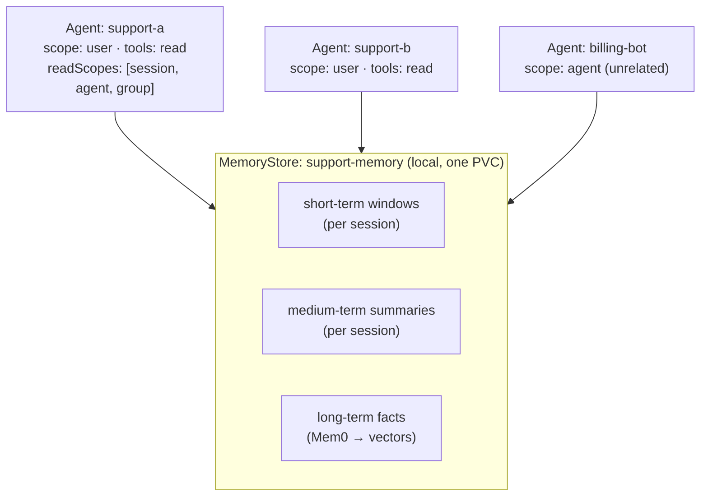

# Worked example v3 draft (restructured per review)

**Status**: placeholder draft for coherence review. Replaces the "Worked Example" section of `BLOGPOST_DRAFT_4.md` once approved and captured. `[PLACEHOLDER]` outputs are filled by a capture run. This draft doubles as the **CLI spec proposal** — it uses `kaos memory …` verbs that do not all exist yet (see "CLI surface used" at the end); reviewing the example reviews the proposed CLI.

Changes from v2 per review: clearer setup (system + architecture + access table + reusable sample, modelled on the auth walkthrough); Part 1 now focuses on short + medium-term memory with a deterministic compaction trigger (configured tiny token budget, no "…ten more turns" ellipsis); the redundant "new session can't see other sessions" beat is removed; Part 3 is no longer store-deletion — it demonstrates the memory tools recalling at different entitled scope levels.

---

## Worked Example: A Support Assistant That Remembers

We will build one small agentic system and use it to watch each memory mechanism from this post work: the short-term window folding into a medium-term summary, cross-session facts recalled by meaning, scopes isolating and aggregating, and the model-driven memory tools recalling at different levels.

### The system under evaluation

The system is a small support desk: two assistant agents that share a team knowledge base, plus one unrelated agent used to prove isolation.



Every component's access to memory is declared, not implicit. This is the access model the rest of the example exercises:

| Agent | `scope` (home partition) | `tools` | `readScopes` (tool entitlement) | Sees |
| --- | --- | --- | --- | --- |
| `support-a` | `user` | `read` | `session`, `agent`, `group` | the user's own history, its own agent memory, the shared team knowledge |
| `support-b` | `user` | `read` | `session`, `group` | the user's own history, the shared team knowledge (not `support-a`'s private agent memory) |
| `billing-bot` | `agent` | — | — | only its own agent partition (used as an isolation control) |

Two things follow from the table. Both support agents write to the *same* store, so a fact saved at `group` is visible to both; but each agent's `readScopes` decides which levels its model may *query* on demand. And `billing-bot` shares the store yet, by scope, can see none of the support memory.

### The reusable sample

All of it is one override-friendly sample, applied in a single step (the manifests live under `samples/memory/`, the same pattern as the other KAOS samples):

```bash
kaos sample apply memory --namespace support-demo
```

That creates the `ModelAPI`, the `MemoryStore` (`support-memory`), and the three agents above. The store is configured with a deliberately small short-term budget so compaction is easy to trigger in Part 1:

```yaml
# excerpt from the sample — the store's conversational-tier knobs
apiVersion: kaos.tools/v1alpha1
kind: Agent
metadata:
  name: support-a
spec:
  config:
    memory:
      memoryStore: support-memory
      scope: user
      tools: read
      readScopes: [session, agent, group]
      clientParams:
        tokenBudget: 256        # small, so a few turns overflow the window
        rollingSummary: true    # fold overflow into a medium-term summary
```

---

### Part 1: Short-Term Window, Medium-Term Summary

A single conversation, sized to cross the 256-token budget on purpose. We talk to `support-a` about one incident across a handful of turns:

```bash
kaos agent invoke support-a -n support-demo --session ticket-42 --user alice \
  -m "Ticket 42: checkout returns 500 for EU customers since the 3pm deploy"
kaos agent invoke support-a -n support-demo --session ticket-42 --user alice \
  -m "The 500s are only on the payments call, and only for EUR currency"
kaos agent invoke support-a -n support-demo --session ticket-42 --user alice \
  -m "Rolling back the payments service cleared it; root cause is a missing EUR rate key"
```

Now inspect what the store holds for that session. The short-term window kept only the most recent turns (the budget overflowed); the older turns were folded into the medium-term summary:

```bash
kaos memory recall --scope session --session ticket-42 -n support-demo --short-term
```

```
[PLACEHOLDER: short_term.recent = last turn(s) only;
 medium_term.summary = rolling narrative of the earlier turns ("investigated 500s on
 the EU checkout, traced to the payments EUR path, resolved by rollback…")]
```

Two mechanisms are visible in that one response: the **window is bounded** (it did not grow with the conversation), and continuity survived eviction because the overflow became a **summary** rather than being truncated. Neither cost the conversation a blocking step — folding ran in the background after the turns.

---

### Part 2: Scopes — Isolation and Aggregation

Every record above was written with full attribution (the agent, the user `alice`, the session, the store's group). That single write is now readable at different levels.

**Per user, across agents.** Alice raises a second ticket, this time with `support-b`:

```bash
kaos agent invoke support-b -n support-demo --session ticket-99 --user alice \
  -m "Ticket 99: alice's SSO login loops on the staging tenant"
```

A `user`-scoped recall aggregates everything Alice contributed through *either* assistant:

```bash
kaos memory recall --scope user --user alice -n support-demo --query "alice's tickets"
```

```
[PLACEHOLDER: facts from BOTH ticket-42 (support-a) and ticket-99 (support-b), all carrying user_id=alice]
```

**Shared across the team.** A fact saved at group level is visible to every agent on the store:

```bash
kaos memory recall --scope group -n support-demo --query "known EU incidents"
```

```
[PLACEHOLDER: group-visible facts, e.g. the EUR rate-key root cause]
```

**Isolation holds.** `billing-bot` shares the same store, database, and tables, but a recall at its agent scope returns none of the support memory:

```bash
kaos memory recall --scope agent --agent billing-bot -n support-demo --query "checkout 500"
```

```
[PLACEHOLDER: empty — no cross-agent leakage]
```

**Erasure is one operation.** Because every record carries Alice's principal, one `forget` reaches her contributions across both assistants and all her sessions:

```bash
kaos memory forget --scope user --user alice -n support-demo
```

```
[PLACEHOLDER: forget response; follow-up user/group recalls show alice's records gone, billing-bot untouched]
```

"Delete everything about Alice" did not require knowing which agents she used.

---

### Part 3: The Memory Tools — Recall at Different Levels

The automatic baseline recalls and persists on every turn with no model involvement. On top of that, `support-a` was given `tools: read` with `readScopes: [session, agent, group]`, so its model has a `search_memory` tool whose `level` can be exactly those three, and no others:

```
[PLACEHOLDER: tool schema excerpt — "level": {"enum": ["session", "agent", "group"]}]
```

`support-b` was entitled to only `[session, group]`, so `agent` is absent from its enum — the model cannot even express an agent-level search there. This is the entitlement expressed as the tool surface, not as a runtime argument the model supplies.

Now drive queries that make the model choose a level. Asked about *this* conversation, it searches `session`; asked what the *team* knows, it searches `group`:

```bash
kaos agent invoke support-a -n support-demo --session ticket-42 --user alice \
  -m "What did we establish earlier in THIS ticket about the currency?"
```

```
[PLACEHOLDER: reply + trace/telemetry showing search_memory(level="session") returning the EUR detail from ticket-42]
```

```bash
kaos agent invoke support-a -n support-demo --session ticket-77 --user alice \
  -m "Has the team seen EU checkout failures like this before?"
```

```
[PLACEHOLDER: reply + trace showing search_memory(level="group") returning the shared EUR rate-key fact, from a fresh session]
```

The same request shape, two different memory surfaces, chosen by the model within a boundary it cannot exceed. And because the level is the tool, the choice is legible in telemetry as `search_memory(level=…)` rather than hidden in an argument.

### Where This Composes

Two configurations we did not run here are where the pieces above compose. An agent can set `defaultReadScope: group`, so its automatic baseline recalls the *fleet's* knowledge before every run — combine that with an always-on autonomous agent from the [autonomous agents post](https://hackernoon.com/) publishing findings at group level, and one agent's observations become every agent's context. And on a cluster with OIDC enabled, the explicit `--user alice` above becomes automatic: the operator detects user identity and `agent` scope silently becomes per-user, fail-closed, keyed to the gateway-verified principal — Alice and Bob get separate memory on the same agent with no configuration at all.

---

## CLI surface used (this is the spec to review)

The example assumes these verbs. Some exist, some are the proposed new admin surface:

| Command | Status | Purpose |
| --- | --- | --- |
| `kaos sample apply memory` | proposed (samples pattern exists) | apply the reusable memory sample |
| `kaos agent invoke <agent> --session <id> --user <p> -m …` | exists (`--user` from the auth CLI) | talk to an agent as a user, in a session |
| `kaos memory recall --scope <level> [--user][--agent][--session][--query][--short-term]` | **new (admin)** | inspect the store at an explicit scope, via port-forward + `/v1/recall` |
| `kaos memory forget --scope <level> [--user][--agent]` | **new (admin)** | erase a scope, via `/v1/forget` |
| `kaos agent memory <agent> [--session]` | exists | an agent's own session events (agent `/memory/events`) |

Design notes for the CLI spec (to formalise after review):
- `kaos memory recall/forget` is the **admin path**: it constructs the scope from the flags and hits the memory service directly through a `kubectl port-forward`; authorization is Kubernetes RBAC (you can port-forward = you are an operator). No user token.
- `--agent support-a` is expanded by the CLI to the stored qualified identity `kaos://agent/<ns>/support-a`. `--user alice` must match the stored principal — verbatim in this OIDC-off example; on a real OIDC cluster the principal is the token subject, so `--user` carries the `sub`.
- `--scope` selects the level; the relevant identity flag (`--user` / `--agent` / `--session`) supplies the owner, matching the four scope levels.

## Capture run notes (not blog text)

- Needs the stack (#280/#282/#286) images. Model dependency: Parts 1 and 3 need a real tool-calling + summarizing model (the compaction summary and the model choosing `search_memory` levels are not deterministic under a pure mock). Parts 1 (window/summary structure) and 2 (scope recall/forget) can be *asserted* against the service regardless of reply quality; Part 3's level-routing needs a capable model. **Open question for the user:** provide LLM access (small hosted model or Ollama with a tool-capable model) for the capture, or accept mock replies for the prose and assert only the service/telemetry state.
- Placeholders map to: Part 1 → P4-style window/summary; Part 2 → P1/P2/P3 + P7 erasure; Part 3 → tool-enum (P6) + level-routing (new, needs model).
- The `kaos memory` verbs must be implemented (their own PR, per the spec above) before an end-to-end capture using them; until then the capture can fall back to the port-forward + curl equivalents the CLI wraps.
