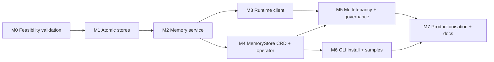

# Proposed work split and sequencing

**Status**: Draft for execution (v1)
**Date**: 2026-07-01
**Scope**: High-level phasing of the implementation that realises the KAOS memory architecture decided across [adr_0001](../adrs/adr_0001_memory-model-and-lifecycle-operations.md) through [adr_0005](../adrs/adr_0005_multi-tenancy-agent-grouping-and-governance.md), grounded in the requirements baseline ([KAOS-R1](../research/KAOS-R1-memory-features-and-limitations.md)) and the target picture ([KAOS-R7](../research/KAOS-R7-target-picture.md)). It spans the KAOS Python runtime (`pydantic-ai-server`), a new central memory service, the Go operator, the `kaos` CLI, and the Helm chart.

---

## Purpose

This document proposes *how the memory work is chunked and in what order*, before the detailed task-level plans. It is intentionally high level: the goal is to agree the sequencing and the dependency structure, not the granular tasks. Each phase is executed as its own plan-implement iteration (one PR per phase), and the detailed per-phase task breakdown lives in its own `M<n>-<slug>.md` plan file next to this one.

The implementation order deliberately does **not** follow the ADR numbering. The ADRs are organised by topic; the implementation is organised **bottom-up** — build and validate the smallest independently-testable stores first, compose them into a service, then wire the data plane and control plane around it — and is **gated by a feasibility-validation phase (M0)** whose findings can reshape everything downstream. Several ADRs are realised across multiple phases, and several phases pull from multiple ADRs at once.

---

## Guiding principles for the split

- **Validate first (M0), then build.** Before committing to the design, prove the load-bearing hypotheses with a working validation harness in `./tmp/memory/` (gitignored): Mem0 as a library against Chroma and pgvector with correct scope-filtered recall, Mem0's models routed through a KAOS `ModelAPI` (OpenAI-compatible base URL), a token-budget short-term tier on SQLite/Postgres, and a Pydantic AI run consuming recalled context. M0 is not throwaway scaffolding — it is real, runnable checks that gate the build and feed plan deltas back into the later phases.
- **Bottom-up: atomic stores first, wire last.** Start with the two smallest independently-testable pieces — the Mem0 long-term adapter and the relational short-term tier store — then compose them into the memory service, and only then integrate the runtime data plane and the operator control plane.
- **One central service, thin agents.** The memory engine runs as a single central service that wraps Mem0 as a library ([adr_0004](../adrs/adr_0004_deployment-topology-and-control-plane.md)); agents call it over the network and stay thin. The service owns both tiers (short-term and long-term), summarization, scope enforcement, and OpenTelemetry; the runtime is a client.
- **Alpha clean break, no compatibility shim.** KAOS is in alpha, so the existing `Memory` method surface, the `MEMORY_*` configuration, and the inline `MemoryConfig` CRD block are redesigned rather than preserved ([adr_0003](../adrs/adr_0003_memory-interface-and-runtime-data-plane.md), [adr_0004](../adrs/adr_0004_deployment-topology-and-control-plane.md)). Long-term memory is additive at the feature level — an agent without a configured store is unaffected — but the short-term tier is not held backward-compatible.
- **Mocks break upstream dependencies.** Early phases stand a store up directly (library mode, crafted scope identifiers, a static `ModelAPI`) so each piece is validated before the operator can deploy it: the adapter and short-term store are unit-tested with fakes; the service is exercised by a local client before the CRD exists; scope is injected from a simulated request context before the full multi-tenancy model lands.
- **Build on what exists.** The operator already deploys workloads from CRDs (the MCPServer controller is the template), the `ModelAPI` CRD already models a `mode`-plus-config shape and `{modelAPI, model}` references, and the CLI already has a `kaos system install` integration-flag pattern (`--gateway-enabled`, `--metallb-enabled`, `--monitoring-enabled`). The phases extend these rather than greenfielding.
- **One phase = one plan-implement iteration = one PR**, stacked, with tests validated and CI green before moving on. Progress and learnings for each phase are documented under `impl/` (see end). After each phase the next plan is re-read and recalibrated against what was learned.

---

## Current-state baseline (what already exists)

This grounds why the phases are shaped the way they are.

- **KAOS runtime (`pydantic-ai-server/pais`)**: a single short-term-memory tier through the `Memory` ABC with `LocalMemory` (in-process `deque` bounded by `maxlen`), `RedisMemory`, and `NullMemory` backends (`pais/memory.py`, 695 lines). `build_message_history` replays only `user_message` and `agent_response` events and drops tool calls, tool results, and delegations; overflow is truncation, not summarization. The backend is chosen by `_create_memory` in `pais/server.py` (~line 646) from `MEMORY_*` env vars and injected into the agent run. There is no long-term tier, no recall, no vector store, no scope dimension beyond a session/user key, and no consolidation or forgetting ([KAOS-R1](../research/KAOS-R1-memory-features-and-limitations.md)).
- **KAOS operator (Go)**: an inline `MemoryConfig` on `AgentSpec.Config.Memory` (`operator/api/v1alpha1/agent_types.go`) describing only short-term memory (`enabled`, `type: local|redis`, `contextLimit`, `maxSessions`, `maxSessionEvents`), surfaced to the runtime as `MEMORY_*` env. There is no resource describing a long-term backend. The operator already reconciles other CRDs into Deployments/Services with owner references, status conditions, and `defaultImages`-driven image selection (the MCPServer and ModelAPI controllers are the templates), and `ModelAPI` already models a `mode`-plus-matching-config-block shape that `MemoryStore` mirrors.
- **KAOS CLI (`kaos-cli`)**: `kaos system install` integrates optional cluster components behind flags (`--gateway-enabled`, `--metallb-enabled`, `--monitoring-enabled`) by driving Helm/kubectl. A new `--memory-enabled` switch and an opt-in development Postgres provisioning step fit this existing pattern.
- **Engine and topology decisions (settled)**: Mem0 is the adopted long-term engine, run as a library inside a central KAOS-owned memory service ([adr_0002](../adrs/adr_0002_memory-implementation-mem0-and-pydantic-ai-integration.md), [adr_0004](../adrs/adr_0004_deployment-topology-and-control-plane.md)). Storage is a single `storage.type: local | external` switch — `local` is embedded Chroma plus a SQLite short-term table in one container on a PVC (single replica); `external` is pgvector plus a plain short-term table on one shared Postgres (stateless, `replicas: 2+`). Background extraction is in-process fire-and-forget with no durable queue. The `MemoryStore` CRD carries only infrastructure and the `summarization`/`embedding` model roles; the Agent keeps a slim behavioural memory block (`storeRef`, `shortTermTokenBudget`, `rollingSummary`, `recall.presentation`, `failureMode`, and the `scope` from [adr_0005](../adrs/adr_0005_multi-tenancy-agent-grouping-and-governance.md)).

---

## The proposed phases

M0 validates and gates everything. M1–M2 build the atomic stores and the service bottom-up; M3 wires the runtime data plane and M4 the operator control plane (siblings off M2); M5 closes multi-tenancy and governance across both planes; M6 integrates the installer and samples; M7 productionises and documents. **Phase numbers are stable identifiers; the sections below are listed in execution order.** M0 learnings may reshape later phases.

### M0 — Feasibility validation and hypothesis testing

**Goal**: prove, with working checks, that the architecture is buildable before writing production code; surface groundwork and plan deltas.

**Scope** (artifacts live in `./tmp/memory/`, gitignored; findings written to `impl/learnings/`):
- run Mem0 in library mode against an embedded **Chroma** store and against **pgvector**, exercising `add`/`search`/`delete` with `user_id`/`agent_id`/`run_id` scope identifiers, and confirm scope filtering is applied **inside** the vector query (correct pre-filtered multi-tenant recall) rather than post-filtered;
- route Mem0's extraction (LLM) and embedding models through a KAOS `ModelAPI` (LiteLLM proxy, OpenAI-compatible base URL) rather than direct provider keys, confirming the `{modelAPI, model}` binding works end to end;
- a minimal token-budget short-term tier on a relational table (SQLite locally, Postgres externally) with a rolling-summary sketch, confirming insert-and-recency-scan and summarized overflow;
- a Pydantic AI agent run that consumes recalled facts as a structured system block, confirming the recall-presentation contract;
- a deployability check — the `local` single-container shape (Chroma + SQLite on one PVC) and the `external` shape (pgvector + Postgres) both stand up in KIND.

**Realises**: de-risks [adr_0002](../adrs/adr_0002_memory-implementation-mem0-and-pydantic-ai-integration.md) (engine + integration), [adr_0003](../adrs/adr_0003_memory-interface-and-runtime-data-plane.md) (short-term tier, recall presentation), [adr_0004](../adrs/adr_0004_deployment-topology-and-control-plane.md) (storage modes, model routing), and the scope-filter correctness premise of [adr_0005](../adrs/adr_0005_multi-tenancy-agent-grouping-and-governance.md).

**Depends on**: nothing. **Outputs**: a go/no-go plus concrete plan deltas, written to `impl/learnings/M0-feasibility-validation.md`. **Demoable**: the harness scripts run green and demonstrate scope-correct recall on both stores and model routing through a `ModelAPI`.

### M1 — Atomic memory stores: long-term adapter and short-term tier

**Goal**: the two smallest independently-testable building blocks, with no service or network around them yet.

**Scope**: build, as library modules with full unit coverage, (a) the **long-term adapter** that wraps Mem0 — scope-mapped `write`/`recall`/`delete` translating the KAOS scope onto Mem0's `user_id`/`agent_id`/`run_id`, against both the Chroma and pgvector providers selected by a storage config; and (b) the **short-term tier store** — a relational table (session, role, content, created time, metadata) with token-budget eviction, a rolling-summary hook, and recency-ordered retrieval, on SQLite (`local`) or Postgres (`external`). Models bind to a `ModelAPI` endpoint resolved from configuration. No HTTP surface, no scope enforcement policy, no operator — those come next. Apply M0 learnings.

**Realises**: the engine-adapter and short-term tier-storage decisions of [adr_0002](../adrs/adr_0002_memory-implementation-mem0-and-pydantic-ai-integration.md) and [adr_0003](../adrs/adr_0003_memory-interface-and-runtime-data-plane.md).

**Depends on**: M0. **Demoable**: unit tests show scope-correct write/recall/delete on the adapter against both providers (with fakes/local stores) and token-budget-plus-summary behaviour on the short-term store.

### M2 — Central memory service (HTTP API composing both tiers)

**Goal**: a deployable central memory service that composes the two stores behind the [adr_0003](../adrs/adr_0003_memory-interface-and-runtime-data-plane.md) contract.

**Scope**: a thin KAOS-owned Python service that imports the M1 stores and exposes the memory operations over HTTP — **synchronous recall** on the hot path, **asynchronous write/extract, consolidate, and forget** as in-process fire-and-forget background tasks bounded by a concurrency setting, the short-term tier operations, the rolling summary executed service-side using the `summarization` model, server-side scope injection from the request context (never trusted from the caller), the fail-soft degradation contract (recall failure returns short-term-memory-only, write failure retried in the background), and OpenTelemetry spans at the operation boundary. It honours the single `storage.type: local | external` switch (Chroma + SQLite single container, or pgvector + Postgres) with idempotent schema setup on boot. Packaged as a container image built by the existing image pipeline. Exercised by a local client and unit/integration tests; no operator yet.

**Realises**: the central-service topology, execution model, storage modes, and degradation contract of [adr_0004](../adrs/adr_0004_deployment-topology-and-control-plane.md); the runtime operation set and observability boundary of [adr_0003](../adrs/adr_0003_memory-interface-and-runtime-data-plane.md).

**Depends on**: M1. **Demoable**: the service runs locally in both storage modes; a client performs scope-isolated write-then-recall, sees background extraction complete, and observes fail-soft behaviour when the store is stopped.

### M3 — Runtime data-plane integration (`pais` memory client)

**Goal**: the agent runtime consumes the memory service through a redesigned `Memory` contract.

**Scope**: redesign the `Memory` abstraction in `pais/memory.py` from the short-term-only event-deque contract into the tiered one — recall (sync), write/extract, consolidate, forget — backed by a **service client** that calls M2 over HTTP; replace `_create_memory` and the `MEMORY_*` configuration (alpha clean break, no shim); fix the message-history bridge to replay full-fidelity history including `ToolCallPart`, `ToolReturnPart`, and delegation parts; inject recalled long-term context as a **structured memory block** by default with **opt-in save/load memory tools**; derive and inject tenant/agent scope server-side from the authenticated request context and the agent's verifiable identity (`AgentDeps`), never from caller- or model-supplied arguments; wire recall/write hooks into the agent run, the autonomous loop (`pais/a2a.py`), and A2A delegation (`pais/tools.py` `DelegationToolset`). OpenTelemetry spans follow the existing `kaos.*` convention.

**Realises**: the runtime interface, short-term tier-as-consumed, recall presentation, message-history fidelity, and scope-injection decisions of [adr_0003](../adrs/adr_0003_memory-interface-and-runtime-data-plane.md); the runtime side of the `Mem0Memory` integration in [adr_0002](../adrs/adr_0002_memory-implementation-mem0-and-pydantic-ai-integration.md).

**Depends on**: M2. **Demoable**: an agent pointed at a locally-running memory service recalls prior-session facts into its context, stores new facts in the background, and replays its own prior tool calls on a continuing run.

### M4 — Control plane: `MemoryStore` CRD and operator reconciliation

**Goal**: declarative deployment and operation of the memory service through the operator.

**Scope**: add the `MemoryStore` CRD (`engine`, `storage.type` with `local`/`external` blocks mirroring `ModelAPI`'s mode-plus-config shape, `replicas`, `models.summarization`/`models.embedding` as `{modelAPI, model}`, `extraction.concurrency`) carrying only infrastructure and models; add the operator controller that reconciles it into the memory-service `Deployment` and `Service` (plus a `PersistentVolumeClaim` in `local` mode), wires the storage secret and the referenced `ModelAPI` endpoints as environment, validates that model references resolve and are Ready, and reports health and the service endpoint in status (the MCPServer controller is the template); replace the inline `MemoryConfig` on the Agent with the slim behavioural block (`storeRef`, `shortTermTokenBudget`, `rollingSummary`, `recall.presentation`, `failureMode`) and surface it to the runtime; regenerate CRD manifests and deepcopy (`make generate manifests`), and wire the new CRD, controller RBAC, and memory-service image tag into the Helm chart and `defaultImages`.

**Realises**: the `MemoryStore` CRD, the slim Agent block, and the operator reconciliation/schema-ownership decisions of [adr_0004](../adrs/adr_0004_deployment-topology-and-control-plane.md).

**Depends on**: M2. **Demoable**: applying a `MemoryStore` deploys a healthy memory service; an Agent with `storeRef` set is reconciled, becomes Ready (or not-Ready with a clear condition when the store is unavailable), and its runtime reaches the service.

### M5 — Multi-tenancy, scope enforcement, and governance

**Goal**: enforce isolation and the lifecycle governance the target requires.

**Scope**: implement the three-value `scope` enum (`private | user | shared`) on the Agent memory block and map it onto Mem0's owner filter keys in the service; make scope filtering **non-optional and fail-closed** at the service (a request that cannot resolve a trusted scope fails rather than querying an unscoped store); bind A2A delegation propagation so a delegate inherits the delegator's scope prefix (shared-above, isolated-below) injected server-side through `DelegationToolset`, overridable to full-share or full-isolation; implement synchronous scope-targeted right-to-erasure that fans out across both tiers (short-term table by scope prefix, Mem0 `delete` filtered by scope, rolling-summary clear); confirm audit rides existing OpenTelemetry. Store-per-tenant isolation is emergent (deploy multiple `MemoryStore`s) and needs no new field.

**Realises**: the scope enum, store-as-group, fail-closed enforcement, A2A binding, and erasure decisions of [adr_0005](../adrs/adr_0005_multi-tenancy-agent-grouping-and-governance.md).

**Depends on**: M3, M4. **Demoable**: two agents with different scopes cannot read each other's private memory; a delegate inherits the configured prefix; a scoped erasure removes exactly that scope's items from both tiers.

### M6 — CLI install integration and samples

**Goal**: a turnkey on-ramp consistent with the rest of KAOS.

**Scope**: add `kaos system install --memory-enabled` following the existing integration-flag pattern, installing/upgrading the chart with the memory components; add the **opt-in development Postgres** provisioning as an explicit first-class step (never the production default), alongside the existing gateway/load-balancer provisioning; ship a `MemoryStore` sample and an Agent-with-memory sample under the samples surface; extend the CLI dry-run YAML validation tests.

**Realises**: the CLI-provisioned development Postgres and install integration of [adr_0004](../adrs/adr_0004_deployment-topology-and-control-plane.md).

**Depends on**: M4. **Demoable**: `kaos system install --memory-enabled` (optionally with dev Postgres) yields a cluster where the sample `MemoryStore` and memory-enabled agent work end to end.

### M7 — Productionisation, hardening, and documentation

**Goal**: complete the operational correctness story and bring docs up to the implementation.

**Scope**: harden `external` mode for high availability (stateless `replicas: 2+`, disruption budget, readiness/liveness, Mem0 change-history log disabled/ignored); finalise the `failureMode: soft | strict` behaviour end to end; add metrics/health endpoints and the memory operation metrics; evaluate (and record a decision on) the deferred durable at-least-once extraction queue, building it only if write durability proves a hard requirement; promote the most valuable M0 harnesses into committed e2e tests runnable in CI (KIND); write the user- and operator-facing documentation (memory model, `MemoryStore` and Agent surfaces, install flow, scope/multi-tenancy, operations) and update `.github/copilot-instructions.md` and the path-specific instructions.

**Realises**: the high-availability, degradation, and deferred-durable-queue follow-ups of [adr_0004](../adrs/adr_0004_deployment-topology-and-control-plane.md); the observability and governance hardening across [adr_0003](../adrs/adr_0003_memory-interface-and-runtime-data-plane.md)/[adr_0005](../adrs/adr_0005_multi-tenancy-agent-grouping-and-governance.md).

**Depends on**: M5, M6. **Demoable**: an `external`-mode store survives a replica restart with no memory loss; the e2e suite is green in CI; the docs describe the full surface.

---

## Sequencing at a glance

| Phase | Repo area | Primary ADRs | Hard prerequisites |
|---|---|---|---|
| M0 Feasibility validation | `./tmp/memory/` (KAOS) | 0002, 0003, 0004, 0005 (de-risk) | — |
| M1 Atomic stores | memory libs (Python) | 0002, 0003 | M0 |
| M2 Memory service | new memory service (Python) | 0004, 0003 | M1 |
| M3 Runtime client | `pydantic-ai-server/pais` | 0003, 0002 | M2 |
| M4 MemoryStore CRD + operator | `operator/`, chart | 0004 | M2 |
| M5 Multi-tenancy + governance | service + `pais` + operator | 0005 | M3, M4 |
| M6 CLI install + samples | `kaos-cli`, chart, samples | 0004 | M4 |
| M7 Productionisation + docs | all + docs | 0003, 0004, 0005 | M5, M6 |

---

## Cross-cutting notes

- **Simulation contract (pre-M4).** Until the operator deploys the service (M4), the storage config, the `ModelAPI` binding, and the request scope are supplied directly (config files, a static `ModelAPI`, a simulated request context) so M1–M3 are validated without the control plane. Real scope derivation and CRD-driven wiring land in M4/M5.
- **Where the new code lives.** The two stores (M1) and the memory service (M2) are new Python code in the KAOS repo (a dedicated service area, sibling to `pydantic-ai-server` and `mcp-servers`, exact home decided in the M1/M2 plans from the surface map); the runtime client (M3) extends `pydantic-ai-server/pais`; the control plane (M4) extends `operator/`; the installer (M6) extends `kaos-cli`. None of it lives inside the operator binary — the operator deploys it.
- **Testing strategy.** Unit tests land in-repo as functionality is built (pais `pytest` + `make lint`, operator `make test-unit` + `make generate manifests`, kaos-cli dry-run YAML tests); integration coverage starts as scripted local-KIND checks promoted to automated e2e (`operator/tests/e2e`) where practical. M0 harnesses in `./tmp/memory/` may be promoted into committed tests in later phases. Run scratch in `./tmp/` (never `/tmp`) and suppress noise to `./tmp/null`.
- **Recalibration.** After each phase the next plan file is re-read and adjusted against the phase's `impl/learnings/` entry before execution begins, since each implementation produces new learnings (Mem0 API specifics, schema shape, operator wiring) that refine the downstream plans.
- **ADR reconciliation.** This plan's sequencing is consistent with the ADRs. `proposed-split.md` owns sequencing; the ADRs own the target design. Where a phase discovers the ADR must change, the ADR is amended (status lifecycle preserved) rather than silently diverged from.

---

## Explicitly later / out of the critical path

- **Durable at-least-once extraction queue** (Postgres SKIP-LOCKED job table) — evaluated in M7, built only if in-process fire-and-forget proves insufficient for write durability ([adr_0004](../adrs/adr_0004_deployment-topology-and-control-plane.md)).
- **Temporal (bi-temporal) and procedural memory tiers** — deferred behind a future Graphiti-class engine; the committed set is short-term plus a unified semantic-and-episodic long-term store ([adr_0001](../adrs/adr_0001_memory-model-and-lifecycle-operations.md), [adr_0002](../adrs/adr_0002_memory-implementation-mem0-and-pydantic-ai-integration.md)).
- **Dynamic cross-cutting agent groups** (a `MemoryGroup` membership-indirection layer) — additive evolution kept open by the stable owner anchors on every item; per-user grouping is already dynamic, so only arbitrary cross-cutting groups need it ([adr_0005](../adrs/adr_0005_multi-tenancy-agent-grouping-and-governance.md)).
- **Per-tenant rate and fair-share quotas, logical export/import, application-level encryption, proof-of-deletion ledgers** — deferred governance; capacity is bounded by PVC/Postgres sizing and encryption/backup delegated to infrastructure ([adr_0004](../adrs/adr_0004_deployment-topology-and-control-plane.md), [adr_0005](../adrs/adr_0005_multi-tenancy-agent-grouping-and-governance.md)).
- **A second long-term engine behind the `Memory` ABC** — the seam is kept but a single engine (Mem0) is shipped and supported; a graph/temporal engine is a new backend, not a watered-down interface ([adr_0002](../adrs/adr_0002_memory-implementation-mem0-and-pydantic-ai-integration.md)).
- **pgvector semantic-recall example** — a fully-fledged, documented `external`-mode example with a real embedder that demonstrates cross-session semantic long-term recall, plus a marker-gated e2e run out-of-band so default CI stays bounded ([M8-pgvector-semantic-recall-example](./M8-pgvector-semantic-recall-example.md)). The always-on memory e2e only asserts model-independent behaviour on `local` Chroma with a mock `ModelAPI`.

---
