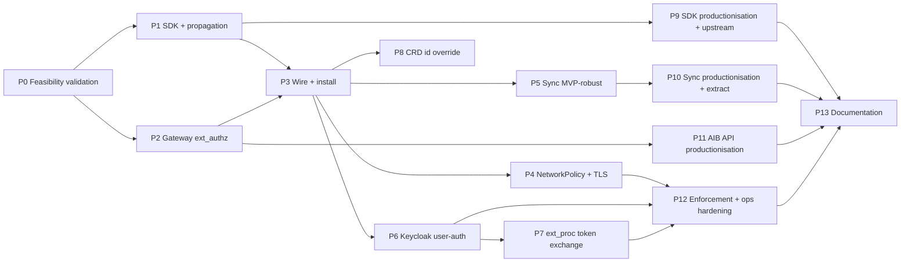

# Proposed work split and sequencing

**Status**: Draft for discussion (v2)
**Date**: 2026-06-21
**Scope**: High-level phasing of the implementation that realises the security and identity target picture ([ADR-KAOS-000](../adr-kaos/ADR-KAOS-000-target-picture.md)), spanning both the KAOS-owned ADRs (`adr-kaos/`) and the AIB-owned ADRs (`adr-aib/`).

---

## Purpose

This document proposes *how the work is chunked and in what order*, before we write a detailed task-level plan. It is intentionally high level: the goal is to agree the sequencing and the dependency structure, not the granular tasks. Detailed per-phase task breakdowns come later, once this split is approved, and each phase is executed as its own plan-implement iteration (one PR per phase).

The implementation order deliberately does **not** follow the ADR numbering, and the chunks do not map one-to-one onto individual ADRs. The ADRs are organised by topic; the implementation is organised **bottom-up** — build and validate the small atomic components first, then wire them together — and is **gated by a feasibility-validation phase (P0)** whose findings can reshape everything downstream. Several ADRs are realised across multiple phases, and several phases pull from multiple ADRs at once.

---

## Guiding principles for the split

- **Validate first (P0), then build.** Before committing to the design, prove the hypotheses with a working validation harness across AIB and KAOS. P0 is not throwaway scaffolding: it is a set of real, runnable tests/checks that must work and that confirm the approach is viable. Its learnings feed back into this plan and may pull later phases earlier.
- **Bottom-up: atomic components first, wire last.** Start with the smallest independently-testable pieces (SDK header propagation, a single gateway `ext_authz` check) and only integrate the full distributed system once each piece is independently validated.
- **Mocks/dummies break upstream dependencies.** Early phases use static/dummy identities and crafted headers so a component can be validated without its eventual upstream being finished (e.g. propagation is validated with dummy tokens; `ext_authz` is validated with crafted agent→resource headers; the user identity is simulated until Keycloak lands).
- **Temporary homes, then upstream.** Two deliverables intentionally start inside the KAOS repos for fast iteration and are relocated later as dedicated productionisation phases: the Python **SDK** (starts in the KAOS python repo, then merges/integrates upstream as an AIB package) and the **sync service** (starts in-repo as an external process, then extracted to its own repository). Neither ever lives in the operator.
- **Productionisation is several phases, not one.** Hardening the SDK (incl. the upstream merge), the sync service (incl. extraction), the AIB API extensions, and the enforcement/operational behaviour are each their own phase.
- **Build on what exists.** KAOS already has the Gateway API HTTPRoute substrate and a clean `kaos system install` integration-flag pattern; AIB already has the OAuth2 server, JWKS, token exchange, ext_proc, per-agent client credentials, and consent/grant/session models. The phases extend these rather than greenfielding.
- **One phase = one plan-implement iteration = one PR**, with tests validated and CI green before moving on. Progress and learnings for each phase are documented under `impl/` (see end).

---

## Current-state baseline (what already exists)

This grounds why the phases are shaped the way they are.

- **KAOS operator**: Gateway API HTTPRoute generation exists for Agent/MCPServer/ModelAPI (Envoy Gateway), but with no `jwt_authn`, `ext_authz`, `ext_proc`, TLS listener, or NetworkPolicy. There is no `spec.security` on any CRD. The requested-edge wiring already exists as `spec.modelAPI`, `spec.mcpServers[]`, and `spec.agentNetwork.access[]`. There is no credential mounting. The CLI install uses a helm/kubectl integration-flag pattern (`--gateway-enabled`, `--metallb-enabled`, `--monitoring-enabled`).
- **KAOS runtime (`pais`)**: no authentication anywhere today — only OpenTelemetry trace-context injection on outbound calls. The incoming `Authorization` header is not forwarded; there is no agent/actor token, no `x-agent-authorization`, and no SDK abstraction. Delegation and MCP calls attach no identity headers.
- **AIB (Go)**: already implements the OAuth2 authorization server (`/oauth2/authorize`, `/oauth2/token`, JWKS), RFC 8693 token exchange, the Envoy ext_proc token-exchange service, per-agent client-credential issuance (admin API), consent / user-grant / user-session (token vault) / PermissionSet models, and CEL + JWT validation helpers. It does **not** implement an Envoy `ext_authz` `Check` service, a `/api/access/check` endpoint, a Python SDK, or a native resource-grant model, and `client_credentials` is currently wired only on the ext_proc exchanger path rather than as a first-class token-endpoint grant.
- **AIB deployability (the [1.5] groundwork)**: AIB's Helm chart references an **unpublished** image (`repository: agentic-identity-broker`, `tag: ""`), ships multiple Dockerfiles (main, `extproc`, `migrate`, `web`, `mock`), and depends on **Postgres + a migration job**. There is no image-publishing CI. So any in-cluster validation or install must first build the AIB images into the cluster (e.g. KIND load), stand up Postgres, and run migrations. A `Dockerfile.mock` / `mocks/` exists and is useful for P0.

---

## The proposed phases

P0 validates and gates everything. P1–P8 build and wire the MVP bottom-up. P9–P12 productionise. P13 documents. P0 learnings may reorder P5 (sync) and P6 (user auth) earlier.

### P0 — Feasibility validation and hypothesis testing

**Goal**: prove, with working tests, that the whole approach is viable before building production code; surface groundwork and plan-deltas.

**Scope** (artifacts live in the KAOS repo `./tmp/security/`, gitignored; findings written to `impl/learnings/`):
- run AIB locally and simulate the permissions/grants/PermissionSet records (incl. the synthetic-service encoding) to confirm the resource-decision model is expressible today;
- a minimal but working validation of the AIB backend access-check path that introduces the API shape, exercised with manual tests that simulate production traffic — against a local Envoy `ext_authz` and/or a small in-cluster check;
- a simple Python client that simulates the SDK's **propagation only** (two-identity headers across a hop) — no access-check calls yet;
- a basic sync routine that can run locally to project KAOS resources into AIB, enough to drive the CLI flow;
- the [1.5] AIB deployability assessment — what is needed to build/run AIB images, Postgres, and migrations in-cluster — documented as groundwork that updates this plan;
- **CI / deployment validation** — confirm we can build images, deploy via Helm, and run the Envoy + `ext_authz` path in CI and/or a local cluster.

**Realises**: de-risks [ADR-AIB-002](../adr-aib/ADR-AIB-002-aib-access-check-api.md), [ADR-AIB-001](../adr-aib/ADR-AIB-001-aib-python-sdk-design.md) (propagation slice), [ADR-KAOS-004](../adr-kaos/ADR-KAOS-004-aib-responsibility-boundary.md)/[005](../adr-kaos/ADR-KAOS-005-authorization-and-policy-model.md) (encoding), [ADR-KAOS-008](../adr-kaos/ADR-KAOS-008-aib-integration-and-synchronization-architecture.md) (sync + install).

**Depends on**: nothing. **Outputs**: a go/no-go + concrete plan-deltas (including any phase reordering and the [1.5] groundwork list).

### P1 — Python SDK and header propagation (temporary home)

**Goal**: the first atomic component — two-identity header propagation as a reusable library.

**Scope**: build the SDK in the KAOS python repo (temporary home, for easy import/iteration) with header propagation (forward the user subject, attach the agent actor) wired into the `pais` runtime's RemoteAgent / MCP / A2A outbound calls; apply P0 learnings. Identities are dummy/static at this stage (real minting + machine-token lifecycle come later); access-check helpers are not built here.

**Realises**: the propagation slice of [ADR-AIB-001](../adr-aib/ADR-AIB-001-aib-python-sdk-design.md) and [ADR-KAOS-003](../adr-kaos/ADR-KAOS-003-user-request-context-propagation.md).

**Depends on**: P0. **Demoable**: A→B→MCP carries both identity headers correctly across hops, unit-tested, with no enforcement yet.

### P2 — Gateway `ext_authz` enforcement (merged gateway substrate + working check)

**Goal**: a working (not production) gateway authorization check.

**Scope**: extend the KAOS Gateway API integration to generate the Envoy `ext_authz` policy and stand up the AIB `ext_authz` `Check` service it calls, returning allow/deny keyed on the actor; validate with a few configurations using crafted headers that exercise agent→resource decisions. `ext_proc` (token exchange) is explicitly **not** a priority here, and ClusterIP restriction is **not** in scope yet. User authentication is simulated/skippable for these tests.

**Realises**: the `ext_authz` half of [ADR-KAOS-009](../adr-kaos/ADR-KAOS-009-gateway-api-resource-boundary-enforcement.md) and [ADR-AIB-002](../adr-aib/ADR-AIB-002-aib-access-check-api.md); enforcement side of [ADR-KAOS-002](../adr-kaos/ADR-KAOS-002-enforcement-topology.md)/[005](../adr-kaos/ADR-KAOS-005-authorization-and-policy-model.md).

**Depends on**: P0 (validated check shape). **Demoable**: a request with a granted agent→resource header is allowed; an ungranted one is denied, fail-closed.

### P3 — End-to-end wiring and install

**Goal**: install and wire the components into a real cluster and prove the e2e MVP.

**Scope**: first complete the [1.5] **AIB deployability groundwork** as a prerequisite (build AIB images into the cluster, Postgres, migrations, usable chart values); then extend the operator Helm chart and add `kaos system install --auth-enabled`, which configures **everything necessary** — installs AIB + the sync service, wires the operator security config, mounts agent credentials — and validate end-to-end with actually-installed components that propagation (P1) and `ext_authz` (P2) work together in-cluster.

**Realises**: [ADR-KAOS-008](../adr-kaos/ADR-KAOS-008-aib-integration-and-synchronization-architecture.md) (integration/install), install UX in [ADR-KAOS-000](../adr-kaos/ADR-KAOS-000-target-picture.md), credential mounting from [ADR-KAOS-001](../adr-kaos/ADR-KAOS-001-identity-model-and-source-of-truth.md)/[009](../adr-kaos/ADR-KAOS-009-gateway-api-resource-boundary-enforcement.md).

**Depends on**: P1, P2, and the [1.5] groundwork. **Demoable**: a one-command install yields a cluster where an agent→MCP call is propagated and authorized end to end.

### P4 — Bypass prevention and transport security

**Goal**: make the gateway the *only* path and encrypt it.

**Scope**: NetworkPolicy generation to deny direct ClusterIP workload-to-workload application traffic (so the gateway cannot be bypassed), and Gateway TLS (`selfSigned` / `certManager` / `provided`) on an HTTPS listener.

**Realises**: NetworkPolicy from [ADR-KAOS-009](../adr-kaos/ADR-KAOS-009-gateway-api-resource-boundary-enforcement.md)/[002](../adr-kaos/ADR-KAOS-002-enforcement-topology.md) and TLS from [ADR-KAOS-007](../adr-kaos/ADR-KAOS-007-transport-security-and-hardening-baseline.md).

**Depends on**: P3 (in-cluster wiring exists). **Demoable**: direct ClusterIP access is blocked; gateway traffic is TLS-terminated.

### P5 — Sync service to MVP-robust (external, in-repo)

**Goal**: a sync service good enough for the end-to-end MVP (not yet production).

**Scope**: harden the basic sync routine from P0/P3 into a standalone external service that lives **in the KAOS repo for now** (later extracted, like the SDK), reconciling identities, requested edges, synthetic services/PermissionSets, and per-agent credential Secrets. May be pulled earlier if P0 shows it is a hard dependency for P3.

**Realises**: [ADR-KAOS-008](../adr-kaos/ADR-KAOS-008-aib-integration-and-synchronization-architecture.md) (sync architecture).

**Depends on**: P3. **Demoable**: resource create/update/delete reliably reconciles into AIB and Secrets.

### P6 — User authentication (Keycloak) and gateway user-auth

**Goal**: add the human-identity half and validate combined authn.

**Scope**: introduce Keycloak (or equivalent) for user authn and extend the Gateway to validate the user provider (`jwt_authn` user provider) including redirect/login flows; keep it as programmatic as possible, requesting a token from the HOST only when an interactive step is unavoidable. May be pulled earlier per P0 learnings.

**Realises**: user-identity side of [ADR-KAOS-001](../adr-kaos/ADR-KAOS-001-identity-model-and-source-of-truth.md), [ADR-KAOS-009](../adr-kaos/ADR-KAOS-009-gateway-api-resource-boundary-enforcement.md) (two `jwt_authn` providers).

**Depends on**: P3. **Demoable**: a request needs a valid user token *and* a valid actor; both are validated at the gateway.

### P7 — `ext_proc` token exchange via the gateway

**Goal**: deliver delegated third-party tokens through the gateway.

**Scope**: wire the Envoy `ext_proc` token-exchange path to AIB, validated first with dummy services/tokens, then integrated in-cluster for a real delegated call.

**Realises**: `ext_proc` half of [ADR-KAOS-009](../adr-kaos/ADR-KAOS-009-gateway-api-resource-boundary-enforcement.md); token-vault/exchange use from [ADR-KAOS-004](../adr-kaos/ADR-KAOS-004-aib-responsibility-boundary.md).

**Depends on**: P3, P6 (user-delegated grants). **Demoable**: a protected call needing a third-party token gets one exchanged inline.

### P8 — CRD identity override

**Goal**: expose the user-configurable logical identity.

**Scope**: add `spec.security.id` (override on top of the `kaos://{kind}/{namespace}/{name}` default the earlier phases rely on) with collision/adoption handling, and test it end to end.

**Realises**: CRD surface of [ADR-KAOS-001](../adr-kaos/ADR-KAOS-001-identity-model-and-source-of-truth.md) (incl. its pre-implementation collision/adoption follow-up).

**Depends on**: P3. **Demoable**: an explicit `spec.security.id` resolves and survives delete/recreate; duplicates are rejected.

### P9 — SDK productionisation and upstream integration

**Goal**: make the SDK production-grade and move it to its proper home.

**Scope**: add the machine-token lifecycle (refresh-ahead caching, file-watched credential reload, single reactive 401 retry, backoff) and the optional access-check/token-exchange/validation helpers; then **merge and integrate the SDK upstream as a proper AIB package** and repoint the runtime at it. This relocation is a distinct deliverable in its own right.

**Realises**: full [ADR-AIB-001](../adr-aib/ADR-AIB-001-aib-python-sdk-design.md), token lifecycle in [ADR-KAOS-006](../adr-kaos/ADR-KAOS-006-re-authentication-execution-model.md).

**Depends on**: P1 (and feature-complete MVP).

### P10 — Sync service productionisation and extraction

**Goal**: make the sync service production-grade and extract it.

**Scope**: robustness, drift/status handling, packaging; then **extract it from the KAOS repo to its own repository** with its own release/CI, consistent with the SDK relocation.

**Realises**: productionisation of [ADR-KAOS-008](../adr-kaos/ADR-KAOS-008-aib-integration-and-synchronization-architecture.md).

**Depends on**: P5.

### P11 — AIB API extensions productionisation

**Goal**: make the AIB-side additions production-grade and upstream them.

**Scope**: harden the `ext_authz` `Check` service, `/api/access/check`, the first-class `client_credentials` token-endpoint grant, and the synthetic-service/PermissionSet encoding; evaluate promoting the encoding toward a native resource-grant model; upstream into AIB.

**Realises**: productionisation of [ADR-AIB-002](../adr-aib/ADR-AIB-002-aib-access-check-api.md) and the AIB capabilities behind [ADR-KAOS-004](../adr-kaos/ADR-KAOS-004-aib-responsibility-boundary.md)/[005](../adr-kaos/ADR-KAOS-005-authorization-and-policy-model.md).

**Depends on**: P2.

### P12 — Enforcement and operational hardening

**Goal**: complete the operational correctness story.

**Scope**: surface re-authentication/failure outcomes through the gateway (`platform_grant_missing`, `user_grant_required`, `third_party_reauth_required` + re-auth URL) and record `user_action_required` for autonomous runs; finalise fail-closed behaviour and the requested-vs-approved semantics end to end; validate the backend-neutral OPA drop-in over the same `ext_authz` contract; production-harden NetworkPolicy/TLS.

**Realises**: [ADR-KAOS-006](../adr-kaos/ADR-KAOS-006-re-authentication-execution-model.md), remainder of [ADR-KAOS-005](../adr-kaos/ADR-KAOS-005-authorization-and-policy-model.md), hardening of [ADR-KAOS-007](../adr-kaos/ADR-KAOS-007-transport-security-and-hardening-baseline.md).

**Depends on**: P4, P6, P7.

### P13 — Documentation across components

**Goal**: bring user- and operator-facing docs up to the same structure as the implementation.

**Scope**: document the security/identity model, install flow, CRD surface, SDK, sync service, and AIB extensions, mirroring the component structure; backfill any consistency tests still missing.

**Depends on**: feature-complete and productionised components.

---

## Sequencing at a glance

| Phase | Repo(s) | Primary ADRs | Hard prerequisites |
|---|---|---|---|
| P0 Feasibility validation | KAOS + AIB (`./tmp/security/`) | AIB-002, AIB-001, KAOS-004/005/008 (de-risk) | — |
| P1 SDK + propagation | KAOS python (temp) | AIB-001 (propagation), KAOS-003 | P0 |
| P2 Gateway `ext_authz` | KAOS + AIB | KAOS-009 (ext_authz), AIB-002 | P0 |
| P3 Wire + install | KAOS (+ AIB deploy) | KAOS-008/000/001 | P1, P2, [1.5] groundwork |
| P4 NetworkPolicy + TLS | KAOS | KAOS-009/002/007 | P3 |
| P5 Sync MVP-robust | KAOS (in-repo) | KAOS-008 | P3 (may move earlier) |
| P6 Keycloak user-auth | KAOS | KAOS-001/009 | P3 (may move earlier) |
| P7 `ext_proc` token exchange | KAOS + AIB | KAOS-009/004 | P3, P6 |
| P8 CRD id override | KAOS | KAOS-001 | P3 |
| P9 SDK productionisation + upstream | KAOS → AIB | AIB-001, KAOS-006 | P1 |
| P10 Sync productionisation + extract | KAOS → own repo | KAOS-008 | P5 |
| P11 AIB API productionisation | AIB | AIB-002, KAOS-004/005 | P2 |
| P12 Enforcement + ops hardening | KAOS | KAOS-006/005/007 | P4, P6, P7 |
| P13 Documentation | all | all | P9–P12 |

---

## Cross-cutting notes

- **Simulation contract (pre-P6).** Until P6, the user identity is a static injected header and the agent actor is a dummy/static token; real `client_credentials` minting and the machine-token lifecycle arrive in P9. This is what lets P1–P5 be validated without the full identity stack.
- **AIB-side work is a thread, not a phase.** The AIB backend additions appear as: P0 (validate the shape) → P2 (working `ext_authz` `Check`) → P11 (productionise + upstream). They are made in the cloned `agentic-identity-broker` repo.
- **Temporary-home relocations.** SDK: P1 (KAOS python) → P9 (upstream AIB package). Sync: P5 (KAOS repo) → P10 (own repo). Neither is ever in the operator.
- **Testing strategy.** Tests are added in-repo as functionality lands and backfilled for consistency, especially during productionisation; integration coverage may start as manual/scripted (a local k8s cluster is available) and is promoted to automated CI where practical. P0 harnesses in `./tmp/security/` may be promoted into committed tests in later phases.
- **ADR reconciliation.** This plan's sequencing is consistent with the ADRs; the only content nuances to reflect when we touch them are the SDK's temporary KAOS-python home before upstreaming ([ADR-AIB-001](../adr-aib/ADR-AIB-001-aib-python-sdk-design.md)) and the sync service's in-repo-first/extract-later path ([ADR-KAOS-008](../adr-kaos/ADR-KAOS-008-aib-integration-and-synchronization-architecture.md)). `proposed-split.md` owns sequencing; the ADRs own the target design.

---

## Explicitly later / out of the critical path

- **Native first-class resource-grant model in AIB** — replaces the temporary synthetic-service/PermissionSet encoding; evaluated in P11, only if the encoding proves limiting ([ADR-KAOS-004](../adr-kaos/ADR-KAOS-004-aib-responsibility-boundary.md)).
- **Granular install override flags** (external Keycloak/AIB, custom issuers/endpoints) — added when a deployment needs them, beyond the single `--auth-enabled` switch ([ADR-KAOS-008](../adr-kaos/ADR-KAOS-008-aib-integration-and-synchronization-architecture.md)).
- **MCP tool/argument-granular authorization** — not at the gateway; possible later via SDK helpers at custom MCP servers ([ADR-KAOS-002](../adr-kaos/ADR-KAOS-002-enforcement-topology.md)).
- **mTLS / SPIFFE / service mesh / sidecars / pod-identity binding** — out of scope by decision, revisited only on concrete need ([ADR-KAOS-000](../adr-kaos/ADR-KAOS-000-target-picture.md), [ADR-KAOS-007](../adr-kaos/ADR-KAOS-007-transport-security-and-hardening-baseline.md)).

---

## Progress and learnings tracking

Each phase is documented in the docs repo under `impl/`: a progress note in `impl/progress/` and a learnings note in `impl/learnings/` (one per phase, named `P<n>-<slug>.md`). P0's learnings are the most consequential, since they can reorder later phases and define the [1.5] groundwork. See `impl/README.md` for the convention.
