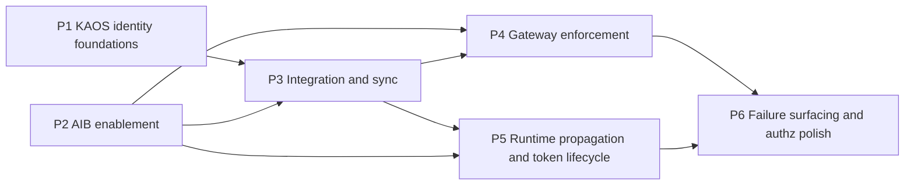

# Proposed work split and sequencing

**Status**: Draft for discussion
**Date**: 2026-06-21
**Scope**: High-level phasing of the implementation that realises the security and identity target picture ([ADR-KAOS-000](../adr-kaos/ADR-KAOS-000-target-picture.md)), spanning both the KAOS-owned ADRs (`adr-kaos/`) and the AIB-owned ADRs (`adr-aib/`).

---

## Purpose

This document proposes *how the work is chunked and in what order*, before we write a detailed task-level plan. It is intentionally high level: the goal here is to agree the sequencing and the dependency structure, not the granular tasks. Detailed per-phase task breakdowns come later, once this split is approved.

The central claim is that **the implementation order does not follow the ADR numbering, and the chunks do not map one-to-one onto individual ADRs.** The ADRs are organised by topic; the implementation is organised by dependency and by deliverable, demoable increments. Several ADRs are realised across multiple phases (e.g. the gateway pipeline in [ADR-KAOS-009](../adr-kaos/ADR-KAOS-009-gateway-api-resource-boundary-enforcement.md) is split between provisioning and enforcement), and several phases pull from multiple ADRs at once.

---

## Guiding principles for the split

- **Dependency-first, not ADR-first.** A chunk is scheduled when its prerequisites exist, regardless of its ADR number. The two highest-numbered AIB items (the access-check API and the SDK) and the high-numbered KAOS integration ADR ([ADR-KAOS-008](../adr-kaos/ADR-KAOS-008-aib-integration-and-synchronization-architecture.md)) are on the critical path and start early.
- **Two repos, two tracks.** KAOS work (operator, CLI, runtime) and AIB work (broker, SDK) live in different repositories and can progress in parallel. The KAOS gateway-enforcement and runtime tracks each have a hard dependency on a specific AIB capability, so the AIB track must lead those dependencies.
- **Each phase ends in something demoable.** Prefer a thin end-to-end slice (one agent → one MCP through the gateway with both identities) over building every generator before anything is enforceable.
- **Bootstrap, then harden.** Where AIB lacks a native concept (first-class resource grants), the early phases deliberately use the temporary synthetic-service / PermissionSet encoding described in [ADR-KAOS-004](../adr-kaos/ADR-KAOS-004-aib-responsibility-boundary.md) and [ADR-KAOS-005](../adr-kaos/ADR-KAOS-005-authorization-and-policy-model.md). The native resource-grant model is explicitly later/optional and is not on the critical path.
- **Build on what exists.** KAOS already has the Gateway API HTTPRoute substrate and a clean `kaos system install` integration-flag pattern; AIB already has the OAuth2 server, JWKS, token exchange, ext_proc, per-agent client credentials, and consent/grant/session models. The phases extend these rather than greenfielding.

---

## Current-state baseline (what already exists)

This grounds why the phases are shaped the way they are.

- **KAOS operator**: Gateway API HTTPRoute generation exists for Agent/MCPServer/ModelAPI (Envoy Gateway), but with no `jwt_authn`, `ext_authz`, `ext_proc`, TLS listener, or NetworkPolicy. There is no `spec.security` on any CRD. The requested-edge wiring already exists as `spec.modelAPI`, `spec.mcpServers[]`, and `spec.agentNetwork.access[]`. There is no credential mounting. The CLI install uses a helm/kubectl integration-flag pattern (`--gateway-enabled`, `--metallb-enabled`, `--monitoring-enabled`).
- **KAOS runtime (`pais`)**: no authentication anywhere today — only OpenTelemetry trace-context injection on outbound calls. The incoming `Authorization` header is not forwarded; there is no agent/actor token, no `x-agent-authorization`, and no SDK abstraction. Delegation and MCP calls attach no identity headers.
- **AIB (Go)**: already implements the OAuth2 authorization server (`/oauth2/authorize`, `/oauth2/token`, JWKS), RFC 8693 token exchange, the Envoy ext_proc token-exchange service, per-agent client-credential issuance (admin API), consent / user-grant / user-session (token vault) / PermissionSet models, and CEL + JWT validation helpers. It does **not** implement an Envoy ext_authz `Check` service, a `/api/access/check` endpoint, a Python SDK, or a native resource-grant model, and the `client_credentials` grant is currently wired only on the ext_proc exchanger path rather than as a first-class token-endpoint grant.

---

## The proposed phases

Six chunks. P1 and P2 can start together (different repos). P3 onward are gated as shown.

### P1 — KAOS identity foundations (KAOS repo)

**Goal**: model identity and requested access as first-class data, with no enforcement and no external dependency yet.

**Scope**: add `spec.security.id` and the logical-identity resolution rules (namespace/name default vs explicit id), including the collision/adoption handling flagged as a pre-implementation follow-up; formalise requested-edge extraction from the existing `modelAPI` / `mcpServers[]` / `agentNetwork.access[]` wiring; introduce the operator-wide Helm `security` config scaffolding (`userAuth`, `agentAuth`, `tls` blocks) as parsed configuration and surface identity/edges in status. Nothing is enforced yet.

**Realises**: [ADR-KAOS-001](../adr-kaos/ADR-KAOS-001-identity-model-and-source-of-truth.md) (identity model), plus the config surface from [ADR-KAOS-000](../adr-kaos/ADR-KAOS-000-target-picture.md) and [ADR-KAOS-009](../adr-kaos/ADR-KAOS-009-gateway-api-resource-boundary-enforcement.md).

**Depends on**: nothing. Pure operator/CRD work; safe first move.

**Demoable outcome**: every Agent/MCPServer/ModelAPI resolves a stable `external_id`, its requested edges are visible, and the operator parses an operator-wide security config — all without changing runtime behaviour.

### P2 — AIB enablement (AIB repo, parallel with P1)

**Goal**: build the AIB capabilities that the KAOS gateway and runtime tracks depend on, so they are ready when KAOS needs them.

**Scope**: the access-check decision path — an Envoy ext_authz `Check` service and the `POST /api/access/check` HTTP endpoint, returning allow/deny only and keyed on the actor; promote `client_credentials` to a first-class token-endpoint grant so agents can mint short-lived actor tokens validated by the gateway against JWKS; and the temporary synthetic-service / PermissionSet encoding that lets the access-check answer resource (agent→MCP / agent→ModelAPI / agent→agent) decisions before a native resource-grant model exists.

**Realises**: [ADR-AIB-002](../adr-aib/ADR-AIB-002-aib-access-check-api.md) (access-check API), the agent-identity issuance path underpinning [ADR-KAOS-001](../adr-kaos/ADR-KAOS-001-identity-model-and-source-of-truth.md), and the bootstrap encoding from [ADR-KAOS-004](../adr-kaos/ADR-KAOS-004-aib-responsibility-boundary.md) / [ADR-KAOS-005](../adr-kaos/ADR-KAOS-005-authorization-and-policy-model.md).

**Depends on**: nothing in KAOS; leads the KAOS critical path. Reuses AIB's existing OAuth2 server, JWKS, token exchange, and PermissionSet models.

**Demoable outcome**: an agent can obtain an actor token via `client_credentials`, and an ext_authz / HTTP access check returns a correct allow/deny for an encoded resource edge.

### P3 — Integration and synchronisation (KAOS repo, gated by P1 + P2)

**Goal**: provision identities, edges, grants, and credentials automatically — wire the two systems together.

**Scope**: the single `--auth-enabled` install path that bootstraps Keycloak + AIB + the sync service and wires the operator security config, following the existing gateway/metallb integration pattern; the lightweight external KAOS→AIB sync service that watches KAOS resources and projects logical identities, requested edges (kept distinct from approved grants), synthetic services / PermissionSets, and per-agent client credentials into Secrets; and the operator-side credential mounting (projected volume, rotation-friendly) into Agent/MCPServer pods.

**Realises**: [ADR-KAOS-008](../adr-kaos/ADR-KAOS-008-aib-integration-and-synchronization-architecture.md) (integration + sync + packaging), the install UX in [ADR-KAOS-000](../adr-kaos/ADR-KAOS-000-target-picture.md), and the credential-mount half of [ADR-KAOS-001](../adr-kaos/ADR-KAOS-001-identity-model-and-source-of-truth.md) / [ADR-KAOS-009](../adr-kaos/ADR-KAOS-009-gateway-api-resource-boundary-enforcement.md).

**Depends on**: P1 (identities/edges to project) and P2 (the AIB shapes to project them into).

**Demoable outcome**: `kaos system install --auth-enabled` stands up the stack; creating an Agent automatically yields an AIB registration, a synthetic-service/PermissionSet edge, and a mounted per-agent credential Secret.

### P4 — Gateway enforcement (KAOS repo, gated by P2 + P3)

**Goal**: turn on the gateway-centric secured posture — the actual enforcement boundary.

**Scope**: the Gateway TLS baseline (`selfSigned` / `certManager` / `provided`) on an HTTPS listener; two `jwt_authn` providers (user + agent); per-route `ext_authz` SecurityPolicy → AIB access-check with neutral `kaos.resource`/`kaos.action` context and fail-closed behaviour; `ext_proc` → AIB token exchange; the extended `GatewayRoute` policy model and gateway-vs-clusterIP URL injection with distinguished status endpoints; NetworkPolicy generation to prevent ClusterIP bypass; and the header conventions (set/strip/propagate trust rules).

**Realises**: [ADR-KAOS-009](../adr-kaos/ADR-KAOS-009-gateway-api-resource-boundary-enforcement.md) (gateway pipeline + NetworkPolicy), [ADR-KAOS-007](../adr-kaos/ADR-KAOS-007-transport-security-and-hardening-baseline.md) (TLS), [ADR-KAOS-002](../adr-kaos/ADR-KAOS-002-enforcement-topology.md) (enforcement topology), and the enforcement side of [ADR-KAOS-005](../adr-kaos/ADR-KAOS-005-authorization-and-policy-model.md).

**Depends on**: P2 (the ext_authz service must exist) and P3 (credentials provisioned, sync populating grants).

**Demoable outcome**: a protected agent→MCP call is allowed only when a matching edge/grant exists and denied otherwise; direct ClusterIP bypass is blocked; the path is fail-closed end to end. This is the first fully secured slice.

### P5 — Runtime propagation and token lifecycle (both repos, gated by P2 + P3)

**Goal**: make the two-identity flow seamless across hops and prove multi-agent delegation correctness.

**Scope**: the AIB Python SDK — header propagation, the agent machine-token lifecycle (refresh-ahead caching, file-watched credential reload, single reactive 401 retry, backoff), and optional access-check / token-exchange / token-validation helpers for off-gateway servers; and its integration into the `pais` runtime so that outbound RemoteAgent / MCP / A2A calls forward the user subject (`Authorization`) and attach the agent actor (`x-agent-authorization`), threading both identities through delegation so that agent B calls resource Y as B, not as A.

**Realises**: [ADR-AIB-001](../adr-aib/ADR-AIB-001-aib-python-sdk-design.md) (SDK), [ADR-KAOS-003](../adr-kaos/ADR-KAOS-003-user-request-context-propagation.md) (propagation), and the token-lifecycle behaviour in [ADR-KAOS-006](../adr-kaos/ADR-KAOS-006-re-authentication-execution-model.md).

**Depends on**: P3 (credentials mounted) and P2 (`client_credentials` minting). Can overlap P4: the SDK/runtime work is independent of writing the gateway policy generators, though full end-to-end validation needs P4 in place.

**Demoable outcome**: an A→B→Y delegation chain is correctly authorised as B at the gateway, with no manual token handling in application code and seamless refresh under rotation.

### P6 — Failure surfacing, authorization polish, and backend-neutral validation (KAOS repo, gated by P4 + P5)

**Goal**: complete the operational and correctness story, and prove the swappable backend.

**Scope**: surface re-authentication and failure outcomes through the gateway path (`platform_grant_missing`, `user_grant_required`, `third_party_reauth_required` + re-auth URL) and record `user_action_required` for autonomous runs; finalise the no-permission-by-default authorization semantics and the requested-vs-approved distinction end to end; and validate the OPA drop-in over the same neutral ext_authz contract. Docs and e2e coverage land here.

**Realises**: [ADR-KAOS-006](../adr-kaos/ADR-KAOS-006-re-authentication-execution-model.md) (re-auth/failure model), the remainder of [ADR-KAOS-005](../adr-kaos/ADR-KAOS-005-authorization-and-policy-model.md) (backend-neutral, OPA drop-in).

**Depends on**: P4 (enforcement path to attach outcomes to) and P5 (runtime to react to them).

**Demoable outcome**: a missing grant produces a structured, user-actionable failure rather than an opaque error; swapping AIB for an OPA backend requires no Envoy/KAOS config change.

---

## Sequencing at a glance

| Phase | Repo(s) | Primary ADRs | Hard prerequisites |
|---|---|---|---|
| P1 KAOS identity foundations | KAOS | KAOS-001 (+000/009 config) | — |
| P2 AIB enablement | AIB | AIB-002, KAOS-004/005 bootstrap | — |
| P3 Integration and sync | KAOS | KAOS-008 (+000/001) | P1, P2 |
| P4 Gateway enforcement | KAOS | KAOS-009/007/002/005 | P2, P3 |
| P5 Runtime propagation + token lifecycle | AIB + KAOS | AIB-001, KAOS-003/006 | P2, P3 |
| P6 Failure surfacing + authz polish | KAOS | KAOS-006/005 | P4, P5 |

---

## Explicitly later / out of the critical path

- **Native first-class resource-grant model in AIB** — replaces the temporary synthetic-service / PermissionSet encoding; scheduled only once the bootstrap encoding proves limiting ([ADR-KAOS-004](../adr-kaos/ADR-KAOS-004-aib-responsibility-boundary.md)).
- **Granular install override flags** (external Keycloak/AIB, custom issuers/endpoints) — added when a deployment needs them, beyond the single `--auth-enabled` switch ([ADR-KAOS-008](../adr-kaos/ADR-KAOS-008-aib-integration-and-synchronization-architecture.md)).
- **MCP tool/argument-granular authorization** — not done at the gateway; possible later via the SDK helpers at custom MCP servers ([ADR-KAOS-002](../adr-kaos/ADR-KAOS-002-enforcement-topology.md)).
- **mTLS / SPIFFE / service mesh / sidecars / pod-identity binding** — out of scope by decision, revisited only on concrete need ([ADR-KAOS-000](../adr-kaos/ADR-KAOS-000-target-picture.md), [ADR-KAOS-007](../adr-kaos/ADR-KAOS-007-transport-security-and-hardening-baseline.md)).
- **Extracting the sync service to its own repository** — starts in the KAOS repo and is extracted later ([ADR-KAOS-008](../adr-kaos/ADR-KAOS-008-aib-integration-and-synchronization-architecture.md)).

---

## Open sequencing questions for discussion

- **Thin slice vs breadth within P4.** Do we want P4 to first secure a single agent→MCP path end to end before generating policy for ModelAPI and agent→agent, or build all route generators together?
- **P5 overlap with P4.** The SDK/runtime propagation work has no code dependency on the gateway policy generators. Do we want to start P5 in parallel with P4 (validating against a hand-rolled gateway config) to shorten the critical path, or keep it strictly after P4 for simpler validation?
- **P2 ownership and cadence.** P2 is AIB-repo work that gates two KAOS phases. Is the AIB track resourced to lead, and do we want the access-check API and the `client_credentials` promotion as one deliverable or two?
- **Risk spikes before committing.** Three items carry integration risk and could warrant a short spike up front: per-cluster CNI NetworkPolicy enforcement (P4), the Envoy Gateway `SecurityPolicy` ext_authz shape against AIB (P4), and confirming AIB `client_credentials` actor-token minting validates cleanly at `jwt_authn` (P2/P5).
