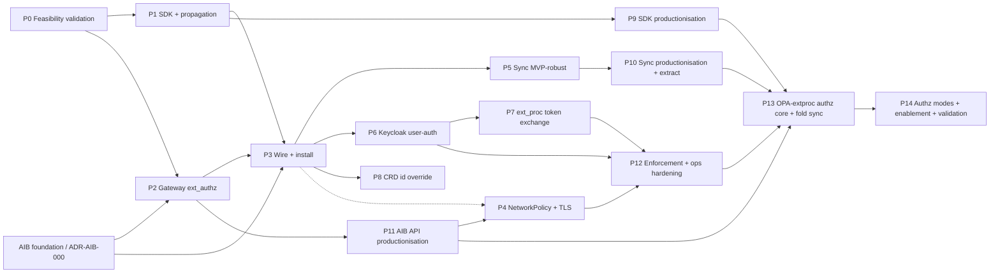

# Proposed work split and sequencing

**Status**: Living plan (v4 — P0–P12 implemented; P13/P14 add the OPA-in-ext_proc authorization redesign)
**Date**: 2026-07-07
**Scope**: High-level phasing of the security and identity implementation. Phases P0–P12 realised the original target picture ([ADR-KAOS-000](../adr-kaos/ADR-KAOS-000-target-picture.md)) and reference the historical `adr-kaos/` and `adr-aib/` records. Phases **P13–P14** realise the current authorization design in the fresh [ADR set](../adrs/adr_high_level_components.md). The previously-planned P13/P14/P15 were not implemented and are moved to [`followups.md`](./followups.md); their numbers are reused.

---

## Purpose

This document proposes *how the work is chunked and in what order*, before we write a detailed task-level plan. It is intentionally high level: the goal is to agree the sequencing and the dependency structure, not the granular tasks. Detailed per-phase task breakdowns come later, once this split is approved, and each phase is executed as its own plan-implement iteration (one PR per phase).

The implementation order deliberately does **not** follow the ADR numbering, and the chunks do not map one-to-one onto individual ADRs. The ADRs are organised by topic; the implementation is organised **bottom-up** — build and validate the small atomic components first, then wire them together — and is **gated by a feasibility-validation phase (P0)** whose findings can reshape everything downstream. Several ADRs are realised across multiple phases, and several phases pull from multiple ADRs at once.

---

## Guiding principles for the split

- **Validate first (P0), then build.** Before committing to the design, prove the hypotheses with a working validation harness across AIB and KAOS. P0 is not throwaway scaffolding: it is a set of real, runnable tests/checks that must work and that confirm the approach is viable. Its learnings feed back into this plan and may pull later phases earlier.
- **Bottom-up: atomic components first, wire last.** Start with the smallest independently-testable pieces (SDK header propagation, a single gateway `ext_authz` check) and only integrate the full distributed system once each piece is independently validated.
- **Mocks/dummies break upstream dependencies.** Early phases use static/dummy identities and crafted headers so a component can be validated without its eventual upstream being finished (e.g. propagation is validated with dummy tokens; `ext_authz` is validated with crafted agent→resource headers; the user identity is simulated until Keycloak lands).
- **Temporary homes, then upstream.** Two deliverables intentionally start inside the KAOS repos for fast iteration and are relocated later: the Python **SDK** (starts in the KAOS python repo, then moves to an AIB package and is contributed upstream in P14) and the **sync service** (starts in-repo as an external process, then extracted to its own repository in P10). Neither ever lives in the operator.
- **Productionisation and upstreaming are separate phases.** Hardening the SDK, the sync service (incl. extraction), the AIB API extensions, and the enforcement/operational behaviour are each their own phase; the AIB-side work is additionally contributed upstream (from a fork) in a dedicated final phase (P14).
- **Build on what exists.** KAOS already has the Gateway API HTTPRoute substrate and a clean `kaos system install` integration-flag pattern; AIB already has the OAuth2 server, JWKS, token exchange, ext_proc, per-agent client credentials, and consent/grant/session models. The phases extend these rather than greenfielding.
- **One phase = one plan-implement iteration = one PR**, with tests validated and CI green before moving on. Progress and learnings for each phase are documented under `impl/` (see end).

---

## Current-state baseline (what already exists)

This grounds why the phases are shaped the way they are.

- **KAOS operator**: Gateway API HTTPRoute generation exists for Agent/MCPServer/ModelAPI (Envoy Gateway), but with no `jwt_authn`, `ext_authz`, `ext_proc`, TLS listener, or NetworkPolicy. There is no `spec.security` on any CRD. The requested-edge wiring already exists as `spec.modelAPI`, `spec.mcpServers[]`, and `spec.agentNetwork.access[]`. There is no credential mounting. The CLI install uses a helm/kubectl integration-flag pattern (`--gateway-enabled`, `--metallb-enabled`, `--monitoring-enabled`).
- **KAOS runtime (`pais`)**: no authentication anywhere today — only OpenTelemetry trace-context injection on outbound calls. The incoming `Authorization` header is not forwarded; there is no agent/actor token, no `x-agent-authorization`, and no SDK abstraction. Delegation and MCP calls attach no identity headers.
- **AIB (Go)**: already implements the OAuth2 authorization server (`/oauth2/authorize`, `/oauth2/token` — including the `client_credentials` grant on the main token endpoint, JWKS), RFC 8693 token exchange, the Envoy ext_proc token-exchange service, per-agent client-credential issuance (admin API), consent / user-grant / user-session (token vault) / PermissionSet models, and CEL + JWT validation helpers. The genuinely new AIB-side capability the target needs is the **access-check decision surface** (`POST /api/access/check` + an Envoy `ext_authz` `Check` service); a Python SDK; and (later, optional) a native resource-grant model. Actor-token minting needs no new endpoint — it needs agents registered as **LocalClients** (P0 finding; see below).
- **AIB deployability (foundation groundwork, confirmed in P0)**: AIB is a **private, not-yet-released** project — it publishes no images or charts. P0 stood it up in KIND and found the foundation gaps that must be closed before KAOS can integrate: the production/extproc/migrate Dockerfiles defaulted to a private (non-pullable) base image; the Helm chart's default values failed the chart's own `values.schema.json`; the chart needs explicit JWE/encryption-key and pre-auth wiring to start. Importantly, **`storage.type=memory` deploys cleanly with no Postgres and no migration job** — the Postgres path (Zalando `acid.zalan.do` operator) is heavier and not needed for dev/CI/MVP. Because images/charts are unpublished, installs build images and `kind load` them. This foundation work is structured as a stacked AIB branch documented in a new **ADR-AIB-000** (see "AIB-side work" below).

---

## The proposed phases

P0 validates and gates everything. P1–P3 and P5–P8 build and wire the MVP bottom-up. P9–P12 productionise. **P13–P14 then re-base authorization on OPA-in-ext_proc (the fresh [ADR set](../adrs/adr_high_level_components.md)) and fold the sync-service into the operator**, superseding the earlier ext_authz-decision-service direction; the previously-planned P13 (docs), P14 (upstream), and P15 (strict gateway) are moved to [`followups.md`](./followups.md) and their numbers reused. **Phase numbers are stable identifiers; the sections below are listed in execution order.** P4 (bypass prevention + TLS) was **resequenced to run after P11**, immediately before P12, because gateway-only enforcement (deny-direct-ClusterIP + TLS) breaks the current frontend's direct workload access and must land together with the coordinated frontend changes that move the UI onto the gateway path — and it is not needed by any of the earlier phases (only P12 consumes it). P0 learnings may reorder P5 (sync) and P6 (user auth) earlier.

### P0 — Feasibility validation and hypothesis testing — **complete (go)**

**Goal**: prove, with working tests, that the whole approach is viable before building production code; surface groundwork and plan-deltas.

**Scope** (artifacts live in the KAOS repo `./tmp/security/`, gitignored; findings written to `impl/learnings/`):
- run AIB locally and simulate the permissions/grants/PermissionSet records (incl. the synthetic-service encoding) to confirm the resource-decision model is expressible today;
- a minimal but working validation of the AIB backend access-check path that introduces the API shape, exercised with manual tests that simulate production traffic — against a local Envoy `ext_authz` and/or a small in-cluster check;
- a simple Python client that simulates the SDK's **propagation only** (two-identity headers across a hop) — no access-check calls yet;
- a basic sync routine that can run locally to project KAOS resources into AIB, enough to drive the CLI flow;
- the AIB deployability assessment — what is needed to build, deploy, and run AIB in-cluster — documented as the foundation groundwork that updates this plan;
- **CI / deployment validation** — confirm we can build images, deploy via Helm, and run the Envoy + `ext_authz` path in CI and/or a local cluster.

**Realises**: de-risks [ADR-AIB-002](../adr-aib/ADR-AIB-002-aib-access-check-api.md), [ADR-AIB-001](../adr-aib/ADR-AIB-001-aib-python-sdk-design.md) (propagation slice), [ADR-KAOS-004](../adr-kaos/ADR-KAOS-004-aib-responsibility-boundary.md)/[005](../adr-kaos/ADR-KAOS-005-authorization-and-policy-model.md) (encoding), [ADR-KAOS-008](../adr-kaos/ADR-KAOS-008-aib-integration-and-synchronization-architecture.md) (sync + install).

**Depends on**: nothing. **Outputs**: a go/no-go + concrete plan-deltas. **Result**: complete — go. All hypotheses confirmed against a live AIB (locally and deployed to KIND): the synthetic-service/PermissionSet encoding, actor-token minting for LocalClients, actor-keyed allow/deny with fail-closed, two-identity propagation, KAOS→AIB sync, and a memory-backend KIND deploy. The deployability findings and the proposed plan-deltas this version incorporates are in [`../impl/learnings/P0-feasibility-validation.md`](../impl/learnings/P0-feasibility-validation.md).

### P1 — Python SDK and header propagation (temporary home)

**Goal**: the first atomic component — two-identity header propagation as a reusable library.

**Scope**: build the SDK in the KAOS python repo (temporary home, for easy import/iteration) with header propagation (forward the user subject, attach the agent actor) wired into the `pais` runtime's RemoteAgent / MCP / A2A outbound calls; apply P0 learnings. Identities are dummy/static at this stage (real minting + machine-token lifecycle come later); access-check helpers are not built here.

**Realises**: the propagation slice of [ADR-AIB-001](../adr-aib/ADR-AIB-001-aib-python-sdk-design.md) and [ADR-KAOS-003](../adr-kaos/ADR-KAOS-003-user-request-context-propagation.md).

**Depends on**: P0. **Demoable**: A→B→MCP carries both identity headers correctly across hops, unit-tested, with no enforcement yet.

### P2 — Gateway `ext_authz` enforcement (merged gateway substrate + working check)

**Goal**: a working (not production) gateway authorization check.

**Scope**: extend the KAOS Gateway API integration (the existing **Envoy** Gateway) to generate the Envoy `ext_authz` policy, and build the genuinely-new AIB capability — the `ext_authz` `Check` service (and its `POST /api/access/check` sibling) returning allow/deny keyed on the actor. Actor-token minting itself needs no new AIB endpoint (`client_credentials` already exists); it needs agents registered as LocalClients (handled by the sync in P3). Validate with a few configurations using crafted headers that exercise agent→resource decisions. `ext_proc` (token exchange) is explicitly **not** a priority here, and ClusterIP restriction is **not** in scope yet. User authentication is simulated/skippable for these tests. AIB's dev stack also ships `agentgateway`, but KAOS targets Envoy; the `ext_authz` 200/403 contract is the integration point.

**Realises**: the `ext_authz` half of [ADR-KAOS-009](../adr-kaos/ADR-KAOS-009-gateway-api-resource-boundary-enforcement.md) and [ADR-AIB-002](../adr-aib/ADR-AIB-002-aib-access-check-api.md); enforcement side of [ADR-KAOS-002](../adr-kaos/ADR-KAOS-002-enforcement-topology.md)/[005](../adr-kaos/ADR-KAOS-005-authorization-and-policy-model.md).

**Depends on**: P0 (validated check shape) and the **AIB foundation branch** (ADR-AIB-000 — so AIB builds/deploys; see "AIB-side work"). **Demoable**: a request with a granted agent→resource header is allowed; an ungranted one is denied, fail-closed.

### P3 — End-to-end wiring and install

**Goal**: install and wire the components into a real cluster and prove the e2e MVP.

**Scope**: first complete the **AIB foundation** as a prerequisite (the ADR-AIB-000 work: public base image, chart that validates its own defaults, JWE/encryption-key + pre-auth wiring, **`memory` storage backend by default** so no Postgres/migrations are needed, and an image-build/`kind load` path); then extend the operator Helm chart and add `kaos system install --auth-enabled`, which configures **everything necessary** — installs AIB + the sync service, wires the operator security config, mounts agent credentials — and validate end-to-end with actually-installed components that propagation (P1) and `ext_authz` (P2) work together in-cluster. The sync service registers KAOS agents as AIB **LocalClients** (no `client_id`) so actor tokens mint locally (P0 finding).

**Realises**: [ADR-KAOS-008](../adr-kaos/ADR-KAOS-008-aib-integration-and-synchronization-architecture.md) (integration/install), install UX in [ADR-KAOS-000](../adr-kaos/ADR-KAOS-000-target-picture.md), credential mounting from [ADR-KAOS-001](../adr-kaos/ADR-KAOS-001-identity-model-and-source-of-truth.md)/[009](../adr-kaos/ADR-KAOS-009-gateway-api-resource-boundary-enforcement.md).

**Depends on**: P1, P2, and the AIB foundation (ADR-AIB-000). **Demoable**: a one-command install yields a cluster where an agent→MCP call is propagated and authorized end to end.

### P5 — Sync service to MVP-robust (external, in-repo)

**Goal**: a sync service good enough for the end-to-end MVP (not yet production).

**Scope**: harden the basic sync routine from P0/P3 into a standalone external service that lives **in the KAOS repo for now** (later extracted, like the SDK), reconciling identities, requested edges, synthetic services/PermissionSets, and per-agent credential Secrets. It registers each KAOS agent as an AIB **LocalClient** (creates the agent record *without* `client_id`/`client_uris`) so AIB mints the actor token itself; the encoding uses the fixed convention `kaos://mcpserver/<ns>/<name>` ↔ synthetic service `client_id` `kaos-mcpserver-<ns>-<name>` with the requested edge as a `call` scope. May be pulled earlier if P0 shows it is a hard dependency for P3.

**Realises**: [ADR-KAOS-008](../adr-kaos/ADR-KAOS-008-aib-integration-and-synchronization-architecture.md) (sync architecture).

**Depends on**: P3. **Demoable**: resource create/update/delete reliably reconciles into AIB and Secrets.

### P6 — User authentication (Keycloak) and gateway user-auth

**Goal**: add the human-identity half and validate combined authn.

**Scope**: introduce Keycloak (or equivalent) for user authn and extend the Gateway to validate the user provider (`jwt_authn` user provider) including redirect/login flows; keep it as programmatic as possible, requesting a token from the HOST only when an interactive step is unavoidable. May be pulled earlier per P0 learnings.

**Realises**: user-identity side of [ADR-KAOS-001](../adr-kaos/ADR-KAOS-001-identity-model-and-source-of-truth.md), [ADR-KAOS-009](../adr-kaos/ADR-KAOS-009-gateway-api-resource-boundary-enforcement.md) (two `jwt_authn` providers).

**Depends on**: P3. **Demoable**: a request needs a valid user token *and* a valid actor; both are validated at the gateway.

### P7 — `ext_proc` token exchange via the gateway

**Goal**: deliver delegated third-party tokens through the gateway.

**Scope**: wire the Envoy `ext_proc` token-exchange path to AIB, validated first with dummy services/tokens, then integrated in-cluster for a real delegated call.

**Realises**: `ext_proc` half of [ADR-KAOS-009](../adr-kaos/ADR-KAOS-009-gateway-api-resource-boundary-enforcement.md); token-vault/exchange use from [ADR-KAOS-004](../adr-kaos/ADR-KAOS-004-aib-responsibility-boundary.md).

**Depends on**: P3, P6 (user-delegated grants). **Demoable**: a protected call needing a third-party token gets one exchanged inline.

### P8 — CRD identity override (removed)

**Goal**: expose the user-configurable logical identity.

**Status**: Implemented, then **removed**. The `spec.security.id` override and its collision/adoption handling were stripped out (see [`P8-crd-identity-override-removal.md`](./P8-crd-identity-override-removal.md) and the Amendment in [ADR-KAOS-001](../adr-kaos/ADR-KAOS-001-identity-model-and-source-of-truth.md)). Logical identity is always `kaos://{kind}/{namespace}/{name}` — unique by construction, with no winner/adoption logic on either the operator or the sync plane.

**Scope (original)**: add `spec.security.id` (override on top of the `kaos://{kind}/{namespace}/{name}` default the earlier phases rely on) with collision/adoption handling, and test it end to end.

**Realises**: CRD surface of [ADR-KAOS-001](../adr-kaos/ADR-KAOS-001-identity-model-and-source-of-truth.md), now superseded by that ADR's removal amendment.

**Depends on**: P3.

### P9 — SDK productionisation

**Goal**: make the SDK production-grade (its move to AIB's package home and upstream contribution happen in P14).

**Scope**: add the machine-token lifecycle (refresh-ahead caching, file-watched credential reload, single reactive 401 retry, backoff) and the optional access-check/token-exchange/validation helpers. The SDK acquires actor tokens by a plain HTTP `client_credentials` call to AIB (no Go client to package — actor minting is an HTTP exchange). This is the **SDK branch** of the AIB stack (stacked on the access-check branch). Repoint the runtime at the productionised SDK; the move to AIB's package home and upstreaming happen in P14.

**Realises**: full [ADR-AIB-001](../adr-aib/ADR-AIB-001-aib-python-sdk-design.md), token lifecycle in [ADR-KAOS-006](../adr-kaos/ADR-KAOS-006-re-authentication-execution-model.md).

**Depends on**: P1 (and feature-complete MVP).

### P10 — Sync service productionisation and extraction

**Goal**: make the sync service production-grade and extract it.

**Scope**: robustness, drift/status handling, packaging; then **extract it from the KAOS repo to its own repository** with its own release/CI, consistent with the SDK relocation.

**Realises**: productionisation of [ADR-KAOS-008](../adr-kaos/ADR-KAOS-008-aib-integration-and-synchronization-architecture.md).

**Depends on**: P5.

### P11 — AIB API extensions productionisation

**Goal**: make the AIB-side additions production-grade and upstream them.

**Scope**: harden the `ext_authz` `Check` service, `/api/access/check`, and the synthetic-service/PermissionSet encoding; evaluate promoting the encoding toward a native resource-grant model. This is the **access-check branch** of the AIB stack (stacked on the ADR-AIB-000 foundation branch). Upstreaming to AIB happens in P14, not here.

**Realises**: productionisation of [ADR-AIB-002](../adr-aib/ADR-AIB-002-aib-access-check-api.md) and the AIB capabilities behind [ADR-KAOS-004](../adr-kaos/ADR-KAOS-004-aib-responsibility-boundary.md)/[005](../adr-kaos/ADR-KAOS-005-authorization-and-policy-model.md).

**Depends on**: P2, and the AIB foundation (ADR-AIB-000).

### P4 — Bypass prevention and transport security — **resequenced after P11**

**Goal**: make the gateway the *only* path and encrypt it.

**Scope**: NetworkPolicy generation to deny direct ClusterIP workload-to-workload application traffic (so the gateway cannot be bypassed), and Gateway TLS (`selfSigned` / `certManager` / `provided`) on an HTTPS listener.

**Realises**: NetworkPolicy from [ADR-KAOS-009](../adr-kaos/ADR-KAOS-009-gateway-api-resource-boundary-enforcement.md)/[002](../adr-kaos/ADR-KAOS-002-enforcement-topology.md) and TLS from [ADR-KAOS-007](../adr-kaos/ADR-KAOS-007-transport-security-and-hardening-baseline.md).

**Depends on**: P3 (in-cluster wiring exists). **Resequenced to run after P11**, immediately before P12: deliberately deferred out of the early MVP wave because locking traffic to the gateway-only path (deny-direct-ClusterIP + TLS) breaks the current frontend, which still reaches workloads directly. It must therefore land together with the coordinated frontend changes that move the UI onto the gateway path, and no earlier phase needs it — its only downstream consumer, P12, already sits after it. **Demoable**: direct ClusterIP access is blocked; gateway traffic is TLS-terminated.

### P12 — Enforcement and operational hardening

**Goal**: complete the operational correctness story.

**Scope**: surface re-authentication/failure outcomes through the gateway (`platform_grant_missing`, `user_grant_required`, `third_party_reauth_required` + re-auth URL) and record `user_action_required` for autonomous runs; finalise fail-closed behaviour and the requested-vs-approved semantics end to end; validate the backend-neutral OPA drop-in over the same `ext_authz` contract; production-harden NetworkPolicy/TLS.

**Realises**: [ADR-KAOS-006](../adr-kaos/ADR-KAOS-006-re-authentication-execution-model.md), remainder of [ADR-KAOS-005](../adr-kaos/ADR-KAOS-005-authorization-and-policy-model.md), hardening of [ADR-KAOS-007](../adr-kaos/ADR-KAOS-007-transport-security-and-hardening-baseline.md).

**Depends on**: P4, P6, P7.

### P13 — Coarse authorization via OPA-in-ext_proc: architecture and enforcement core

**Goal**: adopt the enforcement topology settled in the fresh [ADR set](../adrs/adr_high_level_components.md) — OPA embedded in AIB ext_proc (#222) as the single decision point for both authorization models — superseding the abandoned standalone ext_authz decision-service direction, and fold the standalone sync-service into the operator.

**Scope** (KAOS operator + runtime + chart, against AIB `main`+#222 plus AIB PR #397):
- **Security-config foundation**: decouple the "security enabled" predicate from `ExtAuthzURL` so credential mounting and NetworkPolicy stay on independently of the (now optional) ext_authz seam; add config for authorization **model** (1 / 2 / both), **enforcement posture**, **verification mode**, and **populator mode**.
- **Fold the sync-service into the operator** as an isolated whole-world `AIBProjectionReconciler` — the sole AIB caller, ConfigMap writer, and credential minter — with the workload reconciler never calling AIB; delete the standalone deployable/chart/image/CI job and its Go module; unify per-agent credential-Secret ownership via `ownerReference` GC (removing bespoke `pruneSecrets()`).
- **Shared projection core**: make `Project()→DesiredState` model-agnostic; strip AIB-specific serialisation into the Model-2 admin adapter (the only bespoke integration); verify at implementation that the broker stamps the actor-token `sub` as the logical identity (not a UUID).
- **Model 1 emitter + verification**: ship a static generic rego asset and write `data.kaos.grants` into a ConfigMap mounted into the ext_proc pod via `policy.path`; inject `data.kaos.jwks` only when an issuer is configured so the rego branches `decode_verify` (verified) vs `decode` (demo).
- **Enforcement posture**: make ext_proc OPA the default; generalise ext_authz `SecurityPolicy` generation off the AIB-#398 assumption into an optional, default-off seam pointing at a configurable backend.

**Realises**: [ADR 0001](../adrs/adr_0001_enforcement-topology-and-policy-engine.md), [ADR 0002](../adrs/adr_0002_identity-and-authentication.md), [ADR 0004](../adrs/adr_0004_component-architecture-and-projection.md). Detailed plan: [`P13-opa-extproc-authorization-core.md`](./P13-opa-extproc-authorization-core.md).

**Depends on**: the implemented MVP (P0–P12); AIB `main`+#222 and PR #397 mergeable. Coarse granularity only (no MCP tool-level).

### P14 — Authorization models, framework enablement, and validation

**Goal**: expose both authorization models with their source-of-truth / override modes, wire them through the chart and CLI, and prove every mode end-to-end.

**Scope** (KAOS operator + chart + CLI + docs):
- **Populator / override modes** with the prune-safety invariant (external/manual modes never prune or clobber admin-owned config): default CRD projection for both models; Model-1 **M1-a** (bring-your-own ConfigMap) and **M1-b** (operator-owned rego via server-side-apply field ownership + admin-authored `data.kaos.grants`); Model-2 **external off-switch** (authorization projection off, prune forced off, KAOS keeps identity, AIB authoritative via `granted_permission_sets`).
- **Framework enablement**: Helm values and `kaos system install` flags selecting model, enforcement posture, verification mode, and populator mode, with simple safe defaults.
- **Tests + docs + examples**: unit plus a KIND e2e matrix (both models, demo vs verified, all override modes, allow/deny and no-clobber-across-reconciles assertions); publish the `data.kaos.grants`/`data.kaos.jwks` schema as a public contract; fence demo mode as non-production; update `.github/copilot-instructions.md` and `.github/instructions/*`.
- **Finalise** the new ADR set post-hoc (Proposed → Accepted).

**Realises**: [ADR 0003](../adrs/adr_0003_authorization-models-and-policy-data.md); completes [ADR 0002](../adrs/adr_0002_identity-and-authentication.md) / [ADR 0004](../adrs/adr_0004_component-architecture-and-projection.md). Detailed plan: [`P14-authorization-modes-and-enablement.md`](./P14-authorization-modes-and-enablement.md).

**Depends on**: P13.

### Superseded planned phases (moved to followups)

The originally-planned P13 (cross-component documentation pass), P14 (upstream contribution of the AIB-side work via a fork), and P15 (strict gateway-only traffic, decoupled from authorization) were never implemented and are no longer part of the critical path. P14-upstream is **cancelled** outright (there is no upstreaming: the SDK folds into the KAOS Python SDK). The other two are recorded in [`followups.md`](./followups.md). The phase numbers P13/P14 are reused above for the current authorization work.
---

## AIB-side work: a stack of branches founded on ADR-AIB-000

The AIB project is **private and not yet released**, so its deployability is not a given — it is foundational work KAOS must do. All AIB-repo work is therefore organised as **stacked branches** in the cloned `agentic-identity-broker` repo, bottom to top, each reviewable on its own and contributed upstream (from a fork) in order during P14:

1. **Foundation (base branch)** — the deployability foundation: public container base image, a Helm chart that validates its own defaults and runs on the **`memory` backend by default** (no Postgres/operator), explicit JWE/encryption-key + pre-auth wiring, and an image-build/`kind load` path (a real web/consent-UI toolchain only when the UI is in scope). Documented in a **new `ADR-AIB-000`** (to be authored — the foundations the rest of the AIB work and the KAOS integration depend on, including the chart/image story). The P0 fixes (public `alpine:3` base, chart values-schema fix) are the first commits here.
2. **Access-check API** — `POST /api/access/check` + the Envoy `ext_authz` `Check` service ([ADR-AIB-002](../adr-aib/ADR-AIB-002-aib-access-check-api.md)); built in P2, productionised in P11. Stacked on the foundation branch.
3. **SDK** — the AIB Python SDK ([ADR-AIB-001](../adr-aib/ADR-AIB-001-aib-python-sdk-design.md)); built in P1 (KAOS-python temporary home), productionised in P9. Stacked on the access-check branch.

---

## Sequencing at a glance

| Phase | Repo(s) | Primary ADRs | Hard prerequisites |
|---|---|---|---|
| P0 Feasibility validation | KAOS + AIB (`./tmp/security/`) | AIB-002, AIB-001, KAOS-004/005/008 (de-risk) | — (done) |
| AIB foundation | AIB (stacked base branch) | ADR-AIB-000 (new) | — |
| P1 SDK + propagation | KAOS python (temp) | AIB-001 (propagation), KAOS-003 | P0 |
| P2 Gateway `ext_authz` | KAOS + AIB | KAOS-009 (ext_authz), AIB-002 | P0, AIB foundation |
| P3 Wire + install | KAOS (+ AIB deploy) | KAOS-008/000/001 | P1, P2, AIB foundation |
| P5 Sync MVP-robust | KAOS (in-repo) | KAOS-008 | P3 (may move earlier) |
| P6 Keycloak user-auth | KAOS | KAOS-001/009 | P3 (may move earlier) |
| P7 `ext_proc` token exchange | KAOS + AIB | KAOS-009/004 | P3, P6 |
| P8 CRD id override | KAOS | KAOS-001 | P3 |
| P9 SDK productionisation | KAOS python | AIB-001, KAOS-006 | P1 |
| P10 Sync productionisation + extract | KAOS → own repo | KAOS-008 | P5 |
| P11 AIB API productionisation | AIB | AIB-002, KAOS-004/005 | P2, AIB foundation |
| P4 NetworkPolicy + TLS *(resequenced)* | KAOS | KAOS-009/002/007 | P3 (data); runs after P11 |
| P12 Enforcement + ops hardening | KAOS | KAOS-006/005/007 | P4, P6, P7 |
| P13 OPA-extproc authz core + fold sync | KAOS (+ AIB `main`+#222, #397) | ADR 0001, 0002, 0004 (new set) | P0–P12 |
| P14 Authz modes + enablement + validation | KAOS operator + chart + CLI + docs | ADR 0003 (new set) | P13 |

---

## Cross-cutting notes

- **Simulation contract (pre-P6).** Until P6, the user identity is a static injected header and the agent actor is a dummy/static token in P1; real `client_credentials` minting becomes available once agents are registered (P3) and the full machine-token lifecycle (refresh-ahead, reload, retry) lands in the SDK in P9. This is what lets P1 be validated without the full identity stack.
- **AIB-side work is a stack, not a single phase.** It is organised as stacked branches in the AIB repo — foundation (ADR-AIB-000) → access-check (P2/P11) → SDK (P1/P9) — each reviewable on its own and contributed upstream from a fork in P14. See "AIB-side work" above. The deployability foundation is a hard prerequisite for P2 and P3.
- **Temporary-home relocations.** SDK: P1 (KAOS python) → productionised in P9 → moved to AIB's package home and upstreamed in P14. Sync: P5 (KAOS repo) → P10 (own repo). Neither is ever in the operator.
- **Testing strategy.** Tests are added in-repo as functionality lands and backfilled for consistency, especially during productionisation; integration coverage may start as manual/scripted (a local k8s cluster is available) and is promoted to automated CI where practical. P0 harnesses in `./tmp/security/` may be promoted into committed tests in later phases.
- **ADR reconciliation.** This plan's sequencing is consistent with the ADRs. Nuances to reflect when we touch them: the SDK's temporary KAOS-python home before upstreaming ([ADR-AIB-001](../adr-aib/ADR-AIB-001-aib-python-sdk-design.md)); the sync service's in-repo-first/extract-later path ([ADR-KAOS-008](../adr-kaos/ADR-KAOS-008-aib-integration-and-synchronization-architecture.md)); and a **new `ADR-AIB-000`** to be authored for the AIB deployability foundation (base image, Helm chart, memory backend). `proposed-split.md` owns sequencing; the ADRs own the target design.

---

## Explicitly later / out of the critical path

The full deferred backlog — including the AIB-less agent-identity issuer, the Python SDK consolidation, autonomous-mode enforcement (the G1 gap), ConfigMap bundle hot-reload, the V2 gateway actor-JWT provider, and the previously-planned-but-unimplemented strict-gateway and cross-component-documentation phases — is tracked in [`followups.md`](./followups.md). A few standing items predating that file:

- **Native first-class resource-grant model in AIB** — replaces the temporary synthetic-service/PermissionSet encoding; evaluated in P11, only if the encoding proves limiting ([ADR-KAOS-004](../adr-kaos/ADR-KAOS-004-aib-responsibility-boundary.md)).
- **Granular install override flags** (external Keycloak/AIB, custom issuers/endpoints) — added when a deployment needs them, beyond the single `--auth-enabled` switch ([ADR-KAOS-008](../adr-kaos/ADR-KAOS-008-aib-integration-and-synchronization-architecture.md)).
- **MCP tool/argument-granular authorization** — not at the gateway; possible later via SDK helpers at custom MCP servers ([ADR 0001](../adrs/adr_0001_enforcement-topology-and-policy-engine.md), [ADR-KAOS-002](../adr-kaos/ADR-KAOS-002-enforcement-topology.md)).
- **mTLS / SPIFFE / service mesh / sidecars / pod-identity binding** — out of scope by decision, revisited only on concrete need ([ADR-KAOS-000](../adr-kaos/ADR-KAOS-000-target-picture.md), [ADR-KAOS-007](../adr-kaos/ADR-KAOS-007-transport-security-and-hardening-baseline.md)).

---

## Progress and learnings tracking

Each phase is documented in the docs repo under `impl/`: a progress note in `impl/progress/` and a learnings note in `impl/learnings/` (one per phase, named `P<n>-<slug>.md`). P0's learnings are the most consequential, since they can reorder later phases and defined the AIB deployability foundation (ADR-AIB-000). See `impl/README.md` for the convention.
